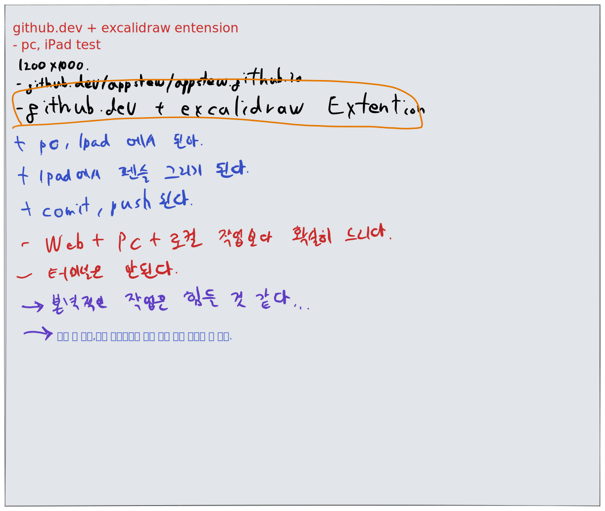

---
---



```
개발 블로그를 쓰는 것도 중요하다 하셨는데 왜냐면 그게 여러분들이 취업할때 자기가 그만큼 노력했다는 것을 증명할 수 있는 몇 안되는 방법 중 하나라서 라고 하셨는데 개발 블로그 중요한 것은 알고 전 개인적으로 html 도 모르고 블로그도 한번도 해보지 않은 상황에서 코드스테이츠에 들어온 이후로 처음엔 엄청 글을 길게도 써보고 짧게도 써보고 jekyll react netlify 여러가지 js 도 적용해보고 진짜 엄청 시간 날려먹고 이제는 어느 정도 타협을 봐서 "더도 말고 덜도 말고 내가 배운 기술들 나중에 안 까먹고 다시 보고 재활용할 수 있게만 쓰자" 라고 결론을 내고 거기에 최적화 해서 블로그를 쓰고 있는데(시간이 없어서 다 갈무리는 못했지만..) 
```

221006 
code김세윤님께 드린 질문글. 
질문

```
그저께인가 선배적 참견시점에 백엔드 선배님께서 여러 말씀을 해주셨는데요, 
그날 얘기를 듣고 생각이 좀 많아지더라구요. 최대한 요약하면
1. 알고리즘 중요하다. 열심히 잘 해야 한다
2.여러분 이거 종료 후 공장에서 찍어낸 듯 만든 프로젝트 몇개 이력서에 쓰고 지금 배우는 spring 이나 그외 나머지 것들, spring 같은 경우 특히 springBootFramework 등 너무 쉽고 편하게 할 수 있게 되어있는데 그런 게 중요할까요?
여러분 코더가 아닌 software Engineer 가 되어야  하지 않나요? 이런게 큰 의미가 있는지 모르겠습니다
능동적으로 생각하고 행동하는 software Engineer 가 되고 알고리즘 공부 많이 하세요!

- 저는 약간 이렇게 받아들여서..ㅠ
1. 알고리즘 중요한 거 동의
2. 그런데 저는 우리가 배운 그동안 몇달간 java, spring이나 앞으로 학습할 cloud 관련 기술이나 그런 것도 중요하다고 생각해요. 
그것이 단순히 이력서에 포트폴리오에 올리기 위해서가 아니라 여기서 비록 단기가 6개월동안 엄청 많은 것을 깊게 배우지는 못해도, 
여기서 6개월 동안 배운 그 기술들, 하다못해 챕터에 나온 그것들만 나중에 취직 후에도 자기가 그걸 현업에서 혼자서 똑같이 재현할 수 있을 정도로 정리하고 기억하고 자기 것으로 만드는 것도 중요하지 않을까요?
- 알고리즘 중요한 건 너무 당연하지만 저는 코테 챕터에서 배우는 이것들을 정말 잘 복습하고 정리하고 자기것으로 만들고 익숙해지면 정말 의미가 있을 것 같다고 생각하고, 너무 재밌는데, 이건 정말 안 중요한 것일까요? ㅠ 전 알고리즘도 재밌지만 리눅스도 너무 재밌어서 개인적으로 많이 쓰고 있고 코테에서 배우는 기술들도 너무 재밌고 중요하다고 생각해요.. 혹시 제 생각이 틀린 건 아니죠..?
왜냐면 배우면 배울수록 이런 기술들을 꼭 취직뿐만 아니라 나중에 이 기술들을 저 스스로 만들고 싶은 앱이나 웹앱, 개발 등에도 충분히 활용할 수 있을 것 같고 너무 재밌고 유용하다고 느껴졌는데 그게 아닌건가 하는 생각이 들었던 것 같습니다..너무 길어서 죄송해요
특히 오늘 배운 배포자동화도 그래요..내 컴퓨터는 가만히 있고 EC2 가 깃헙에 있는 소스를 스스로 빌드하고 알아서 서비스가 배포된다는 게 너무 신기하고 시간이 지날수록 전 코드스테이츠 커리큘럼이 정말 잘 짜여졌다고 생각되어서요..
그리고 여러분 같은 개발자 300명중 네카라쿠배에 들어가는 것은 1명밖에 안될 거고 처음 신입부터 그런 곳에 못 들어가면 마치 큰일나고 더이상은 개발공부를 하질 못할 것이다 이런 느낌으로 말씀하시더라구요..
정말 그런가요? 꼭 처음부터 네카라쿠배를 못가도 자기가 원하면 얼마든지 더 공부하고 실력 올릴 수 있지 않나요? 그리고 그 300명 중 한명이 아닌 지금 여기 200여명 한명한명들 분명 모두 중요한 사람들이고 software engineering 자체가 너무 재밌어서 하는 분들도 많을 거라고 생각되어서요..
죄송합니다 글이 너무 길어서..그날 얘기 듣고 너무 생각이 많아졌던 것 같아요..
```

```
* 전 리눅스 그중에서도 fedora linux 를 좋아해서 닉네임도 fedorakin인데 (fedora+akin(좋아함)) 인데 가상화에 너무 관심이 많아서 이미 예전에 KVM(kernel-based Virtual Machine) type1 hypervisor 사용하거나 여러 파티션에 각자의 커널로 부트로더를 구성하고 그 파티션 안에서도 여러개의 kvm 머신을 구동할 수 있게 구현하였는데, 코테 수료 취업 이후에는 fedora linux 관련해서도 이런 리눅스 환경 구성을 편하게 할 수 있는 gui cli 툴을 만들 계획입니다. 비록 제가 백엔드이지만 코테에서 배운 백엔드 기술들과 프론트엔드 별도로 공부해서 융합할 수 있겠다는 생각이 막 듭니다..
하지만 제가 2년전 리눅스에 입문했을때에는 우분투로 입문했고 커맨드조차도 어렵기만 한 시절이 있었는데(그 2년간 리눅스만 공부한것도 아니고 그냥 재미로)

저에게는 사실 html 자바 모든 게 처음이고 코테에서 배우는 지금 모든 것들이 처음이고 어렵습니다 하지만 지금 잘 배워두고 시간이 지나면 "그때 그런 시절이 있었지" 하면서 이걸 기반으로 지금은 상상도 못할 웹앱이나 서비스들을 만들 수 있다고 충분히 생각합니다 저 뿐만 아니라 여기 모두가요 
하지만 시간이 필요하겠죠..최소 1~2년 이후에는 이중에 누군가 획기적인 웹앱 서비스 만드는 사람도 나올 거라 생각합니다..

그래서 알고리즘도 중요하지만 지금 배우는 것들도 굉장히 중요하다고 생각합니다
6개월 수료 후 취직이 끝이고 그 회사가 모든 것을 결정한다고 절대로 생각되지 않는데.. 제 생각이 틀렸을까요..ㅠ

저 뿐만 꽤 많은 사람들이 개발 입문인 걸로 아는데 그 6개월동안 세계적인 일류 개발자가 되는 건 불가능한데 그렇게 안된다고 끝은 아닌 것 같아요..

```

##

