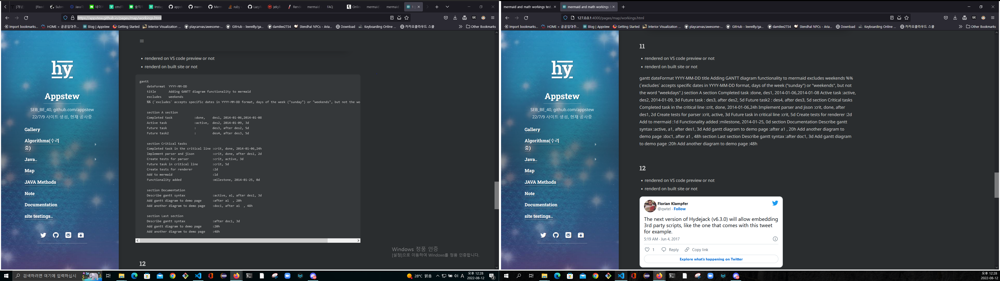
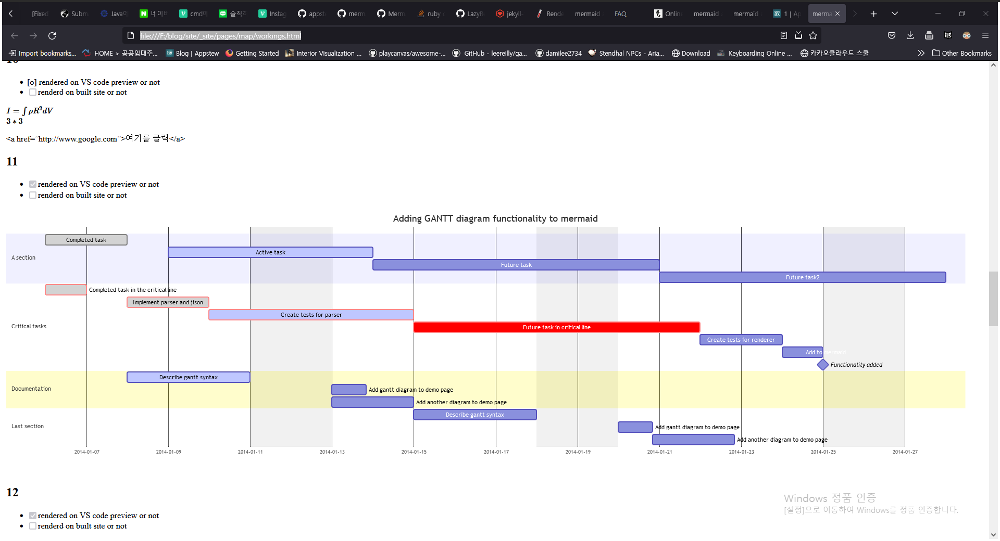
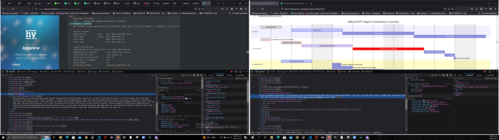

{TOC}

0. this unordered seed list will be replaced by toc as unordered list
   {:toc}


```
//관련 사이트
https://jekyllrb.com/docs/rendering-process/
https://rubygems.org/gems/jekyll-theme-hydejack
https://github.com/LazyRen/LazyRen.github.io/blob/master/Gemfile
https://stackoverflow.com/questions/46380722/jekyll-theme-could-not-be-found
https://mermaid-js.github.io/mermaid/#/


```
20220812
gem install "jekyll-theme-hydejack"
- https://stackoverflow.com/questions/46380722/jekyll-theme-could-not-be-found
- https://rubygems.org/gems/jekyll-theme-hydejack
- 드디어 hydejack gem 파일 설치 성공했다!

```

```bash
https://jekyllrb.com/docs/themes/
bundle info --path # minima, or jekyll-theme-hydejack, mermaid etc
```

```java
 Error: YAML Exception reading F:/blog/site/_posts/JAVA/chapter/2022-08-08-spring.basic.md: (<unknown>): did not find expected key while parsing a block mapping at line 2 column 1
 ```
 - 위 문제는 보통 post나 page 의 제목 부분이 [test] 로 [로 시작했기 때문. [를 안쓰면 된다.

```
//220812
그러니까 갑자기 시간이 없어 어쩔 수 없이 미루던 mermaid와 수식렌더링, 제킬 블로그 관련해서 갑자기 손을 댔다. 원래는 수업시간이지만 정말 너무 오랜만에 하고싶어서 시간가는 줄을 모르고 건드렸다..이 블로그도 별 것 아니지만 여타 블로그 한번도 운영해본적이 없던 나에게 처음 며칠밤 새고(정말 하루는 밤새고 하루는 2시간 그다음날 3시간 자거나 이런식) 만든 것이다. 그때는 피곤한 줄도 몰랐다. 그만큼 흥미가 정말 중요하다. 그 이후 부트캠프 정규 과정을 거치면서 완전 비전공인 나에게는 어렵고 흥미없는 데다가 8/1~8/10 까지 코로나 걸려서 엄청 힘들고 공부를 전혀 못했는데, 오랜만에 전공 공부를 할 의욕이 생긴 것이다. 시간이 없어서 글이 두서없고 어법이 이상한 부분이 있을테지만..이걸 다시 읽고 문법 등 깔끔하게 다시 쓸 시간이 없다..(퇴고라고 하나 어쨌든..)
지금이라도 빨리 이것 마저 완성하고 오늘자 정규 수업과정도 해야지..
```

<div>
"test"
mermaid1.svg
</div>

```
//이어서1
```
```
//이어서2
아무튼, 다음 두가지의 렌더링을 비교했다.
1. https://appstew.github.io/pages/map/workings.html // github pages
2. http://127.0.0.1:4000/pages/map/workings.html //bundle exec jekyll serve
```

<div> "test"
<svg viewBox="0 0 124.61666870117188 248" style="max-width: 124.61666870117188px;" height="248" aria-labelledby="chart-title-graph-div chart-desc-graph-div" role="img" xmlns="http://www.w3.org/2000/svg" width="100%" id="graph-div" xmlns:xlink="http://www.w3.org/1999/xlink"><style>@import url("https://cdnjs.cloudflare.com/ajax/libs/font-awesome/5.15.2/css/all.min.css");'</style><title id="chart-title-graph-div"></title><desc id="chart-desc-graph-div"></desc><style>#graph-div {font-family:"trebuchet ms",verdana,arial,sans-serif;font-size:16px;fill:#ccc;}#graph-div .error-icon{fill:#a44141;}#graph-div .error-text{fill:#ddd;stroke:#ddd;}#graph-div .edge-thickness-normal{stroke-width:2px;}#graph-div .edge-thickness-thick{stroke-width:3.5px;}#graph-div .edge-pattern-solid{stroke-dasharray:0;}#graph-div .edge-pattern-dashed{stroke-dasharray:3;}#graph-div .edge-pattern-dotted{stroke-dasharray:2;}#graph-div .marker{fill:lightgrey;stroke:lightgrey;}#graph-div .marker.cross{stroke:lightgrey;}#graph-div svg{font-family:"trebuchet ms",verdana,arial,sans-serif;font-size:16px;}#graph-div .label{font-family:"trebuchet ms",verdana,arial,sans-serif;color:#ccc;}#graph-div .cluster-label text{fill:#F9FFFE;}#graph-div .cluster-label span{color:#F9FFFE;}#graph-div .label text,#graph-div span{fill:#ccc;color:#ccc;}#graph-div .node rect,#graph-div .node circle,#graph-div .node ellipse,#graph-div .node polygon,#graph-div .node path{fill:#1f2020;stroke:#81B1DB;stroke-width:1px;}#graph-div .node .label{text-align:center;}#graph-div .node.clickable{cursor:pointer;}#graph-div .arrowheadPath{fill:lightgrey;}#graph-div .edgePath .path{stroke:lightgrey;stroke-width:2.0px;}#graph-div .flowchart-link{stroke:lightgrey;fill:none;}#graph-div .edgeLabel{background-color:hsl(0, 0%, 34.4117647059%);text-align:center;}#graph-div .edgeLabel rect{opacity:0.5;background-color:hsl(0, 0%, 34.4117647059%);fill:hsl(0, 0%, 34.4117647059%);}#graph-div .cluster rect{fill:hsl(180, 1.5873015873%, 28.3529411765%);stroke:rgba(255, 255, 255, 0.25);stroke-width:1px;}#graph-div .cluster text{fill:#F9FFFE;}#graph-div .cluster span{color:#F9FFFE;}#graph-div div.mermaidTooltip{position:absolute;text-align:center;max-width:200px;padding:2px;font-family:"trebuchet ms",verdana,arial,sans-serif;font-size:12px;background:hsl(20, 1.5873015873%, 12.3529411765%);border:1px solid rgba(255, 255, 255, 0.25);border-radius:2px;pointer-events:none;z-index:100;}#graph-div :root{--mermaid-font-family:"trebuchet ms",verdana,arial,sans-serif;}</style><g transform="translate(0, 0)"><g class="output"><g class="clusters"></g><g class="edgePaths"><g id="L-A-B" style="opacity: 1;" class="edgePath LS-A LE-B"><path style="fill:none" marker-end="url(#arrowhead14)" d="M47.462501525878906,47.44289204665813L43.306251525878906,52.369076705548444C39.150001525878906,57.29526136443875,30.837501525878906,67.14763068221937,26.681251525878906,76.24048200777635C22.525001525878906,85.33333333333333,22.525001525878906,93.66666666666667,22.525001525878906,97.83333333333333L22.525001525878906,102" class="path"></path><defs><marker orient="auto" markerHeight="6" markerWidth="8" markerUnits="strokeWidth" refY="5" refX="9" viewBox="0 0 10 10" id="arrowhead14"><path style="stroke-width: 1px; stroke-dasharray: 1px, 0px;" class="arrowheadPath" d="M 0 0 L 10 5 L 0 10 z"></path></marker></defs></g><g id="L-A-C" style="opacity: 1;" class="edgePath LS-A LE-C"><path style="fill:none" marker-end="url(#arrowhead15)" d="M76.89583587646484,47.44289204665813L81.05208587646484,52.369076705548444C85.20833587646484,57.29526136443875,93.52083587646484,67.14763068221937,97.67708587646484,76.24048200777635C101.83333587646484,85.33333333333333,101.83333587646484,93.66666666666667,101.83333587646484,97.83333333333333L101.83333587646484,102" class="path"></path><defs><marker orient="auto" markerHeight="6" markerWidth="8" markerUnits="strokeWidth" refY="5" refX="9" viewBox="0 0 10 10" id="arrowhead15"><path style="stroke-width: 1px; stroke-dasharray: 1px, 0px;" class="arrowheadPath" d="M 0 0 L 10 5 L 0 10 z"></path></marker></defs></g><g id="L-B-D" style="opacity: 1;" class="edgePath LS-B LE-D"><path style="fill:none" marker-end="url(#arrowhead16)" d="M22.525001525878906,146L22.525001525878906,150.16666666666666C22.525001525878906,154.33333333333334,22.525001525878906,162.66666666666666,26.649307250976562,171.7216561222776C30.77361297607422,180.77664557788853,39.02222442626953,190.55329115577703,43.14653015136719,195.4416139447213L47.270835876464844,200.32993673366553" class="path"></path><defs><marker orient="auto" markerHeight="6" markerWidth="8" markerUnits="strokeWidth" refY="5" refX="9" viewBox="0 0 10 10" id="arrowhead16"><path style="stroke-width: 1px; stroke-dasharray: 1px, 0px;" class="arrowheadPath" d="M 0 0 L 10 5 L 0 10 z"></path></marker></defs></g><g id="L-C-D" style="opacity: 1;" class="edgePath LS-C LE-D"><path style="fill:none" marker-end="url(#arrowhead17)" d="M101.83333587646484,146L101.83333587646484,150.16666666666666C101.83333587646484,154.33333333333334,101.83333587646484,162.66666666666666,97.70903015136719,171.7216561222776C93.58472442626953,180.77664557788853,85.33611297607422,190.55329115577703,81.21180725097656,195.4416139447213L77.0875015258789,200.32993673366553" class="path"></path><defs><marker orient="auto" markerHeight="6" markerWidth="8" markerUnits="strokeWidth" refY="5" refX="9" viewBox="0 0 10 10" id="arrowhead17"><path style="stroke-width: 1px; stroke-dasharray: 1px, 0px;" class="arrowheadPath" d="M 0 0 L 10 5 L 0 10 z"></path></marker></defs></g></g><g class="edgeLabels"><g transform="" style="opacity: 1;" class="edgeLabel"><g class="label" transform="translate(0,0)"><rect height="0" width="0" ry="0" rx="0"></rect><foreignObject height="0" width="0"><div style="display: inline-block; white-space: nowrap;" xmlns="http://www.w3.org/1999/xhtml"><span style="" class="edgeLabel L-LS-A' L-LE-B" id="L-L-A-B"></span></div></foreignObject></g></g><g transform="" style="opacity: 1;" class="edgeLabel"><g class="label" transform="translate(0,0)"><rect height="0" width="0" ry="0" rx="0"></rect><foreignObject height="0" width="0"><div style="display: inline-block; white-space: nowrap;" xmlns="http://www.w3.org/1999/xhtml"><span style="" class="edgeLabel L-LS-A' L-LE-C" id="L-L-A-C"></span></div></foreignObject></g></g><g transform="" style="opacity: 1;" class="edgeLabel"><g class="label" transform="translate(0,0)"><rect height="0" width="0" ry="0" rx="0"></rect><foreignObject height="0" width="0"><div style="display: inline-block; white-space: nowrap;" xmlns="http://www.w3.org/1999/xhtml"><span style="" class="edgeLabel L-LS-B' L-LE-D" id="L-L-B-D"></span></div></foreignObject></g></g><g transform="" style="opacity: 1;" class="edgeLabel"><g class="label" transform="translate(0,0)"><rect height="0" width="0" ry="0" rx="0"></rect><foreignObject height="0" width="0"><div style="display: inline-block; white-space: nowrap;" xmlns="http://www.w3.org/1999/xhtml"><span style="" class="edgeLabel L-LS-C' L-LE-D" id="L-L-C-D"></span></div></foreignObject></g></g></g><g class="nodes"><g transform="translate(62.179168701171875,30)" id="flowchart-A-32" style="opacity: 1;" class="node default"><rect class="label-container" height="44" width="29.433334350585938" y="-22" x="-14.716667175292969" ry="0" rx="0"></rect><g transform="translate(0,0)" class="label"><g transform="translate(-4.716667175292969,-12)"><foreignObject height="24" width="9.433334350585938"><div style="display: inline-block; white-space: nowrap;" xmlns="http://www.w3.org/1999/xhtml">A</div></foreignObject></g></g></g><g transform="translate(22.525001525878906,124)" id="flowchart-B-33" style="opacity: 1;" class="node default"><rect class="label-container" height="44" width="29.050003051757812" y="-22" x="-14.525001525878906" ry="0" rx="0"></rect><g transform="translate(0,0)" class="label"><g transform="translate(-4.525001525878906,-12)"><foreignObject height="24" width="9.050003051757812"><div style="display: inline-block; white-space: nowrap;" xmlns="http://www.w3.org/1999/xhtml">B</div></foreignObject></g></g></g><g transform="translate(101.83333587646484,124)" id="flowchart-C-35" style="opacity: 1;" class="node default"><rect class="label-container" height="44" width="29.566665649414062" y="-22" x="-14.783332824707031" ry="0" rx="0"></rect><g transform="translate(0,0)" class="label"><g transform="translate(-4.783332824707031,-12)"><foreignObject height="24" width="9.566665649414062"><div style="display: inline-block; white-space: nowrap;" xmlns="http://www.w3.org/1999/xhtml">C</div></foreignObject></g></g></g><g transform="translate(62.179168701171875,218)" id="flowchart-D-37" style="opacity: 1;" class="node clickable"><a rel="noopener" href="https://google.com" class="clickable"><rect class="label-container" height="44" width="29.816665649414062" y="-22" x="-14.908332824707031" ry="0" rx="0"></rect><g transform="translate(0,0)" class="label"><g transform="translate(-4.908332824707031,-12)"><foreignObject height="24" width="9.816665649414062"><div style="display: inline-block; white-space: nowrap;" xmlns="http://www.w3.org/1999/xhtml">D</div></foreignObject></g></g></a></g></g></g></g></svg>
</div>





<div>embed test

end of embed test
</div>

[svg]: mermaid1.svg

```html
///문제의 코드
<div class="mermaid">
gantt   
    dateFormat  YYYY-MM-DD
    title       Adding GANTT diagram functionality to mermaid
    excludes    weekends
    %% (`excludes` accepts specific dates in YYYY-MM-DD format, days of the week ("sunday") or "weekends", but not the word "weekdays".)

    section A section
    Completed task            :done,    des1, 2014-01-06,2014-01-08
    Active task               :active,  des2, 2014-01-09, 3d
    Future task               :         des3, after des2, 5d
    Future task2              :         des4, after des3, 5d

    section Critical tasks
    Completed task in the critical line :crit, done, 2014-01-06,24h
    Implement parser and jison          :crit, done, after des1, 2d
    Create tests for parser             :crit, active, 3d
    [x]     :crit, 5d
    Create tests for renderer           :2d
    Add to mermaid                      :1d
    Functionality added                 :milestone, 2014-01-25, 0d

    section Documentation
    Describe gantt syntax               :active, a1, after des1, 3d
    Add gantt diagram to demo page      :after a1  , 20h
    Add another diagram to demo page    :doc1, after a1  , 48h

    section Last section
    Describe gantt syntax               :after doc1, 3d
    Add gantt diagram to demo page      :20h
    Add another diagram to demo page    :48h
</div>
```

 ```
 이어서3
 예상했듯이 위 사진처럼 똑같이 안된다. 그런데,
 file:///F:/blog/site/_site/pages/map/workings.html
 즉 빌드 된 사이트를 파폭으로 오프라인으로 열면 제대로 렌더링된다.
 ```




```
이어서4
대체 왜...?
어쩔 수 없이 다음 두개
https://appstew.github.io/pages/map/workings.html
file:///F:/blog/site/_site/pages/map/workings.html
를 파이어폭스 인스펙터로 자세히 살펴보았다..
```


```
//이건 중간 잠깐 메모
<div class="mermaid">
  graph TD;
  A-->B;
  A-->C;
  B-->D;
  C-->D;
click D href "https://google.com"  
</div>
```

```
이어서5
둘의 코드가 약간 다르다!
왜 이런 결과가 나왔을까?..는 더이상 알아볼 시간이 없고(12:43),
당장 작동하는 해결책만 찾아보자!
당장 깃헙 블로그를 사용하는 상황에서 시간이 없지만 뭔가 힌트는 얻은 것 같다! 이제 수업으로...
```


https://rubygems.org/gems/jekyll-mermaid
https://mermaid-js.github.io/mermaid/#/integrations?id=browser-extensions
https://jekyllrb.com/resources/


http://jekyllrb.com/docs/plugins/installation/
https://rubygems.org/gems/jekyll-mermaid

여러 문제와 더불어, sidebar 엔트리 readme 파일에서 
description 내용을 한글로 할 경우 엔트리가 뜨지 않는 현상을 목격하였다.

https://jojozhuang.github.io/tutorial/jekyll-diagram-with-mermaid/

https:github.blog

https://stackoverflow.com/questions/53883747/how-to-make-github-pages-markdown-support-mermaid-diagram
https://stackedit.io/