



{:toc}

## 1

```
|--|--|--|--|--|--|--|--|
|♜| |♝|♛|♚|♝|♞|♜|
| |♟|♟|♟| |♟|♟|♟|
|♟| |♞| | | | | |
| |♗| | |♟| | | |
| | | | |♙| | | |
| | | | | |♘| | |
|♙|♙|♙|♙| |♙|♙|♙|
|♖|♘|♗|♕|♔| | |♖|
```

|--|--|--|--|--|--|--|--|
|♜| |♝|♛|♚|♝|♞|♜|
| |♟|♟|♟| |♟|♟|♟|
|♟| |♞| | | | | |
| |♗| | |♟| | | |
| | | | |♙| | | |
| | | | | |♘| | |
|♙|♙|♙|♙| |♙|♙|♙|
|♖|♘|♗|♕|♔| | |♖|

## 2

```mermaid
gantt
    [Prototype design] lasts 15 days
    [Test prototype] lasts 10 days
    -- All example --
    [Task 1 (1 day)] lasts 1 day
    [T2 (5 days)] lasts 5 days
    [T3 (1 week)] lasts 1 week
    [T4 (1 week and 4 days)] lasts 1 week and 4 days
    [T5 (2 weeks)] lasts 2 weeks
```

```mermaid
gantt
    [Prototype design] lasts 15 days
    [Test prototype] lasts 10 days
    -- All example --
    [Task 1 (1 day)] lasts 1 day
    [T2 (5 days)] lasts 5 days
    [T3 (1 week)] lasts 1 week
    [T4 (1 week and 4 days)] lasts 1 week and 4 days
    [T5 (2 weeks)] lasts 2 weeks
```

## 3

```
```mermaid + !
gantt
[Prototype design] lasts 15 days
[Test prototype] lasts 10 days
-- All example --
[Task 1 (1 day)] lasts 1 day
[T2 (5 days)] lasts 5 days
[T3 (1 week)] lasts 1 week
[T4 (1 week and 4 days)] lasts 1 week and 4 days
[T5 (2 weeks)] lasts 2 weeks
``` //
```


## 4


```
@ + startmermaid
graph TD;
A[Client] --> B[Load Balancer] 
B --> C[Server01] 
B --> D[Server02]
@ + endmermaid
```

@startmermaid
graph TD;
A[Client] --> B[Load Balancer] 
B --> C[Server01] 
B --> D[Server02]
@endmermaid

## 5
- [x] rendered on VS code preview or not
- [ ] renderd on built site or not

```
```mermaid + !
graph TD;
    A-->B;
    A-->C;
    B-->D;
    C-->D;
``` //
```



graph TD;
    A-->B;
    A-->C;
    B-->D;
    C-->D;


## 6

```
| :    Easy Multiline   : |||
| :----- | :----- | :------ |
| Apple  | Banana | Orange  \
| Apple  | Banana | Orange  \
| Apple  | Banana | Orange  
| Apple  | Banana | Orange  \
| Apple  | Banana | Orange  |
| Apple  | Banana | Orange  |
```


| :    Easy Multiline   : |||
| :----- | :----- | :------ |
| Apple  | Banana | Orange  
| Apple  | Banana | Orange  
| Apple  | Banana | Orange  |
| Apple  | Banana | Orange  \
| Apple  | Banana | Orange  |
| Apple  | Banana | Orange  |

## 7 

- IAL

```
{:color-style: style="background: black;"}
{:color-style: style="color: white;"}
{:text-style: style="font-weight: 800; text-decoration: underline;"}

|:             Here's an Inline Attribute Lists example                :||||
| ------- | ------------------ | -------------------- | ------------------ |
|:       :|:  <div style="color: red;"> &lt; Normal HTML Block > </div> :|||
| ^^      |   Red    {: .cls style="background: orange" }                |||
| ^^ IALs |   Green  {: #id style="background: green; color: white" }    |||
| ^^      |   Blue   {: style="background: blue; color: white" }         |||
| ^^      |   Black  {: color-style text-style }                         |||
```


{:color-style: style="background: black;"}
{:color-style: style="color: white;"}
{:text-style: style="font-weight: 800; text-decoration: underline;"}

|:             Here's an Inline Attribute Lists example                :||||
| ------- | ------------------ | -------------------- | ------------------ |
|:       :|:  <div style="color: red;"> &lt; Normal HTML Block > </div> :|||
| ^^      |   Red    {: .cls style="background: orange" }                |||
| ^^ IALs |   Green  {: #id style="background: green; color: white" }    |||
| ^^      |   Blue   {: style="background: blue; color: white" }         |||
| ^^      |   Black  {: color-style text-style }                         |||


## 8

- [o] rendered on VS code preview or not
- [ ] renderd on built site or not

| :        Fruits \|\| Food       : |||
| :--------- | :-------- | :--------  |
| Apple      | : Apple : | Apple      \
| Banana     |   Banana  | Banana     \
| Orange     |   Orange  | Orange     |
| :   Rowspan is 4    : || How's it?  |
|^^    A. Peach         ||   1. Fine :|
|^^    B. Orange        ||^^ 2. Bad   |
|^^    C. Banana        ||  It's OK!  |

## 9

- [o] rendered on VS code preview or not
- [ ] renderd on built site or not

| :                    MathJax \|\| Image                 : |||
| :------------ | :-------- | :----------------------------- |
| Apple         | : Apple : | Apple                          \
| Banana        | Banana    | Banana                         \
| Orange        | Orange    | Orange                         |
| :     Rowspan is 4     : || :        How's it?           : |
|     A. Peach          ||    1. ![example][cell-image]   |
|     B. Orange         ||  2. $$ I = \int \rho R^{2} dV $$ |
|     C. Banana         || **It's OK!**                   |

[cell-image]: https://jekyllrb.com/img/octojekyll.png "An exemplary image"


## 10

- [o] rendered on VS code preview or not
- [ ] renderd on built site or not

$$ I = \int \rho R^{2} dV $$  
$$ 3 * 3 $$


## 11

- [x] rendered on VS code preview or not
- [ ] renderd on built site or not


## 12


```
<script async src="//platform.twitter.com/widgets.js" charset="utf-8"></script>
<blockquote class="twitter-tweet" data-lang="en">
  <p lang="en" dir="ltr">
    The next version of Hydejack (v6.3.0) will allow embedding 3rd party scripts,
    like the one that comes with this tweet for example.
  </p>
  &mdash; Florian Klampfer (@qwtel)
  <a href="https://twitter.com/qwtel/status/871098943505039362">June 3, 2017</a>
</blockquote>
```

<script async src="//platform.twitter.com/widgets.js" charset="utf-8"></script>
<blockquote class="twitter-tweet" data-lang="en">
  <p lang="en" dir="ltr">
    The next version of Hydejack (v6.3.0) will allow embedding 3rd party scripts,
    like the one that comes with this tweet for example.
  </p>
  &mdash; Florian Klampfer (@qwtel)
  <a href="https://twitter.com/qwtel/status/871098943505039362">June 3, 2017</a>
</blockquote>

  


## 13

- [x] rendered on VS code preview or not
- [ ] renderd on built site or not

<div class="mermaid">
graph TD;
    A-->B;
    A-->C;
    B-->D;
    C-->D;
click D href "https://google.com"
</div>


## 14

```
$$
a * b = c ^ b   \\
2^{\frac{n-1}{3}}  \\  
\int\_a^b f(x)\,dx.  \\
$$

-------------------
$$
\begin{aligned} %!!15
  \phi(x,y) &= \phi \left(\sum_{i=1}^n x_ie_i, \sum_{j=1}^n y_je_j \right) \\[2em]
            &= \sum_{i=1}^n \sum_{j=1}^n x_i y_j \phi(e_i, e_j)            \\[2em]
            &= (x_1, \ldots, x_n)
               \left(\begin{array}{ccc}
                 \phi(e_1, e_1)  & \cdots & \phi(e_1, e_n) \\
                 \vdots          & \ddots & \vdots         \\
                 \phi(e_n, e_1)  & \cdots & \phi(e_n, e_n)
               \end{array}\right)
               \left(\begin{array}{c}
                 y_1    \\
                 \vdots \\
                 y_n
               \end{array}\right) \\
\end{aligned}
$$
```

$$
a * b = c ^ b   \\
2^{\frac{n-1}{3}}  \\  
\int\_a^b f(x)\,dx.  \\
$$

-------------------
$$
\begin{aligned} %!!15
  \phi(x,y) &= \phi \left(\sum_{i=1}^n x_ie_i, \sum_{j=1}^n y_je_j \right) \\[2em]
            &= \sum_{i=1}^n \sum_{j=1}^n x_i y_j \phi(e_i, e_j)            \\[2em]
            &= (x_1, \ldots, x_n)
               \left(\begin{array}{ccc}
                 \phi(e_1, e_1)  & \cdots & \phi(e_1, e_n) \\
                 \vdots          & \ddots & \vdots         \\
                 \phi(e_n, e_1)  & \cdots & \phi(e_n, e_n)
               \end{array}\right)
               \left(\begin{array}{c}
                 y_1    \\
                 \vdots \\
                 y_n
               \end{array}\right) \\
\end{aligned}
$$


## 17

<div class="mermaid">
graph TD
    A[Loading URL failed. We can try to figure out why.] -->|Decode JSON| B(Please check the console to see the JSON and error details.)
    B --> C{Is the JSON correct?}
    C -->|Yes| D(Please Click here to Raise an issue in github.<br/>Including the broken link in the issue <br/> will speed up the fix.)
    C -->|No| E{Did someone <br/>send you this link?}
    E -->|Yes| F[Ask them to send <br/>you the complete link]
    E -->|No| G{Did you copy <br/> the complete URL?}
    G --> |Yes| D
    G --> |"No :("| H(Try using the Timeline tab in History <br/>from same browser you used to create the diagram.)
    click D href "https://github.com/mermaid-js/mermaid-live-editor/issues/new?assignees=&labels=bug&template=bug_report.md&title=Broken%20link" "Raise issue"
</div>


## 19

```mermaid
gantt;
[Prototype design] lasts 15 days
[Test prototype] lasts 10 days
-- All example --
[Task 1 (1 day)] lasts 1 day
[T2 (5 days)] lasts 5 days
[T3 (1 week)] lasts 1 week
[T4 (1 week and 4 days)] lasts 1 week and 4 days
[T5 (2 weeks)] lasts 2 weeks
```


## 20

```
[Alt text](./mermaid1.svg)
```


[Alt text](./mermaid1.svg)

## 21

```

```


