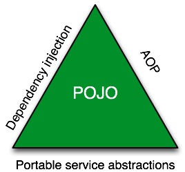
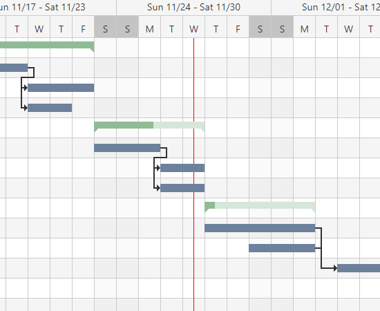
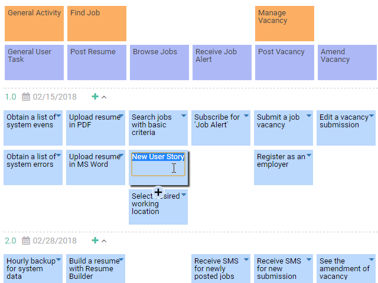
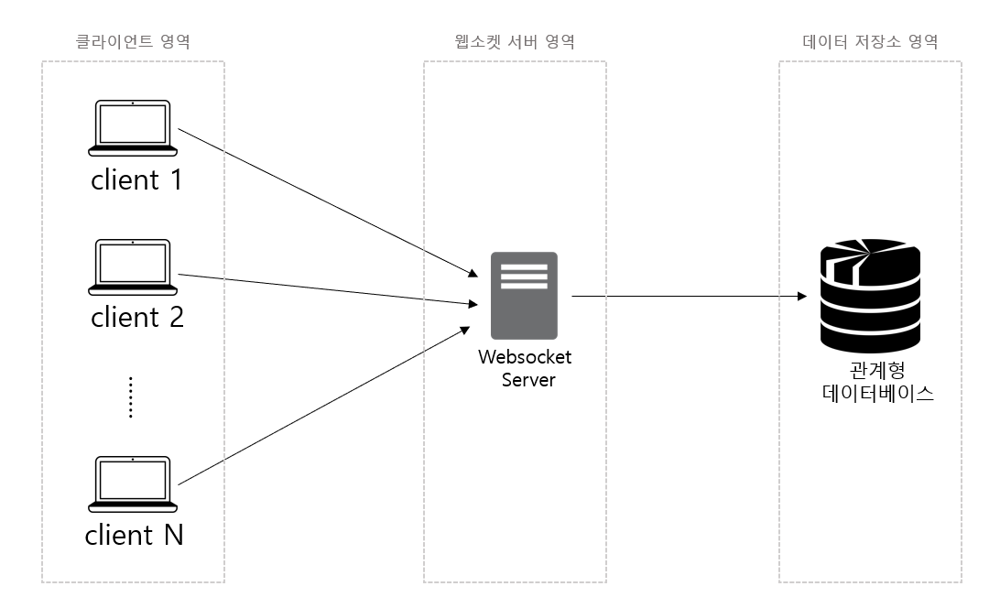
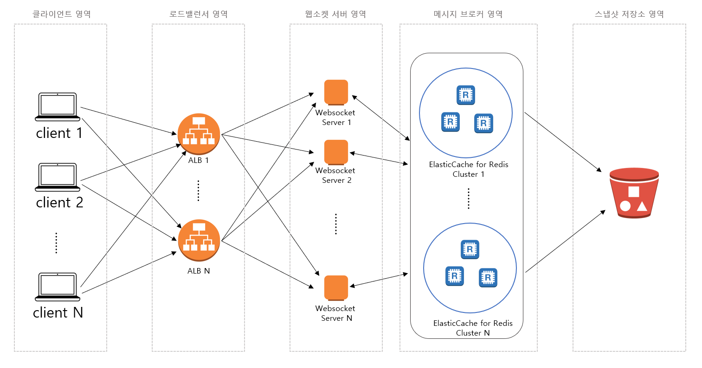
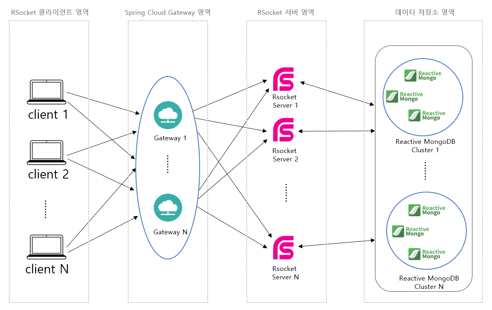
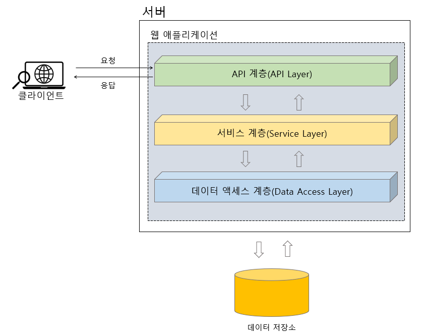

# [Spring Core]Spring Framework 기본

- JAVA 기반의 웹 앱을 만드는 다양한 기술들이 존재하는데, 그중 앞으로 우리가 배울 기술은 바로 Spring Framework 입니다.

- Spring Framework 의 핵심 개념들을 이해하는 것이 쉽지 않은 것은 사실입니다.

- 하지만 이번 유닛부터 단계적으로 천천히 그리고 포기하지말고 꾸준히 학습을 진행한다면 어느새 Spring에 익숙해져 있는 자신을 보게될 것입니다.

학습 목표

    Spring Framework이 무엇인지 이해할 수 있다.
    Spring Framework을 왜 배워야하는지 이해할 수 있다.
    Spring Framework의 아키텍처를 버드 아이 뷰 관점에서 이해할 수 있다.
    Spring Framework 모듈이 무엇이고 Spring Framework에서 지원하는 모듈에는 어떤 것이 있는지 이해할 수 있다.
    Spring Boot이 무엇이고 Spring Boot을 왜 사용해야하는지 이해할 수 있다.

## Framework 란?

- HTML5 버전에서는 지원하지 않지만 웹의 초창기 시절에는 HTML 문서를 구성하는 태그 중에서 frame 이라는 태크가 존재했습니다.
```html
<frameset cols="33%,*,33%">
    <frame name="left" src="/left_menu"/>
    <frame name="center" src="/context"/>
    <frame name="right" src="/right_menu"/>
</frameset>
```

## Spring Framework 를 배우는 이유

- 핵심 포인트  
    Spring Framework이 도입되기 전에는 JSP나 Servlet 기술을 사용한 Model1, Model2 아키텍쳐를 기반으로 한 Java 웹 애플리케이션을 제작하였다.
    Spring MVC 방식이 도입됨으로써 Java 웹 애플리케이션의 제작 방식이 획기적으로 변하게 되었다.
    Spring MVC 설정의 복잡함과 어려움을 극복하기 위해 Spring Boot이 탄생하게 되었다.

## Spring Framework 의 특징

- 개요

```
    POJO(Plain Old Java Object)
        POJO의 의미를 이해할 수 있다.
        POJO가 필요한 이유를 알 수 있다.
    IoC(Inversioin of Control)/DI(Dependency Injection)
        IoC/DI의 의미를 이해할 수 있다.
        IoC/DI가 필요한 이유를 알 수 있다.
    AOP(Aspect Oriented Programming)
        AOP의 의미를 이해할 수 있다.
        AOP가 필요한 이유을 알 수 있다.
    PSA(Portable Service Abstraction)
        PSA의 의미를 이해할 수 있다.
        PSA가 필요한 이유를 알 수 있다.
```

### 1/4 POJO (Plain Old Java Object)

- Spring triangle



1. Java나 Java의 스펙에 정의된 것 이외에는 다른 기술이나 규약에 얽매이지 않아야 한다.
2. 특정 환경에 종속적이지 않아야 한다.
    - 최대한 다른 환경이나 기술에 종속적이지 않은 POJO 프로그래밍 코드를 작성하기 위해 Spring 에서는 세가지 기술을 지원하고 있습니다.
    - 그 세가지 기술은 IoC/Di, AOP, PSA 입니다.
- 
- 심화: SOLID 원칙,

### 2/4 IoC/Di (Inversion of Control/Dependency Injection)

- 제어의 역전을 위해 의존성을 주입
- 라이브러리와 프레임워크의 차이점
    - Library는 애플리케이션 흐름의 주도권이 개발자에게 있음
    - Framework 는 애플리케이션 흐름의 주도권이 Framework에게 있음
    - 이런 흐름의 주도권이 뒤바뀐 것을 IoC 라고 한다.

- 그렇다면 Spring 에는 IoC 의 개념이 어떻게 적용되어 있을까요?
    - 답은 바로 DI(Dependency Injection) 입니다.

- 심화: <u>visual-paradigm</u> 같은 툴 사용해보기
- 심화: DL(Dependency Loopup)과 차이




### 3/4 AOP (Aspect Oriented Programming)

- 한줄요약: 중복코드 제거
- OOP (Object Oriented Programming) 가 객체지향프로그래밍 이듯이,

- AOP 는 한글로 관심지향프로그램 정도로 말 할 수 있다. 그럼 여기서 말하는 관심이란 무엇일까?
    - 아기는 키우는 방식은 부모마다 다를 것입니다. 하지만 아기의 건강은 대부분 부모의 공통된 관심사 입니다. 
    - <u>AOP에서 Aspect 는 애플리케이션에 필요한 기능 중 공통적으로 적용되는 공통 기능에 대한 관심과 관련이 있습니다.</u>
    - 공통 관심 사항: 로깅, 보안, 트랜잭션 등
    - 핵심 관심 사항: 커피 메뉴 등록, 커피 주문, 커피 주문 변경 등
- 결국 AOP 라는 것은 애플리케이션의 핵심 업무 로직에서 로깅이나 보안, 트랜잭션 같은 고옹 기능 로직들을 분리하는 것이라고 생각하면 됩니다.

- 그렇다면 애플리케이션의 핵심 로직에서 공통 기능을 분리하는 이유가 무엇일까요? 다음 각각 AOP 가 적용되지 않은 코드와 적용된 코드를 비교해보면서 AOP 가 필요한 이유를 체감해봅시다.

- 잠시, 코드를 보기 전 트랜잭션이란?
    - 트랜잭션이란 데이터를 처리하는 하나의 작업 단위를 의미합니다.
    - 커밋은 모든 작업이 성공적으로 수행되었을 경우 데이터에 반영하는 것이고,
    - 롤백은 작업이 하나라도 실패한다면 이전에 성공한 작업까지도 작업수행 이전 상태로 되돌리는 것을 말합니다.

```java
public class Example2_11 {
    private Connection connection;

    public void registerMember(Member member, Point point) throws SQLException {
        connection.setAutoCommit(false); // (1)
        try {
            saveMember(member); // (2)
            savePoint(point);   // (2)
            
            connection.commit(); // (3)
        } catch (SQLException e) {
            connection.rollback(); // (4)
        }
    }

    private void saveMember(Member member) throws SQLException {
        PreparedStatement psMember =
                connection.prepareStatement("INSERT INTO member (email, password) VALUES (?, ?)");
        psMember.setString(1, member.getEmail());
        psMember.setString(2, member.getPassword());
        psMember.executeUpdate();
    }

    private void savePoint(Point point) throws SQLException {
        PreparedStatement psPoint =
                connection.prepareStatement("INSERT INTO point (email, point) VALUES (?, ?)");
        psPoint.setString(1, point.getEmail());
        psPoint.setInt(2, point.getPoint());
        psPoint.executeUpdate();
    }
}
```

```java
@Component
@Transactional // (1)
public class Example2_12 {
    private Connection connection;

    public void registerMember(Member member, Point point) throws SQLException {
        saveMember(member);
        savePoint(point);
    }

    private void saveMember(Member member) throws SQLException {
        // Spring JDBC를 이용한 회원 정보 저장
    }

    private void savePoint(Point point) throws SQLException {
        // Spring JDBC를 이용한 포인트 정보 저장
    }
}
```

- [코드 2-12] 에는 트랜잭션 처리를 위한 코드들이 모두 사라지고 순수하게 비즈니스 로직을 처리하기 위한 saveMember(member)와 savePoint(point)만 남은 것을 볼 수 있습니다.
- 그리고 (1) 의 @Transactional 애너테이션 하나만 붙이면 Spring 내부에서 이 애너테이션 정보를 활용해서 AOP 기능을 통해 트랜잭션을 적용합니다.

### 4/4 PSA (Portable Service Abstraction)

- 한줄요약: 애플리케이션의 요구사항 변경에 유연하게 대처하자. 인터페이스를 잘 짜자.
- 운전방법만 알면 아반떼건 K5건 티볼리건 운전할 수 있다.
- Spring.basic폴더 프로젝트에 영아기 PSA 를 사용한 예를 적긴 했는데 아직 잘 모르겠다..

- 애플리케이션에서 특정 서비스를 이용할 때, '서비스의 기능을 접근하는 방식 자체를 일관되게 유지하면서 기술 자체를 유연하게 사용할 수 있도록 하는 것을 PSA(일관된 서비스 추상화)라고 합니다.

- Spring 에서 PSA가 적용된 분야로는 트랜잭션 서비스, 메일 서비스, Spring Data 서비스 등이 있습니다.

## Spring Framework 모듈 구성

### 아키텍쳐란?

- 시스템 아키텍쳐 사례



- 채팅 서버를 구축하기 위한 전통적인 시스템 아키텍쳐 사례.
    - 채팅 사용자가 많지 않다면 위 그림만으로 충분할 수도.
    - 단일 서버가 처리 할 수 있는 사용자 요청은 제한적
    - 또한 웹소켓 서버가 단일하므로 해당 서버가 다운되면 시스템 전체가 죽는 문제.



- 위 그림에서 개선된 점은 다음과 같습니다.
    - 아키텍쳐 사용자의 요청을 분산시켜주는 로드 밸런서 영역을 두어서 웹소켓 서버를 안정적으로 운영할 수 있도록 하고 있습니다.
    - 여러대의 웹소켓 서버로 사용자의 요청이 늘어나더라도 서버의 부하를 줄일 수 있으며, 특정 서버에 장애가 발생하더라도 전체 시스템이 죽는 경우를 방지할 수 있습니다.
    - 메시지 브로커 영역을 두어서 웹소켓 서버가 다중 서버로 구성되어 있더라도 특정 사용자들 간에 메시지를 주고 받을 수 있는 공유 채널을 사용하는 것이 가능해집니다.



- 위 그림에서 개선된 점은?
    - 사용자의 요청과 서버의 응답이 이루어지는 전체 영역에 걸쳐 Blocking 되는 요소가 없도록 리액티브 시스템을 구성하여 클라이언트의 요청을 보다 빠르게 처리할 수 있습니다.
    - 웹소켓이 하나의 Connection과 연결되는 것에 비해 RSocket 은 하나의 Conneection 내에서 다중 요청 처리가 가능하기 때문에 대량의 요청을 안정적으로 처리할 수 있습니다.

- 위의 것들은 예시이고, 우리가 프로젝트에서 만들게 될 시스템에 대한 아키텍쳐를 위 사례들처럼 스스로 그릴 수 있어야 합니다.

### 소프트웨어 아키텍처/ 애플리케이션 아키텍처

- 소프트웨어 아키텍처 사례의 대표적인 Java 플랫폼 아키텍처


- 다음은 우리가 앞으로 학습할 웹 애플리케이션을 계층형으로 표현한 아키텍처입니다.



- API 계층(API Layer)

- 서비스 계층(Service Layer)

- 데이터 액세스 계층(Data Access Layer)

### Spring Framework 모듈 아키텍쳐


- Spring Framework 에서 지원하는 모듈들을 아키텍쳐로 표현한 그림입니다.

- 모듈이란? 
    - Java에서는 일반적으로, 지원되는 여러 기능들을 목적에 맞게 그룹화하여 묶어 놓은 것을 말합니다
    - 이러한 모듈들은 Java 의 패키지 단위로 묶여 있으며, 이 패키지 안에는 관련 기능을 제공하기 위한 클래스들이 포함되어 있습니다.
    - 보통 모듈은 재사용 가능하도록 라이브러리 형태로 제공되는 경우가 많습니다.
- 우리가 앞으로 학습하게 될 내용들이 위 그림에 대부분 포함되어 있음^^
    - 즉 앞으로 섹션3 등에서 본격적으로 Spring 학습이 진행되고 난 이후에 이 아키텍처 그림을 보면 놀랍게도 친숙한 느낌을 받을 수도 있다고 합니다^^
    - 위 그림의 각각의 기술 스택들에 대해 살펴보려면 [link1](https://docs.spring.io/spring-framework/docs/5.0.0.M5/spring-framework-reference/html/overview.html) 


## Spring Boot 개요

- [Spring Framework을 배워야하는 이유] 챕터에서 Spring Boot 을 사용하면 Spring의 설정이 얼마나 간결해지는지 확인을 했습니다.
- 그렇다면 Spring Boot은 무엇일까요?

- Spring Framework 는 엔터프라이즈 앱을 개발하기 위한 핵심 기능을 제공하는 Spring Project 중 하나입니다.
    - Spring Boot 은 Spring Framework 의 편리함에도 불구하고 Spring 설정의 복잡함으로 인해 Spring 기반 앱 개발을 시작하기도 전에 어려움을 겪는 문제점을 해결하기 위해 생겨난 Spring Project 중 하나 입니다.

- 우리가 앞으로 학습하게 될 모든 강의 역시 Spring Boot을 기반으로 진행하게 됩니다.
- Spring Boot 에 대한 이론적인 내용들은 사실 앱개발을 진행해본 적이 없는 분들이라면 현실감 있게 와닿을 수가 없습니다.
- 따라서 이번 챕터에서는 Spring Boot 에 대한 대략적인 내용들만 이해하고, 실제로 애플리케이션 제작에 사용되는 구체적인 사용법은 section3 에서 천천히 알아가도록 하겠습니다.

## SOLID

- 개방폐쇄원칙: 수정에 대해 닫혀 있다. 

## Spring 요약
- 스프링은 좋은 객체 지향적 개발을 돕는 도구
- Framework 가 갖는 주도권
- POJO를 달성하기 위한 세가지
- 시스템 아키텍쳐
- 스프링 부트

## Spring Boot 요약


    Spring Boot은 Spring 설정의 복잡함이라는 문제점을 해결하기 위해 생겨난 Spring Project 중 하나이다.
    Spring Boot을 사용해야 하는 이유
        Spring Boot은 XML 기반의 복잡한 설계 방식을 지양한다.
        Spring Boot의 starter 모듈 구성 기능을 통해 의존 라이브러리를 자동으로 구성해준다.
        애플리케이션 설정의 자동 구성
        Spring Boot은 프로덕션급 애플리케이션의 빌드를 손쉽게 할 수 있다.
        Spring Boot은 내장된 WAS를 사용가능하기 때문에 배포가 용이하다.
    Spring Boot의 핵심 컨셉
        Spring 구성은 Spring에게 맡겨버리고 비즈니스 로직에만 집중하자!

심화 학습

    아파치 톰캣(Apache Tomcat) 이외에 Spring Boot에서 사용할 수 있는 서블릿 컨테이너(WAS라고도 부름)에는  어떤 것들이 있는지 구글에서 검색해보세요.

- 클린 코드, 토비 앤 스프링, 객체지향의 사실과 오해