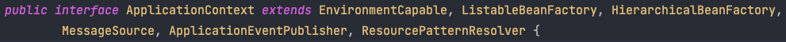
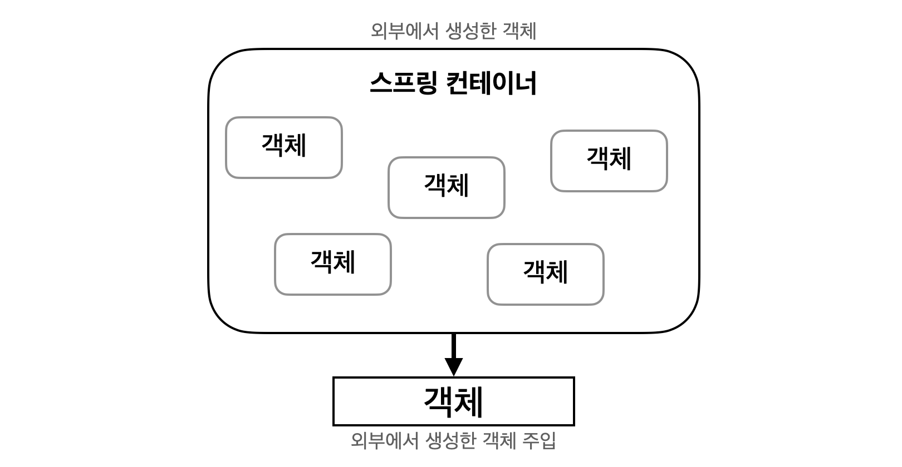
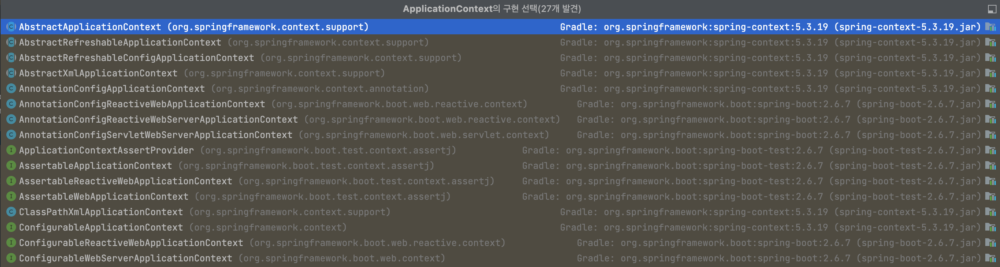
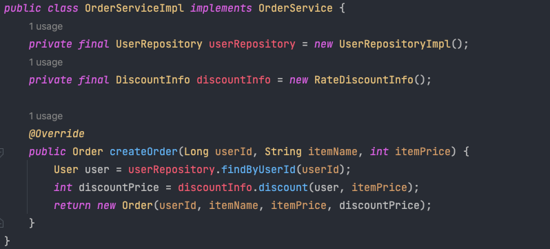
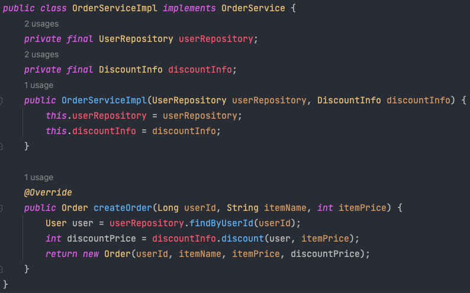
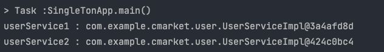
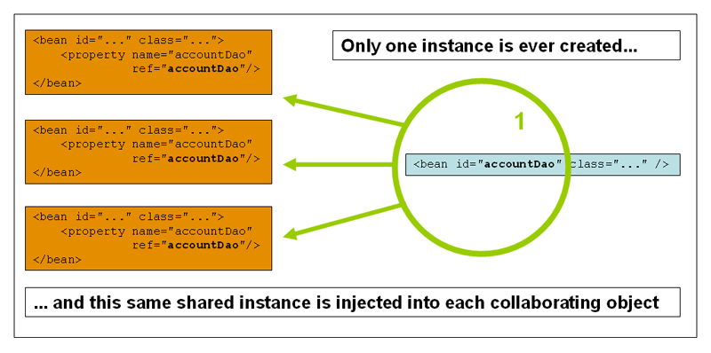
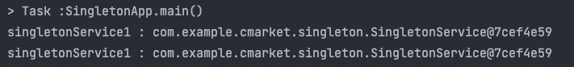
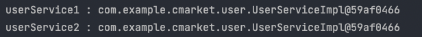
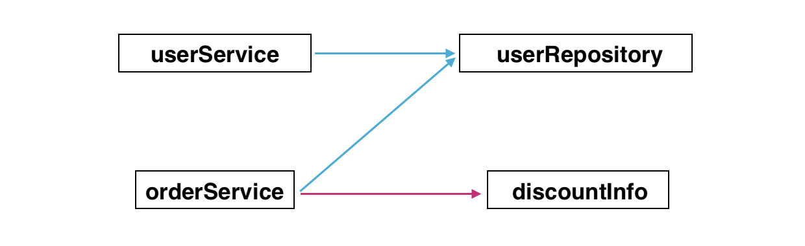

# [Spring Core]Spring Framework 의 핵심 개념

> 학습 목표  

- Spring Framework 의 핵심 개념이 필요한 이유를 이해할 수 있다.

- DI(Dependency Injection, 의존성 주입) 이 어떤 방식으로 구현되는지 설명할 수 있다.

- 객체 지향 설계에서 AOP 가 필요한 이유를 설명할 수 있다.

- Spring Framework에서 AOP 가 어떤 방식으로 구현되는지 설명할 수 있다.

- 흔히 그냥 생성자를 많이 쓰는데, 그것의 배경, 다른 방법과의 차이

- [https://start.spring.io/](https://start.spring.io/)

# DI (Dependency Injection)

## Spring 컨테이너와 빈(Bean)

- ApplicationContext 를 스프링 컨테이너라고 하고 인터페이스로 구현되어 있습니다(다형성 적용)
  
  



### Why? 스프링 컨테이너 왜 사용?

    - 객체를 사용하기 위해 new 생성자를 써야 했습니다.
    - 애플리케이션에서 이런 객체가 무수히 많이 존재하고 서로 참조하게 되어 있었습니다.
        - 서로 참조가 심할수록 의존성이 높다고 표현합니다.
        - 낮은 결합도와 높은 캡슐화가 객체지향프로그래밍의 핵심 중 하나입니다.
        - 따라서 높은 의존성은 객체지향적이지 못하다고 말할 수 있습니다.
     - 객체 간의 의존성을 낮추기 위해 스프링 컨테이너가 사용됩니다.

```java
// Spring Container 생성
ApplicationContext applicationContext = new AnnotationConfigApplicationContext(AppConfig.class);
```

- How? 

- ApplicationContext 인터페이스 구현체 확인법(intelliJ)
  
  - Mac(Cmd+O), Windows(Ctrn+N) -> ApplicationContext 검색



### 스프링 컨테이너의 종류

- BeanFactory
  
  - 스프링 컨테이너의 최상위 인터페이스 입니다
  - 

- ApplicationContext
  
  - BeanFactory의 기능을 상속받아 제공합니다.

### 컨테이너 인스턴스화

- ApplicationContext 생성자에 제공된 위치 경로 또는 경로는 컨테이너가 로컬 파일 시스템, Java CLASSPATH 등과 같은 다양한 외부 리소스로부터 구성 메타데이터를 로드할 수 있도록 하는 리소스 문자열입니다.

```java
  // Annotation
  ApplicationContext context = new AnnotationConfigApplicationContext(AppConfig.class);


// XML
ApplicationContext context = new ClassPathXmlApplicationContext("services.xml", "daos.xml");
```

### new와 생성자 주입 코드 차이점

- 기존 new를 통해 직접 객체 생성 방식



- 생성자 주입을 통해 IoC & DI



- new 를 사용하는 대신 생성자를 통해 의존 객체가 주입되고, 느슨한 의존 관계가 이루어집니다.
- userRepository 와 discountInfo 의 구현 클래스는 Bean 설정에 따라서 유연하게 변합니다.
- OrderServiceImpl 입장에서는 생성자를 통해 어떤 구현 객체가 주입될지 알 수 없으며, 알 필요도 없습니다.
- 어떤 객체가 주입될지는 외부 (AppConfig) 에서 결정하게 됩니다.
- OrderServiceImpl 은 오로지 실행에만 집중하게 됩니다.

## 빈(Bean)

- 스프링 컨테이너에 의해 관리되는 재사용 소프트웨어 컴포넌트이다.
  
  - 빈은 인스턴스화된 객체를 의미
  
  - 스프링 컨테이너에 등록된 객체를 스프링 빈이라고 합니다.
  
  - @Bean 이 적힌 메서드를 모두 호출해서 반환된 객체를 스프링 컨테이너에 등록합니다.
  
  - 빈은 클래스의 등록정보, 게터/세터 메서드를 포함합니다.
  
  - 빈은 컨테이너에 사용되는 설정 메타데이터로 생성되비니다.
  
  - 설정 메타데이터
    
    - XML 또는 자바 애너테이션, 자바 코드로 표현
    - 컨테이너의 명령과 인스턴스화, 설정, 조립할 객체를 정의
  
  - bean 접근 방법
    
    - ApplicationContext 를 사용하여 bean 정의를 읽고 액세스할 수 있습니다,

```java
// create and configure beans
      ApplicationContext context = new ClassPathXmlApplicationContext("services.xml", "daos.xml");


// retrieve configured instance
PetStoreService service = context.getBean("cmarket", cmarketService.class);

// use configured instance
List<String> userList = service.getUsernameList();
```

- getBean 을 사용하여 bean 의 인스턴스를 가져올 수 있습니다.
- ApplicationContext 인터페이스는 bean 을 가져오는 몇가지 방법들이 있습니다.
- 실제 응용 프로그램 코드에서는 getBean() 메서드로 호출하여 사용하면 안됩니다.
  - 이유는 [IoC/Di](https://urclass.codestates.com/content/e6ba4c30-cb11-44ff-9dc2-28ee8b5f0912?playlist=2029)

## 빈 스코프(Bean Scope)

> 이번 DI/AOP 클래스는 인텔리제이 OrderApp 에서 실습 위주로 진행이 된다.







- 싱글톤 방식 결과



## Java 기반 컨테이너 설정



- 위에 있는 의존관계가 설정되는 이유에 대해 모르시겠는 경우에는 넘어가지마시고 **`반드시`** 이해가 될 때까지 학습하시고 **확실하게 이해**가 되면 넘어가시기를 권장합니다.
- 위에 있는 의존관계를 모두 이해하셨다면 현재는 스프링 빈을 등록하면 생성자를 호출하면서 **의존관계 주입도 한번에 처리된다**는 점을 기억하시고 다음 학습을 진행해주시기 바랍니다.
- 

## 220812 금요일 오후 5시 줌 세션 이정민님

- 인터페이스는, 추상화가 되어있다는 의미

- 유연한 확장, 결합력 낮추기, 객체지향적

- Spring bean 도 객체다.
  
  - 정의? : 스프링 컨테이너가 관리하는 객체
  - 설정 정보와 함께 스프링 컨테이너에 등록된 객체를 의미함

- 

- Java Bean vs Spring Bean
  
  - 둘은 분명히 다름
  - Java Beean 의 경우 단순하게 클래스에서 게터 세터만 가지고 있는 클래스를 의미함

```java
///
public class Car {
String name;

public String getName {
return name;
}
public void setName(String name) {
this.name = name;
}
}
```

- 추상화

- AppConfig.class 로 만들었지만 appConfig.xml 이나 appConfig.xxx 등으로도 만들 수 잇다.
	- AppConfig.class 의 메타정보가 BeanDefinition 에 전달되고, 이를 스프링 컨테이너가 과ㅗㄴ리한다.
    - 모두 추상화가 이루어지고 있는데, 만약 추상화 안하면 객체마다 일일이 그때그때 메타정보를 바꿔줘야 한다.
    
- getBean() 실제 쓰면 안좋은 이유: 제어의 역전이 깨짐. 제어권이 스프링 컨테이너에서 개발자로 넘어가므로. 

- 애너테이션: @Configuration @Bean @ComponentScan @Component @Controller
	- @Bean 과 @Component 의 차이는?; 빈은 메서드에 컴포넌트는 클래스에 쓴다.
    	- 근데 왜 나눠쓸까?:
    
    
