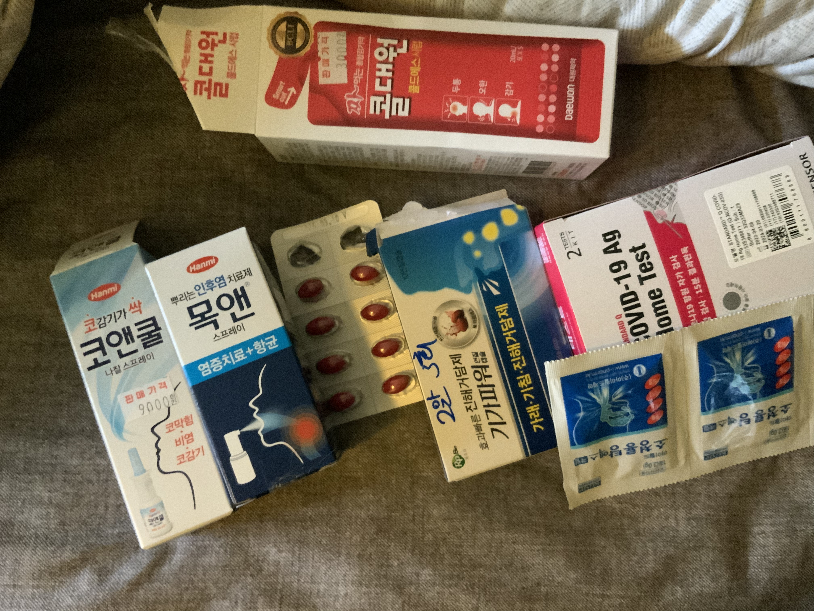
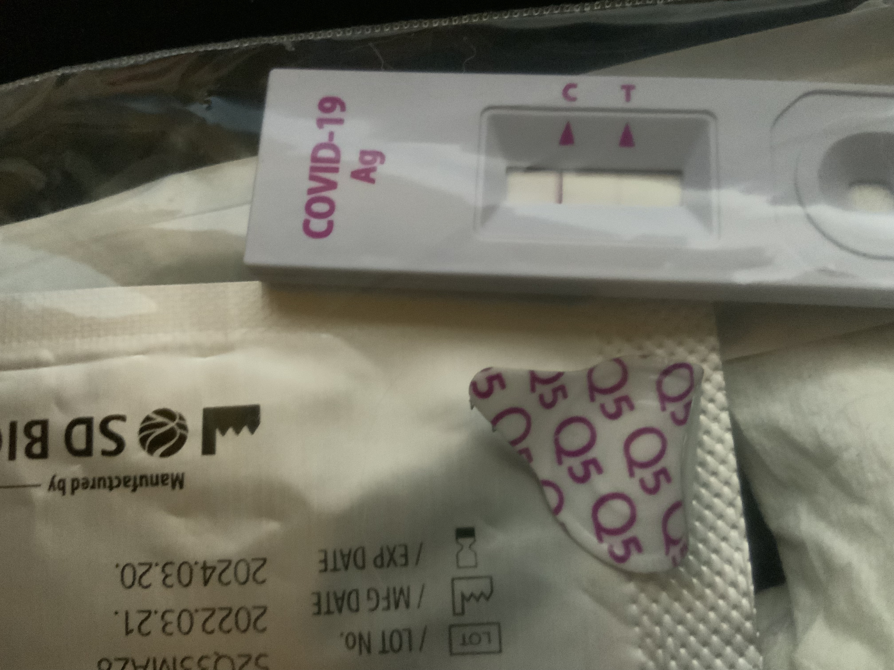

- 8/4 어제 밤에 코로나 양성 확인하고 아침까지 늦게까지 잤다..
- 사진에 잘 안보이지만 희미하게 T 줄이 있다..

## 아침 줌 세션.

- developers.naver.com 에 파파고나 클로바 등 여러가지 재밌는  API 등이 있다.

- 이를 POSTMAN 으로 어제처럼 할 수 있다.

- 데이터베이스. 기술 면접 단골. 중요.

## 8/5 줌 세션.

- RDBMS

- CRUD
    - create, read, update, delete

- SQL: mysql, mariadb, sqlite

- NoSQL: mongodb, redis, amazon dynamodb

- sql vs Nosql 차이: structured vs Un-structured data

- SQL 의 Primary key vs Foreign key 
    - PK: 반드시 고유값을 가져야 하고 null, 빈 값을 가질 수 없다.
    - 하나의 테이블은 하나의 pk 만 가질 수 있다. 다만 여러 개의 컬럼을 가질 수 있다.
    - 가령 하나의 pk 란 주민 번호 같은 것, 나머지 컬럼은 가령 성, 이름, 성별 같은 것.
    - 근데 가령 예약 상황에서, pk를 이름으로 지정해버리면 그 사람은 평생 한번 밖에 예약을 못함
    - FK: 

- varchar(??) 란?

- 가령 한명의 유저가 여러 주문을 하는 것을 1:다 상황.
    - 하나의 주문에는 여러개의 상품이 담길 수 있다.
    - 하나의 상품은 여러 개의 주문에 묶일 수 있다.

