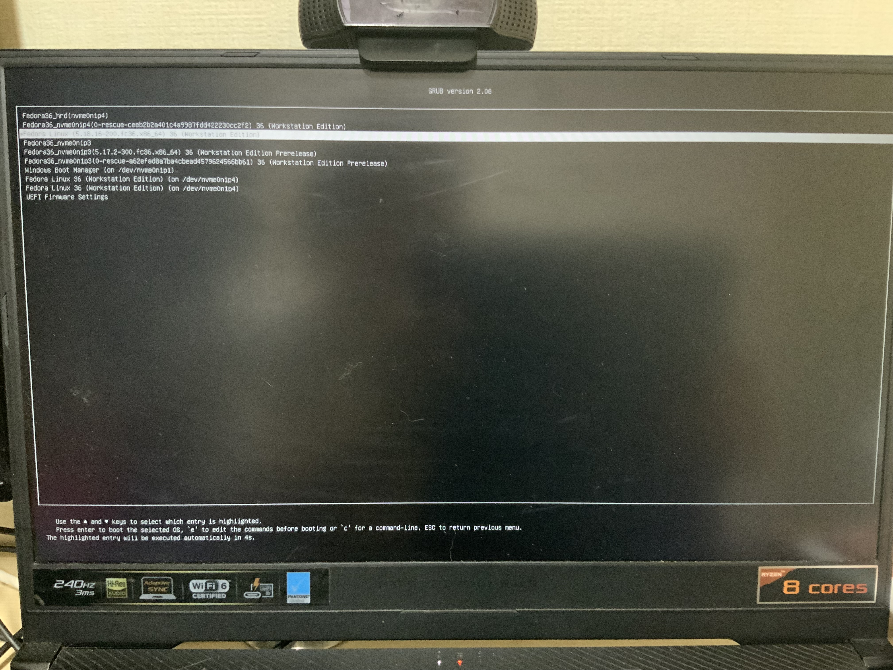

# 하기 전 상태(사진)

- 부트로더..정리해야겠다.



- nvme0n1p1


- nvme0n102


- nvme0n1p1 을 nautilus 로 열어본 모습입니다.


# 배경

- 원래는 nvme0n1p3(세번째 파티션)까지만 있고 그 뒤는 없었습니다.
- 개발환경을 위해 200G 짜리 새 페도라를 깔고자 했습니다.
- 근데 깔다보니(중간에 멈췄지만) 기존 3개에 별도로 추가 3개의 파티션을 생성하는 게 아니겠습니까? 
- 비효율적이죠..과거 윈도우 10 은 파티션 막 4개인가 설치됐던 것 같은데 아무튼 지저분하고 싫어요.
- 그리고 보통 앞 2개는 커널파일, 부트로더파일 이고 용량도 적은데 굳이 여러개를 만들 필요가 없다고 생각했습니다...


# 준비

- 몇 달 전이라 커맨드를 까먹어 
```bash
history 2000 > history2000.txt
```
를 하고 관련 명령어를 찾았습니다.
```bash
grubby
efibootmgr
grub2-editenv
sudo grubby --info=ALL
git clone https://github.com/Elinvention/efiboots.git

python3 efiboots
```
`sudo grubby --info=ALL 명령어를 치면 다음 사진들을 볼 수 있습니다.


- 지금 부팅한 4번째 파티션이 grubby 했을 때의 UUID 동일한 것을 알 수 있다. 
- 또한 해당 파티션에 지정된 두개의 커널을 확인할 수 있다.


- 그리고 첫번째 파티션을 열고 들어가 보면 실제로 커널과 관련 파일들이 보인다.

- 그래서 2번째 파티션의 모든 파일을 첫번째 파티션으로 옮기고 마운트 지점을 /boot/efi 가 아닌 /boot 으로 설정했다.
- 그 후 만약을 대비해 2번째파티션(기존 /boot 로 마운트되던 지점)의 파티션을 img파일로 떠서 2TB/resources 폴더에 넣어놓았다.
- 그리고 용감하게도(!) 2번째 파티션을 그냥 제거하고 free space 가 되게 하고 재부팅을 했다.

- !!! 

- 그리고, 부팅실패..grub> 가 뜨기 시작했다....

- 이런 문제가 발생한 이유는 grub 또는 grub2 폴더를 복사하지 않아서 같은데, 커널과 loader 파일 등만 옮겨서 grub2 부트로더가 없어서 생긴 결과인 것 같다.

- 어쨌든 다음의 명령어를 치고 ubuntu_server_legacy.iso 파일로 부팅해서 어드밴스드모드에서 grub.cfg 등을 살리려고 해봤지만, 거기선 mkconfig 등도 먹히지 않고 방법을 찾는다 해도 너무 오래 걸릴 것 같았다.


- 그래서 그냥 안쓰는 usb에 우분투서버 레거시 설치..


- 사진에 보면 우분투 서버 설치 중에 update-grub 을 실행하는 게 보였고 사진은 못 찍었지만 그 전에 흔히 mkconfig 명령어 칠 때 나오는 메시지인 "looking for other linux installations..." 같은 메시지를 볼 수 있었다. 

- 그리고 재부팅 했더니 nvme0n1p3 부트로더는 없지만 다행히도 nvme0n1p4(두번째 페도라) 의 부트로더가 살아났고 부팅 성공해서 바로 스크린샷을 찍고 지금 이 기록을 남기고 있다.


- 일단, usb 에 깔린 정상 작동하는 grub.cfg 파일을 이해해보자.
```grub
125 ### BEGIN /etc/grub.d/10_linux ###
```
```
//145~169
menuentry 'Ubuntu' --class ubuntu --class gnu-linux --class gnu --class os $menuentry_id_option 'gnulinux-simple-ca4c9d10-ec50-4277-bd7a-4a828f4d2690' {
	recordfail
	load_video
	gfxmode $linux_gfx_mode
	insmod gzio
	if [ x$grub_platform = xxen ]; then insmod xzio; insmod lzopio; fi
	insmod ext2
	set root='hd1'
	if [ x$feature_platform_search_hint = xy ]; then
	  search --no-floppy --fs-uuid --set=root --hint-bios=hd1 --hint-efi=hd1 --hint-baremetal=ahci1  ca4c9d10-ec50-4277-bd7a-4a828f4d2690
	else
	  search --no-floppy --fs-uuid --set=root ca4c9d10-ec50-4277-bd7a-4a828f4d2690
	fi
	linux	/boot/vmlinuz-5.4.0-42-generic root=UUID=ca4c9d10-ec50-4277-bd7a-4a828f4d2690 ro  quiet splash $vt_handoff
	initrd	/boot/initrd.img-5.4.0-42-generic
}
```
```
//170~206
submenu 'Advanced options for Ubuntu' $menuentry_id_option 'gnulinux-advanced-ca4c9d10-ec50-4277-bd7a-4a828f4d2690' {
	menuentry 'Ubuntu, with Linux 5.4.0-42-generic' --class ubuntu --class gnu-linux --class gnu --class os $menuentry_id_option 'gnulinux-5.4.0-42-generic-advanced-ca4c9d10-ec50-4277-bd7a-4a828f4d2690' {
		recordfail
		load_video
		gfxmode $linux_gfx_mode
		insmod gzio
		if [ x$grub_platform = xxen ]; then insmod xzio; insmod lzopio; fi
		insmod ext2
		set root='hd1'
		if [ x$feature_platform_search_hint = xy ]; then
		  search --no-floppy --fs-uuid --set=root --hint-bios=hd1 --hint-efi=hd1 --hint-baremetal=ahci1  ca4c9d10-ec50-4277-bd7a-4a828f4d2690
		else
		  search --no-floppy --fs-uuid --set=root ca4c9d10-ec50-4277-bd7a-4a828f4d2690
		fi
		echo	'Loading Linux 5.4.0-42-generic ...'
		linux	/boot/vmlinuz-5.4.0-42-generic root=UUID=ca4c9d10-ec50-4277-bd7a-4a828f4d2690 ro  quiet splash $vt_handoff
		echo	'Loading initial ramdisk ...'
		initrd	/boot/initrd.img-5.4.0-42-generic
	}
	menuentry 'Ubuntu, with Linux 5.4.0-42-generic (recovery mode)' --class ubuntu --class gnu-linux --class gnu --class os $menuentry_id_option 'gnulinux-5.4.0-42-generic-recovery-ca4c9d10-ec50-4277-bd7a-4a828f4d2690' {
		recordfail
		load_video
		insmod gzio
		if [ x$grub_platform = xxen ]; then insmod xzio; insmod lzopio; fi
		insmod ext2
		set root='hd1'
		if [ x$feature_platform_search_hint = xy ]; then
		  search --no-floppy --fs-uuid --set=root --hint-bios=hd1 --hint-efi=hd1 --hint-baremetal=ahci1  ca4c9d10-ec50-4277-bd7a-4a828f4d2690
		else
		  search --no-floppy --fs-uuid --set=root ca4c9d10-ec50-4277-bd7a-4a828f4d2690
		fi
		echo	'Loading Linux 5.4.0-42-generic ...'
		linux	/boot/vmlinuz-5.4.0-42-generic root=UUID=ca4c9d10-ec50-4277-bd7a-4a828f4d2690 ro recovery nomodeset dis_ucode_ldr 
		echo	'Loading initial ramdisk ...'
		initrd	/boot/initrd.img-5.4.0-42-generic
	}
}
```
```
//208
### END /etc/grub.d/10_linux ###
```

- 그리고 이제 대망의 nvme0n1p4 페도라 부트로더 부분

```
//217
### BEGIN /etc/grub.d/30_os-prober ###
```
```
//217~258
### BEGIN /etc/grub.d/30_os-prober ###
menuentry 'Fedora Linux 36 (Workstation Edition) (on /dev/nvme0n1p4)' --class fedora --class gnu-linux --class gnu --class os $menuentry_id_option 'osprober-gnulinux-simple-ade81d79-30b9-43a6-b028-629b9c9aa517' {
	insmod part_gpt
	insmod ext2
	if [ x$feature_platform_search_hint = xy ]; then
	  search --no-floppy --fs-uuid --set=root  ade81d79-30b9-43a6-b028-629b9c9aa517
	else
	  search --no-floppy --fs-uuid --set=root ade81d79-30b9-43a6-b028-629b9c9aa517
	fi
	linux /boot/vmlinuz-0-rescue-ceeb2b2a401c4a9987fdd422230cc2f2 root=/dev/nvme0n1p4
	initrd /boot/initramfs-0-rescue-ceeb2b2a401c4a9987fdd422230cc2f2.img
}
submenu 'Advanced options for Fedora Linux 36 (Workstation Edition) (on /dev/nvme0n1p4)' $menuentry_id_option 'osprober-gnulinux-advanced-ade81d79-30b9-43a6-b028-629b9c9aa517' {
	menuentry 'Fedora Linux 36 (Workstation Edition) (on /dev/nvme0n1p4)' --class gnu-linux --class gnu --class os $menuentry_id_option 'osprober-gnulinux-/boot/vmlinuz-0-rescue-ceeb2b2a401c4a9987fdd422230cc2f2--ade81d79-30b9-43a6-b028-629b9c9aa517' {
		insmod part_gpt
		insmod ext2
		if [ x$feature_platform_search_hint = xy ]; then
		  search --no-floppy --fs-uuid --set=root  ade81d79-30b9-43a6-b028-629b9c9aa517
		else
		  search --no-floppy --fs-uuid --set=root ade81d79-30b9-43a6-b028-629b9c9aa517
		fi
		linux /boot/vmlinuz-0-rescue-ceeb2b2a401c4a9987fdd422230cc2f2 root=/dev/nvme0n1p4
		initrd /boot/initramfs-0-rescue-ceeb2b2a401c4a9987fdd422230cc2f2.img
	}
	menuentry 'Fedora Linux 36 (Workstation Edition) (on /dev/nvme0n1p4)' --class gnu-linux --class gnu --class os $menuentry_id_option 'osprober-gnulinux-/boot/vmlinuz-5.18.10-200.fc36.x86_64--ade81d79-30b9-43a6-b028-629b9c9aa517' {
		insmod part_gpt
		insmod ext2
		if [ x$feature_platform_search_hint = xy ]; then
		  search --no-floppy --fs-uuid --set=root  ade81d79-30b9-43a6-b028-629b9c9aa517
		else
		  search --no-floppy --fs-uuid --set=root ade81d79-30b9-43a6-b028-629b9c9aa517
		fi
		linux /boot/vmlinuz-5.18.10-200.fc36.x86_64 root=/dev/nvme0n1p4
		initrd /boot/initramfs-5.18.10-200.fc36.x86_64.img
	}
}

set timeout_style=menu
if [ "${timeout}" = 0 ]; then
  set timeout=10
fi
### END /etc/grub.d/30_os-prober ###
```

- 아마 이번에 부트로더가 망가지고 grub> 으로 들어가진 이유는 내가 grub2 폴더를 복사하지 않아서인 듯 하다.
- 기존의 /boot 에 마운트되던 지점 안의 grub2 폴더 안의 내용과 비교화면 확실히 다르다.


- 그럼 여기서 질문. 왜 첫째리눅스 부트로더는 없고 두번째것(현재 nvme0n1p4)만 있을까? 한번 알아보자


