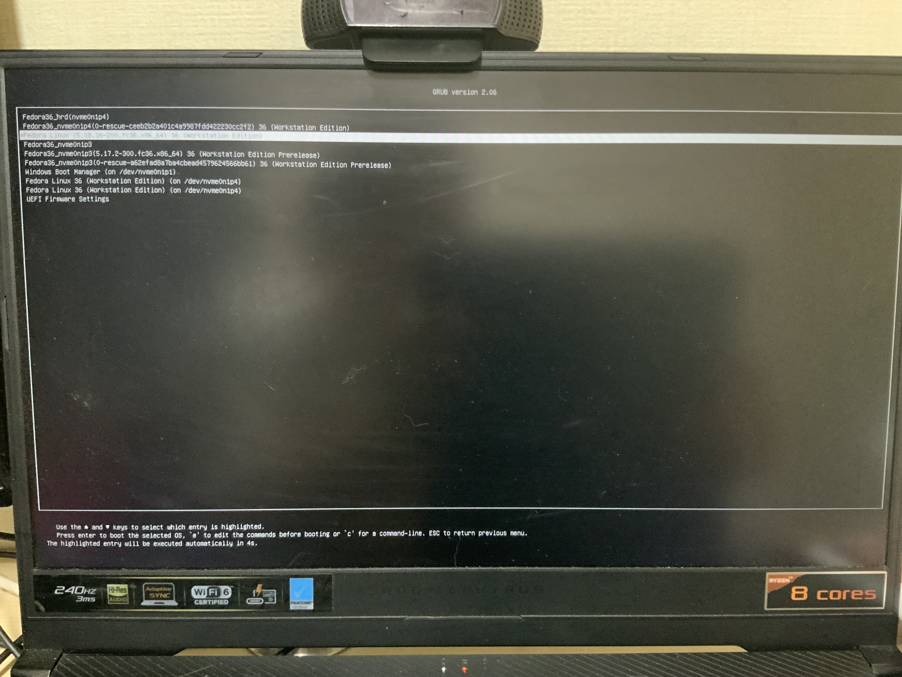

# 하기 전 상태(사진)

- 부트로더..정리해야겠다.



- nvme0n1p1


- nvme0n102


- nvme0n1p1 을 nautilus 로 열어본 모습입니다.


# 배경

- 원래는 nvme0n1p3(세번째 파티션)까지만 있고 그 뒤는 없었습니다.
- 개발환경을 위해 200G 짜리 새 페도라를 깔고자 했습니다.
- 근데 깔다보니(중간에 멈췄지만) 기존 3개에 별도로 추가 3개의 파티션을 생성하는 게 아니겠습니까? 
- 비효율적이죠..과거 윈도우 10 은 파티션 막 4개인가 설치됐던 것 같은데 아무튼 지저분하고 싫어요.
- 그리고 보통 앞 2개는 커널파일, 부트로더파일 이고 용량도 적은데 굳이 여러개를 만들 필요가 없다고 생각했습니다...


# 준비

- 몇 달 전이라 커맨드를 까먹어 
```bash
history 2000 > history2000.txt
```
를 하고 관련 명령어를 찾았습니다.
```bash
grubby
efibootmgr
grub2-editenv
sudo grubby --info=ALL
git clone https://github.com/Elinvention/efiboots.git

python3 efiboots
```
`sudo grubby --info=ALL 명령어를 치면 다음 사진들을 볼 수 있습니다.


- 지금 부팅한 4번째 파티션이 grubby 했을 때의 UUID 동일한 것을 알 수 있다. 
- 또한 해당 파티션에 지정된 두개의 커널을 확인할 수 있다.


- 그리고 첫번째 파티션을 열고 들어가 보면 실제로 커널과 관련 파일들이 보인다.