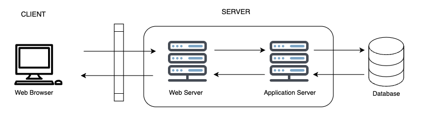
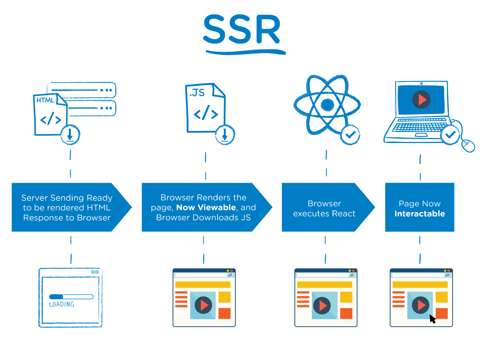
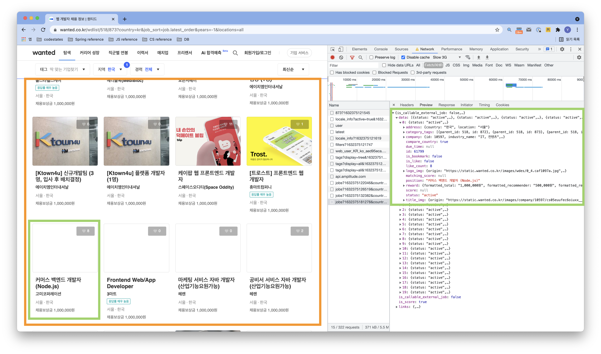

# Web

- web. 1989년 입자물리연구소(CERN) 이 제안한 하이퍼텍스트, HTML와 인터넷이 융합하여 탄생함.

## 웹 애플리케이션 아키텍쳐



- "웹 애플리케이션의 안보이는 영역엥서는 어떤 방식으로 작동하는지 아는 데로 설명해 주세요" 라는 질문을 받는다면?

- "클라이언트의 요청은 서버에 도달하고, 서버에서는 요청에 따른 back-end 로직을 실행한다. 그 이후, 서버는 이를 클라이언트에 돌려주고 클라이언트는 화면에 표시합니다."

- 맞긴 한데, 뭔가 부족.

### 웹 애플리케이션 아키텍쳐란?

- 질문:

```
    naver.com 은 ‘website’ 일까요 OR ‘web application’ 일까요?
    facebook.com 은 ‘website’ 일까요 OR ‘web application’ 일까요?
```

- 동적 페이지를 포함하고 있고, 엄밀히 말해서 웹 애플리케이션이 맞다!

- 그럼 웹 애플리케이션 아키텍쳐란? 

- 웹 애플리케이션과 유저 간의 상호작용을 유지시키는 아키텍쳐, 즉 뼈대.

-그리고 흔히 웹 애플리케이션의 상호작용은 찰나에 이루어지므로, 다음을 고려해야 합니다.
    - 신뢰성(reliability)
    - 확장성(scalability)
    - 보안성(security)
    - 견고성(robustness)

## 웹 애플리케이션의 요청 흐름

```
    브라우저에 https://urclass.codestates.com 를 입력합니다.
    브라우저는 URL을 입력 받으면 서버의 주소를 찾기 위해 DNS 서버에 요청을 보냅니다.
    IP 주소를 찾으면 해당 주소에 HTTPS 요청을 보냅니다. 이미 방문 기록이 캐시 메모리에 있으면 주소를 캐시 메모리에서 가져옵니다.
    웹서버에 요청이 도착 합니다.
    웹서버는 저장소에 요청을 보내 페이지 관련 데이터들을 가져옵니다.
    정보들은 가져오는 중에 비지니스 로직이 작용합니다.
    비지니스 로직들은 각 데이터들을 어떻게 다룰지가 정해져 있습니다.
    로직들을 통해 요청 받은 데이터들이 처리되고 브라우저에 응답합니다.
    요청들이 브라우저에 응답으로 돌아왔을 때, web page 화면에서 출력됩니다.
```

- 웹 애플리케이션은 client-side, server-side 로 나뉘어 작동합니다.
  - Client-side 는 주로 HTML, CSS, JavaScript 의 언어로 조합되어 있습니다.
  - Server-side 는 주로 Java, Python, JavaScript, C#, PHP, Ruby_on_Rails 등 서버사이드 에서 실행 가능하고 HTTP 요청에 응답할 수 있는 언어들이 사용됩니다.

## 웹 애플리케이션의 구현방식

- 크게 세 가지.
  
  - Single Page Application
  
  - Microservice architecture
  
  - Serverless Architecture

## HTTP

- HyperText Transfer Protocol 로, 브라우저 상에서 클라이언트와 서버간의 통신을 담당하는 프로토콜 입니다. 

## Cookie 와 Session

- 쿠키: 웹 애플리케이션을 사용하는 유저의 정보를 클라이언트에 보관하고, 다음에 그 정보를 서버로 보내서 유저를 서버가 식별하게 합니다. 가령, 저장된 비밀번호, 브라우저 설정 등.
- 세션: session-Id 라는 고유 아이디를 할당해서 유저를 식별합니다. 단순하고 유출이 되면 안되는 정보는 서버에서 관리를 하면서 세션 ID 와 매칭해서 저장해 관리합니다. 
- 주로 사용되는 방법은, 세션정보는 쿠키에서 관리하고, 실제 매칭되는 값들은 서버 측에서 관리하는 것이 일반적입니다.

## 사용자 인증

- 기존에는 비밀번호, 최근에는 물리적 하드웨어 토큰, OTP, OAuth, 온라인 자격증명 서비스

```
//블로깅 주제
- Microservices Architecture 는 추가로 어떤 장점이 있고 어떤 경우에 사용하면 좋을까요?
- Serverless Architecture 도
```

## SSR 과 CSR

- SSR 은 Server Side Rendering 의 줄임말로, 서버에서 렌더링

- [SEO, Search Engine Optimization](https://en.wikipedia.org/wiki/Search_engine_optimization) 가 우선순위 인 경우, 일반적으로 SSR 을 사용

- 첫 화면의 빠른 렌더링이 필요한 경우에도 단일 파일의 용량이 작은 SSR 이 적합

- 웹 페이지가 사용자와 상호작용이 적은 경우도 SSR 을 활용할 수 있습니다.
  

- CSR 은 Client Side Rendering의 준말로, 클라이언트단에서 렌더링.

- SEO가 우선순위가 아닌 경우, CSR을 이용할 수 있다.

- 사이트에 풍부한 상호 작용이 있는 경우, CSR 은 빠른 라우팅으로 강력한 사용자 경험을 제공합니다.

- 웹 애플리케이션을 제작하는 경우, CSR 로 더 나은 사용자 경험(빠른 동적 렌더링)을 제공할 수 있습니다.

- Risks of CSR
  
  - 느린 렌더링 속도. 모든 렌더링 부하가 클라이언트 쪽에 집중되므로 사용자에 따라서 경험이 달라질 수 있습니다.
  - search engine bots 와 상성이 안 좋고, JS가 렌더링 하는 정보들이 구글과 가은 search engine index 에 포함이 안될 가능성이 매우 높습니다.

### SSR 예시

- 이 부분은 https://urclass.codestates.com/content/182bb7c5-e0a3-40d4-9172-ac6f15288bee?playlist=2450 보고 블로깅 재정리 필요
1. 네이버 블로그
2. 뉴욕 타임즈

### CSR 예시

1. 아고다

## CORS (Cross-Origin Resource Sharing)

- [링크]([Cross-Origin Resource Sharing (CORS) - HTTP | MDN](https://developer.mozilla.org/en-US/docs/Web/HTTP/CORS))
  
  - MDN 읽으시오..시간나면

## AJAX

1. AJAX 란?
- Asynchronous JavaScript And XMLHttpRequest 의 약자로, 
- JavaScript, DOM, Fetch, XMLHttpRequest, HTML 등의 다양한 기술을 사용하는 웹 개발 기법입니다.
- 가령 검색창은, 필요한 데이터만 비동기적으로 받아와 렌더링되며, 여기에 AJAX가 사용됩니다.



- 원티드 에서는 스크롤 하면 무한으로 새로운 채용 공고를 로드 합니다. 이것을 무한 스크롤이라고 하는데, 무한 스크롤이 발생할 때마다 Fetch 를 통해 데이터를 가져와 업데이트하고 렌더링 합니다. 
2. AJAX 의 두 가지 핵심 기술
   
   - AJAX를 구성하는 핵심 기술은 JavaScript와 DOM, 그리고 Fetch 입니다.
   
   - 전통적인 웹 애플리케이션에서는 <form> 태그를 이용해 서버에 데이터를 전공해야 했습니다. 그리고 서버는 이에 응답으로 새로운 웹 페이지를 제공해 주었습니다. 즉 매번 새로운 페이지로 이동해야 했습니다.
   
   - 그러나 Fetch 를 사용하면, 사용하는 현재 페이지에 머문 채 필요한 데이터를 받아올 수 있습니다. 이는 비동기적인 방식입니다.
   
   - 또한 자바스크립트에서는 DOM 을 사용해 조작할 수 있기 때문에, Fetch를 통해 전체 페이지가 아닌 필요한 데이터만 가져와 DOM 에 적용시켜 새로운 페이지로 이동하지 않고 기존 페이지에서 필요한 부분만 변경할 수 있습니다.
- XHR과 Fetch

- Fetch 이전에는 XHR(XMLHttpRequest) 를 사용했습니다. Fetch는 XHR 의 단점을 보완한 새로운 Web API 이며, XML보다 가볍고 JavaScript 와 호환되는 JSON 을 사용합니다.

- 따라서 오늘날에는 XHR 보다 Fetch를 많이 사용 합니다.

- Fetch 예제  

```html
  // Fetch를 사용
fetch('http://52.78.213.9:3000/messages')
    .then (function(response) {
        return response.json();
    })
    .then(function (json) {
        ...
});
```

- XMLHttpRequest 예제

```html
  // XMLHttpRequest를 사용
  var xhr = new XMLHttpRequest();
  xhr.open('get', 'http://52.78.213.9:3000/messages');

xhr.onreadystatechange = function(){
    if(xhr.readyState !== 4) return;
    // readyState 4: 완료

    if(xhr.status === 200) {
        // status 200: 성공
        console.log(xhr.responseText); // 서버로부터 온 응답
    } else {
        console.log('에러: ' + xhr.status); // 요청 도중 에러 발생
    }

}

xhr.send(); // 요청 전송
```

3. AJAX 의 장점
   
   - 서버에서 HTML 을 완성하여 보내주지 않아도 웹페이지를 만들 수 있습니다.
   - XHR 이 표준화된 이후에는 브라우저 상관없이 AJAX 를 사용할 수 있게 되었습니다.
   - 더 작은 대역폭: 이전에는 완성된 HTML 을 받아야 했지만 AJAX 에서는 JSON, XML 등을 보내면 되기 때문에 비교적 데이터의 크기가 작습니다.
   4. AJAX 의 단점
   - Search Engine Optimization(SEO) 에 불리
   - 뒤로가기 버튼 문제: AJAX 에서는 이전 상태를 기억하지 않기 때문에 사용자가 의도한 대로 동작하지 않습니다. 따라서 뒤로가기 등의 기능을 구현하기 위해서는 별도로 History API 를 사용해야 합니다.
