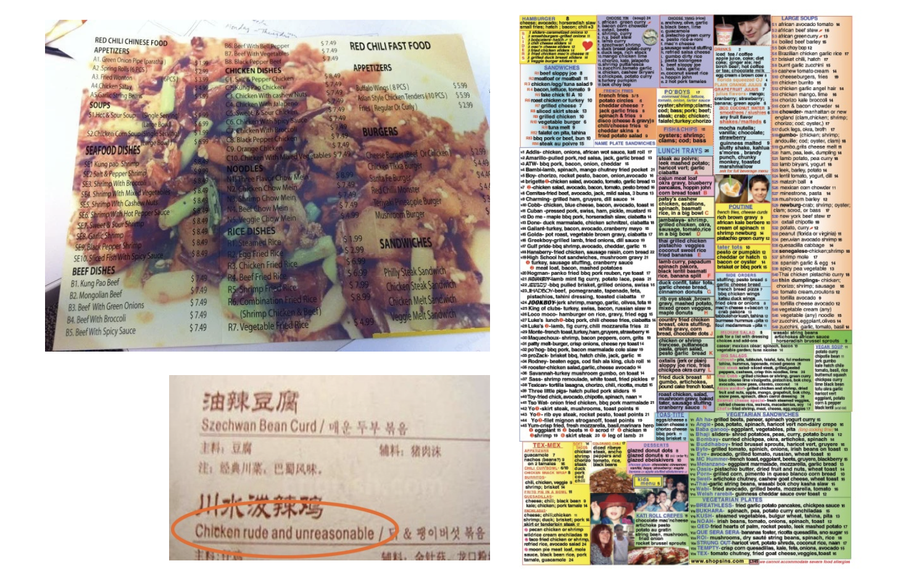
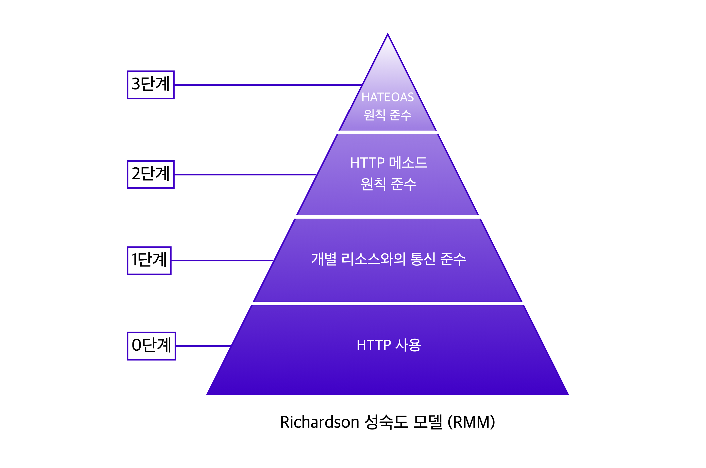
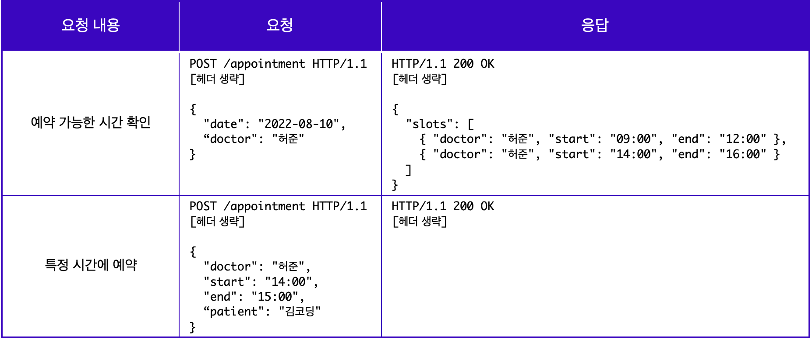
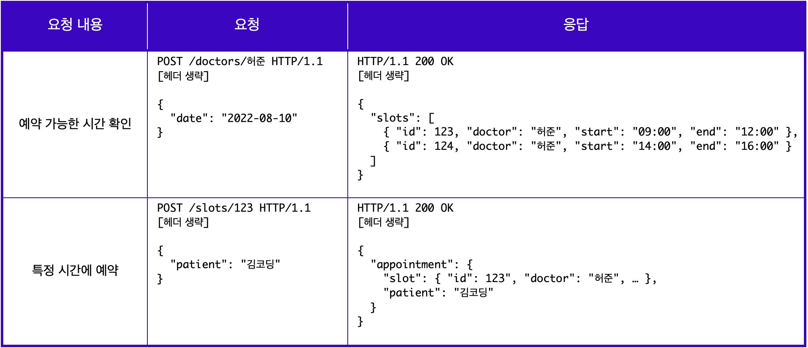
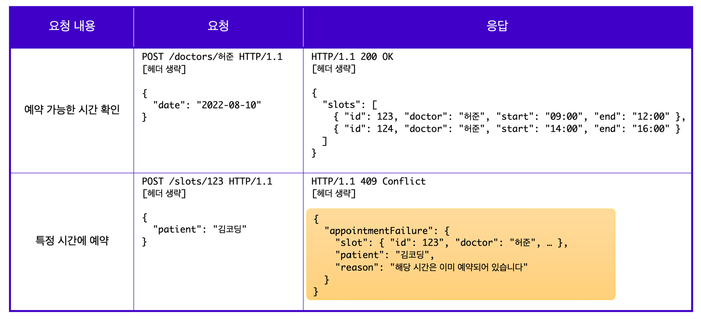
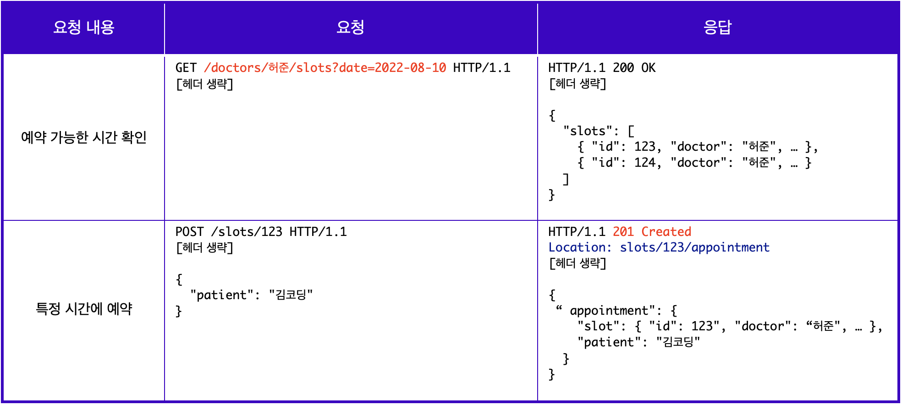
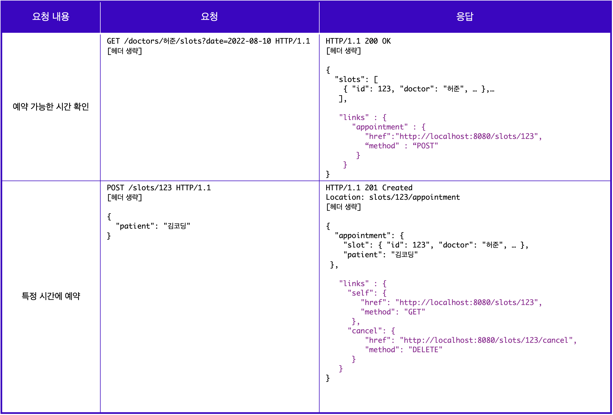

## HTTP Messages

## Stateless

- stateless 란 말 그대로 상태를 가지지 않는다는 뜻입니다.
- 클라 -서버 가 통신을 주고받는 과정에서, HTTP 가 클라이언트나 서버의 상태를 확인하지 않습니다.
- 사용자가 쇼핑몰에 로그인하고 상품 상세 화면을 보고 장바구니에 담아도, 클라이언트에서 발생한 이런 모든 상태를 HTTP 는 통신 규약일 뿐이므로 저장하지 않습니다.
- 따라서, 다른 방법(쿠키, 세션, AIP 등) 을 통해 상태를 확인할 수 있습니다.

# 220803

<details>
<summary>시작하면서</summary>

```java
네트워크 실습을 학습하러 오신 여러분 환영합니다!

이번 유닛에서는 앞선 유닛에서 학습했던 클라이언트와 서버의 통신 과정을 직접 실습하고, REST API에 대해 학습하게 됩니다. 아직 어렵다면 앞의 유닛을 다시한번 복습하고 진행하세요!
Before You Learn
    클라이언트-서버 아키텍처를 이해하고 있어야 합니다.
    HTTP 통신에 대해 이해하고 있어야 합니다.
    질문하는 법: 학습 도중 이해되지 않는 부분은 질문으로 해결해 주세요.
    Postman 설치가 필요합니다.
학습 방법과 도구
REST API
    개념학습 : 기초 개념을 학습합니다.
    퀴즈 : 학습한 개념을 확인하고 복습합니다.
Postman
    개념학습 : 기초 개념을 학습합니다.
    실습 : 학습한 개념을 통해 실습을 진행합니다.
과제
    Message States 요청 : Postman을 활용하여 직접 API문서를 보고 요청을 보내는 과정을 실습합니다.
학습 목표
    REST API에 대해 이해할 수 있다.
        REST API 문서를 읽을 수 있다.
        REST API에 맞춰 디자인할 수 있다.
        Open API와 API Key에 대해 이해할 수 있다.
    Postman이 무엇인지 이해하고 사용할 수 있다.
        HTTP API 테스팅이 무엇인지 알 수 있다.
        Postman을 사용하여 서버에 GET, POST 요청을 보내고 응답을 받을 수 있다.
```

</details>

## REST API

- REST API 란?
  
  - 웹 애플리케이션 에서는 HTTP 메서드를 이용해 서버와 통신합니다.
    - GET 을 통해 웹 페이지나 데이터를 요청
    - POST 로 새로운 글이나 데이터를 전송
    - DELETE 로 저장된 글이나 데이터 삭제
  - 이처럼 요청과 응답에는 일종의 규약이 존재합니다.

- REST API 에서 REST 는 "Representational State Transfer" 의 약자입니다.

- [로이 필딩](https://en.wikipedia.org/wiki/Roy_Fielding) 의 논문에서 웹(http)의 장점을 최대한 활용할 수 있는 아키텍처로서 처음 소개되었습니다.

- <u>REST API 는 웹에서 사용되는 데이터나 자원을 HTTP URI 로 표현하고, HTTP프로토콜을 통해 요청과 응답을 정의하는 방식을 말합니다.</u>

- 만약 식당에 갔는데 메뉴판의 상태가 아래 사진과 같다면 어떨까요? 알아보기도 어렵고, 주문하기에도 어렵습니다.



- 좋은 REST API 를 디자인하는 방법
  
  - 리차드슨의 REST 4단계 성숙도 모델 



- 로이 필딩은 이 모델의 모든 단계를 충족해야 좋은 REST API 라 부를 수 있다고 주장했습니다.

- 그러나 실제로 엄밀하게 3단계(0~3, 총 4단계)까지 지키기 어렵기 때문에 2단계까지만 적용해도 좋은 API 디자인이라고 볼 수 있고, 이런 경우 HTTP API 라고도 부릅니다.
1. REST 성숙도 - 0단계
- 허준이라는 이름의 주치의의 예약 가능한 시간을 확인하고, 특정 시간에 예약하는 상황 예시



2. REST 성숙도 - 1단계
- 1단계에서는 개별 리소스와의 통신을 준수해야 한다고 했습니다.
  
  - 앞서 REST API 는 웹에서 사용되는 모든 데이터나 자원을 HTTP URI 로 표현한다고 이야기 했습니다.
  - 그래서 [모든 자원은 개별 리소스에 맞는 엔드포인트(Endpoint)를 사용해야 한다]는 것과 [요청하고 받은 자원에 대한 정보를 응답으로 전달해야 한다] 는 것이 1단계에서 의미하는 바입니다.

- 앞서 0단계에서는 모든 요청에서 엔드포인트로 /appointment 를 사용하였습니다. 하지만 1단계에서는 요청하는 리소스에 따라 각기 다른 엔드포인트로 구분하여 사용해야 합니다.  



- 위의 예시에서 예약 가능한 시간 확인이라는 요청의 응답으로 받게 되는 자원은 허준의라는 의사의 예약 가능 시간대입니다.
  
  - 그래서 /doctors/허준 이라는 엔드포인트를 사용하였습니다.

- 또한 특정 시간에 예약하게 되면, slot 이라는 리소스의 123 이라는 id 를 가진 리소스가 변경되기 때문에, 하단의 특정시간에 예약이라는 요청해서는 
  
  - /slots/123 으로 실제 변경되는 리소스를 엔드포인트로 사용하셨습니다.

- 엔드포인트 작성 시에는 리소스에 집중해 명사 형태의 단어로 작성하는 것이 바람직합니다.

- 더불어 요청에 따른 응답으로 리소르를 전달할 때에도 사용한 리소스에 대한 정보와 함께 리소스 사용에 대한 성공/실패 여부를 반환해야 합니다.
  
  - 예를 들어 김코딩 환자가 허준 의사에게 9시 예약을 요청하였으나 해당 시간이 마감되어 예약이 불가능하다면, 아래와 같이 리소스 사용에 대한 실패 여부를 포함한 응답을 받아야 합니다.



3. REST 성숙도 - 2단계
- 2단계에서는 CRUD 에 맞게 적절한 HTTP 메서드를 사용하는 것에 중점을 둡니다. 앞서 0단계와 1단계 예시에서는, 모든 요청을 CRUD 에 상관없이 POST 로 하였습니다. 
  
  - 그러나 이는 REST 성숙도 모델 2단계에 따르면 이는 CRUD에 따른 적합한 메서드를 사용한 것은 아닙니다.

- 먼저 예약 가능한 시간을 확인한다는 것은 예약가능한 시간을 조회(READ) 하는 행위를 의미하고, 특정 시간에 예약한다는 것은 해당 특정 시간에 예약을 생성(CREATE) 한다는 것과 같습니다.
  
  - 따라서 조회하기 위해서는 GET 메서드를 사용하ㅏ여 요청을 보내고, 이때 GET 메서드는 body를 가지지 않기 때문에 query parameter 를 사용하여 필요한 리소스를 전달합니다.
  - 또한 예약을 생성 하기 위해서는 POST 메서드를 사용하여 요청을 보내는 것이 바랍직합니다. 그리고 2단계에서는 POST 요청에 대한 응답이 어떻게 반환되는지도 중요합니다.

- 이 경우 응답은 새롭게 생성된 리소르를 보내주기 때문에, 응답 코드도 201 Created 로 명확하게 작성해야 하며, 관련 리소르를 클라이언트가 Location 헤더에 작성된 URI 를 통해 확인할 수 있도록 해야, 완벽하게 REST 성숙도 2단계를 충족한 것이라고 볼 수 있습니다.    



- 물론 메서드를 사용할 때도 규칙이 있습니다.
  
  - GET 메서드는 서버의 데이터를 변화시키지 않는 요청에 사용해야 합니다.
  - POST 는 요청마다 새로운 리소스를 생성하고 PUT은 요청마다 같은 리소스를 반환합니다.
    - 이렇게 매 요청마다 같은 리소스를 반환하는 특징을 멱등([idempotent](https://developer.mozilla.org/en-US/docs/Glossary/Idempotent)) 하다고 합니다. 
    - 그렇기 때문에 멱등성을 가지는 메서드 PUT 과 그렇지 않은 POST 는 구분하여 사용해야 합니다.
  - PUT 과 PATCH 도 구분하여 사용해야 합니다. PUT 은 교체, PATCH 는 수정의 용도로 사용합니다.
    - 더 자세한 내용은 [MDN HTTP request methods](https://developer.mozilla.org/en-US/docs/Web/HTTP/Methods)
4. REST 성숙도 - 4단계
- 마지막 단계는 HATEOFAS ( Hypertext As The Engine Of Application State ) 라는 약어로 표현되는 하이퍼미디어 컨트롤을 적용합니다.
  - 3단계의 요청은 2단계와 동일하지만, 응답에는 리소스의 URI 를 포함한 링크 요소를 삽입하여 작성한다는 것이 다릅니다.
  - 이때 응답에 들어가는 링크 요소는 응답을 받은 다음에 할 수 있는 다양한 액션들을 위해 많은 하이퍼미디어 컨트롤을 포함하고 있습니다.



- 예를 들어 위와 같이 허준이라는 의사의 예약 가능 시간을 확인한 후에는 그 시간대에 예약을 할 수 있는 링크를 삽입하거나, 특정 시간에 예약을 완료하고 나서는 그 예약을 다시 확인할 수 있도록 링크를 작성해 넣을 수도 있습니다.
  
  - 이렇게 응답 내에 새로운 링크를 넣어 새로운 기능에 접근할 수 있도록 하는 것이 3단계의 중요 포인트 입니다.
4. Reference
- 위의 원칙에 따라 API를 작성했다면 가장 좋겠지만, 개발자 혹은 개발 상황에 따라 위의 원칙을 꼭 지키지 못할 수도 있습니다.

- 다음의 다양한 API 를 참고하여, 모범적인 API 디자인을 할 수 있도록 학습해 봅니다.

- [5가지의 기본적인 REST API 디자인 가이드](https://blog.restcase.com/5-basic-rest-api-design-guidelines/)

- [호주 정부 API 작성 가이드](https://api.gov.au/standards/national_api_standards/)

- [구글 API 작성 가이드](https://cloud.google.com/apis/design?hl=ko)

- [MS의 REST API 가이드라인](https://github.com/Microsoft/api-guidelines/blob/master/Guidelines.md)

- .

## Open API 와 API Key

1. Open API
- Open 이지만 "무조건 무제한" 은 아닙니다. 기관이나 API마다 정해진 이용 수칙이 있고, 가격, 정보의 제한 등이 있을 수 있습니다.
- 정부에서 제공하는 [공공데이터 포털](https://www.data.go.kr/)
- [Open Weather Map](https://openweathermap.org/api)
  - 제한적이나마 무료로 날씨 API 를 사용할 수 있습니다.
  - 데이터를 JSON 형태로 응답합니다.
2. API Key
- API 를 이용하기 위해서는 API Key 가 필요합니다. 
- 클라이언트의 요청은 서버의 응답으로 이어지고, 비용이 발생합니다.
- 허가된 이용자(가령 로그인)에게만 자원에 접근할 수 있는 권한을 API Key의 형태로 제공하고, 데이터를 요청할 때 API Key 를 같이 전달해야만 원하는 응답을 받을 수 있습니다.
