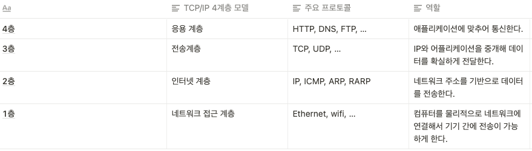
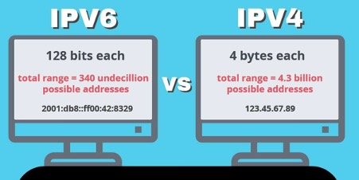

# Network basics..

## LAN 과 WAN

- LAN = Local Area Network
- WAN = Wide Area Network
- WEB = Word Wide Web

### 인터네트워킹(internetworking)

- 네트워크와 네트워크를 연결하는 것. 
- 그리고 우리가 흔히 쓰는 인터넷(The Internet) 은 전 세계적으로 쓰이는 인터네트워킹(중 하나.)

> jekyll 포스트 에서는 접기 펼치기가 안먹히나? 페이지에선 잘되던데..하여튼 신경쓸 게 많은 깃헙 블로그..

<details>
<summary>내 생각</summary>

- 내 생각: 중 하나라고 쓴 이유는, 국지적으로 쓰이는 인터네트워킹은 많겠지만, 전세계적으로 쓰이는 인터네트워크가 정말 인터넷 하나 인지에 대해 불확실 해서.
- 가령 토르는 전 세계적이라고 할수 있을지도 모르겠고, 설령 그렇다 해도 그냥 인터넷의 일부라고 해야 하는지. 
- 또는 그외 알려지지 않았지만 전세계적인 인터네트워킹의 존재가능성이라든지..
- 너무 깊게 들어가지 말자..지금은

</details>

- 프로토콜: 네트워크 통신 규약. 나사끼리 규격이 필요하듯이. 그리고 그중 TCP/IP 프로토콜이 주로 쓰임

## TCP/IP(Transmission Control Protocol/Internet Protocol)

- Internet Protocol Suite 는 인터넷에서 컴퓨터들이 서로 정보를 주고받는데 쓰이는 통신규약의 모음

- TCP/IP 4계층 모델



- 데이터가 계층모델을 통해 상대에게 도달하는 흐름
  
  

- IP: 네트워크 상의 특정 PC의 주소를 나타내는 체계  

- public IP 는 인터넷에서, Private IP 는 LAN 내부에서.

```bash
nslookup codestates.com //IP 주소와 간단한 도메인 정보를 확인
```



- MAC 주소 : IP 뿐만 아니라, 기기 고유 시리얼인 MAC 주소와 조합해야만 네트워크 통신이 가능하다.
- 이더넷 에서는 송수신 상대를 특정하고자 MAC 주소를, TCP/IP에서는 IP 주소를 사용한다.


- 기기끼리의 통신은 회선 교환(circuit Switching) 방식과 패킷 교환(Packet Switching) 두가지 방식이 있는데, 

- 회선 교환 방식은 1:1, 주로 음성전화 시스템에,

- 패킷 교환은 데이터를 패킷 이라는 작은 단위로 나누어, 여러 회선과 통신 가능

- IPv4 주소 에서 네트워크부가 어디까지인지 나타내는 것이 서브넷마스크.

```
- IP 주소: 192.168.1.1

- 서브넷 마스크: 255.255.255.0

- 네트워크 주소: 192.168.1.0

- 브로드캐스트 주소: 192.168.1.255
```

- [자기IP 보는 사이트 예시](https://ko.infobyip.com/)
- [IPAM](https://en.wikipedia.org/wiki/IP_address_management) 네트워크 접속 기기가 많아질 때 IP 주소를 별도로 관리하기 위한 소프트웨어

## TCP 와 UDP


- 위 그림 처럼 전송계층은 TCP, UDP 등이 있다.

- TCP와 UDT의 차이는 무엇일까?


- TCP 는 속도보다는 신뢰성, 웹 애플리케이션에서 많이 쓰임

- 다음 주제도 생각해보고, 시간이 나면 블로깅해보자.

```
- 위 에서 학습한 내용을 토대로: 비디오 스트리밍 상황에 주로 사용하는 방식은 TCP 방식일까요 아니면 UDP가 되어야 할까요?
- 미 국방부는 어떠한 점에 착안하여 TCP/IP 가 극심한 전시중 에도 신뢰성을 잃지 않는다고 판단 하였을까요?
- DNS 서버가 TCP방식에서 동작한다면 어떠한 문제가 발생할 수 있을까요?
```

## Port

- IP 로 컴퓨터(또는 집 네트워크)를 특정 후, MAC 으로 그 중의 기기를 특정한 후, 여러 애플리케이션 중 하나를 특정하기 위해 port 가 필요하다.
  
  가령 한번쯤 들어본 포트 넘버 443 이라든가..


- 자주 사용되는 포트
  

- [더 많은 포트 번호 확인하기](https://en.wikipedia.org/wiki/List_of_TCP_and_UDP_port_numbers)

- 블로깅주제예시: 같은 웹 브라우저를 동시에 두개 켜 놓고 같은 사이트에 접속을 해도 문제 없이 통신이 가능합니다. 이러한 경우. 어떠한 방식으로 원활히 통신이 가능할 수 있을까요

## URL, DNS, 그리고 URI?

- URL(Uniform Resource Locator): 인터넷 상에서 HTML 이나 이미지 등의 자원의 위치를  특정하기 위한 서식.
  
  ```
  //내 컴퓨터 파일에 접속하는 URL
  Ubuntu:
    file://127.0.0.1/home/username/Desktop
  macOS:
    file://127.0.0.1/Users/username/Desktop/
  Windows:
    file://localhost/C:\Users/username\Desktop\
  ```

- URL 은 scheme / hosts / url-path 로 구분할 수 있다.

- query 는 웹 서버에 보내는 추가적인 질문입니다. 가령 아래 예에서는 구글에 JavaScript를 검색하는 식이다.


- URI 는 Uniform Resource Identifier 의 줄임말로, URL 의 상위 개념이다.

- Domain: IP 주소가 중국집 주소라면 domain name 은 중국집 상호명 이라고 할 수 있다.


- 가령 위 그림에서 IP 주소는 3.34.153.168, 도메인 이름은 codestates.com 입니다. 

- 그리고 현재 4억개에 달하는 도메인을 관리하는 곳은 ICANN 이라는 비영리 단체입니다.


- Registry 는 도메인 관리 기관, Registrar 는 도메인 중개등록 업체.

- 도메인은 두 종류로 나뉩니다. 
    1.gTLD : generic Top Level Domain
  
        - .com .net .org .edu .gov .int .mil .biz .name .info
        - ICANN 인증 registrar 는 가비아, 후이즈, 등이 있습니다.
  
    2.ccTLD : country code TLD
  
        - .kr .us .jp 등 200개 이상이 있습니다.
        - 한국의 경우 한국인터넷진흥원이 registry 로 있습니다.
  
  - DNS: Domain Name System 의 줄임말로, 도메인 이름과 IP 주소를 서로 변환할 수 있도록 개발된 데이터 베이스 시스템.
