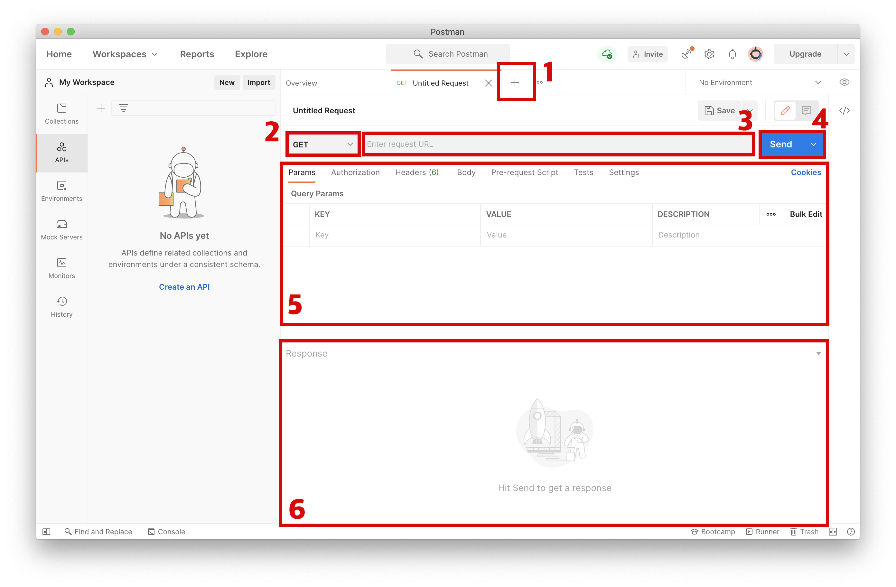
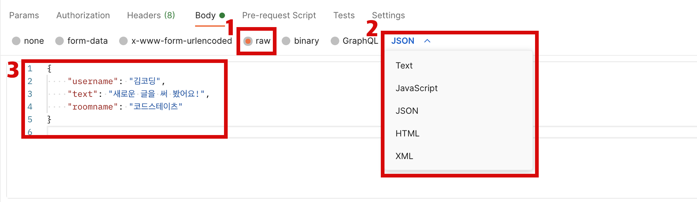
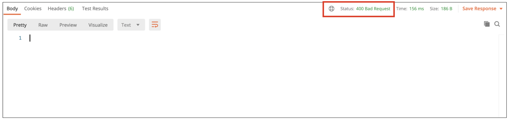

# about Postman

## Postman 사용하는 방법

### HTTP API 테스트 도구

- 웹 개발에서 사용하는 대표적인 클라이언트는 브라우저입니다. 
  
  - 브라우저는 서버에 HTTP 요청을 보낼 수 있는 훌륭한 도구이지만, 주로 웹 페이지를 받아오는 GET 요청에 사용합니다. 
  - 브라우저의 주소창에 URL 을 입력하면, 해당 URL의 root-endpoint 로 GET 요청을 보냅니다. 
  - 테스트를 위해 GET 이 아닌 다른 요청을 보내려면, 개발자 도구의 콘솔 창에서 내장 함수 fetch 를 사용해야 합니다.

- HTTIP API 테스트 도구 (CLI)
  
  - curl
  - [wuzz](https://github.com/asciimoo/wuzz)

- HTTP API 테스트 도구 (GUI)
  
  - [Postman](https://www.postman.com/)
  - [Insomnia](https://insomnia.rest/)   

### Postman 사용하기

- 먼저, 이미 만들어져 있는 API 서버가 주어지는 경우를 생각해 보겠습니다. HTTP 로 소통하기 위해서는 API 서버의 endpoint 가 URL 로 주어져야 합니다.
- 예를 들어, 다음과 같은 API 문서가 있다고 가정하겠습니다.

#### GET 요청하기

> ### URL
> 
> `http://3.36.72.17:3000/`
> 
> ### 메시지 조회
> 
> #### Request
> 
> ```
> 1
> ```
> 
> [요청] kimcoding이 작성한 모든 메시지를 조회합니다.
> 
> 추가적인 파라미터를 사용할 수 있습니다.
> 
> | parameter | 형식        | 설명              | 필수 포함 여부 |
> | --------- | --------- | --------------- | -------- |
> | roomname  | 방 이름(문자열) | 특정 roomname만 조회 | 필수 아님    |
> 
> [표] 파라미터 정보
> 
> #### Response
> 
> 응답은 다음과 같은 JSON 형식입니다.
> 
> ```
> 1
> 2
> 3
> 4
> 5
> 6
> 7
> 8
> 9
> 10
> ```
> 
> [데이터] Request에 따른 Response 예시
> 
> 메시지에서 사용하는 속성은 다음과 같습니다.
> 
> | parameter | 형식  | 설명      |
> | --------- | --- | ------- |
> | id        | 숫자  | 고유한 아이디 |
> | username  | 문자열 | 사용자 이름  |
> | text      | 문자열 | 본문 내용   |
> | roomname  | 문자열 | 방 이름    |
> | date      | 문자열 | 작성한 시간  |
> 
> [표] 파라미터 정보

#### Post 화면 보기

- 다음 그림을 보고 포스트맨의 화면 구성을 확인합니다.



1. 새로운 탭 오픈
   - 요청/응답을 여러 개 확인할 수 있습니다.
2. HTTP 메서드 선택
   - GET, POST, DELETE 등과 같은 메서드 중 하나를 선택합니다.
     - API 문서 상 `GET` 메서드를 사용하므로, `GET`으로 선택합니다.
3. URL 입력 창
   - URL과 Endpoint를 입력합니다.
     - API 문서에 따르면, `http://3.36.72.17:3000/kimcoding/messages` 와 같이 입력하면 됩니다.
4. HTTP 요청 버튼
   - 요청을 보냅니다.
5. HTTP 요청시 설정할 수 있는 각종 옵션
   - 추가적인 파라미터나, 요청 본문(body)을 추가할 수 있습니다.
     - API 문서에서 확인할 수 있듯이, `roomname` 이라는 파라미터를 사용할 수 있습니다. 필수는 아니지만, 파라미터를 사용하려면 Params 탭의 `KEY`, `VALUE` 에 각각 `roomname` 과 필요한 값을 입력합니다.
6. HTTP 응답 화면
   - 요청을 보낸 후 응답을 확인하세요.

#### POST 요청하기

- GET 요청은 브라우저로도 충분히 테스트할 수 있습니다.
- POST 요청은 GET 요청과 다르게 body 를 포함하는 경우가 많습니다.
- 본문(body) 를 설정하는 방법은, 위 그림에서 (5)번 - HTTP 요청 설정 화면 에서 본문을 입력하면 됩니다.
  - POST 를 사용하는 API 문서를 먼저 확인해 봅시다.

> ### URL
> 
> `http://3.36.72.17:3000/`
> 
> ### 메시지 추가
> 
> #### Request
> 
> ```
> 1
> ```
> 
> [요청] kimcoding이 새로운 message를 작성합니다.
> 
> 요청 본문에는 다음의 내용을 반드시 포함해야 합니다.
> 
> - 요청 형식: JSON
> 
> | parameter | 형식  | 설명     | 필수 포함 여부 |
> | --------- | --- | ------ | -------- |
> | username  | 문자열 | 사용자 이름 | 필수       |
> | text      | 문자열 | 본문 내용  | 필수       |
> | roomname  | 문자열 | 방 이름   | 필수       |
> 
> [표] 파라미터 정보
> 
> #### Response
> 
> 응답은 다음과 같은 JSON 형식입니다.
> 
> ```
> 1
> 2
> 3
> ```
> 
> [데이터] Request에 따른 Response 예시
> 
> id는 숫자 형식이며, 새로 생성된 메시지의 고유한 ID 값입니다.

- 다음 그림을 참고하여 POST 요청에 본문을 함께 보냅니다.



1. 본문의 형식 선택 (1)
   
   - JSON 형식으로 보낼 때에는, `raw`를 선택합니다.

2. 본문의 형식 선택 (2)
   
   - 보낼 형식에 맞게 정확한 타입을 선택합니다.
     
     - JSON 형식으로 보낼 때에는, `JSON`을 선택합니다.
     - 앞서 1번 및 2번 과정은 HTTP 요청 헤더에 다음과 같이 작성하는 것과 동일합니다.
     
     ```
     1
     ```
     
     [헤더] HTTP 요청 헤더에 전송할 데이터 타입을 입력합니다.

3. 본문 내용
   
   - 본문을 입력합니다. 앞서 JSON을 선택했으므로, 유효한 JSON을 적어주어야 합니다.
     - API 문서에 따르면 `username`, `text`, `roomname` 을 형식에 맞게 적어주어야 합니다.

모든 요청 본문 입력이 완료되었다면, 요청을 보냅니다. URL과 Endpoint, 그리고 HTTP 메서드를 정확하게 입력했는지 한 번 더 확인하세요!

#### 응답 살펴보기

- 한번에 응답을 확인할 수 있다면 기쁘겠지만, 그렇지 않을 수도 있습니다. 다음과 같은 상황이 발생할 수 있습니다.
  - Q. 요청이 끝나지 않아요!
    - 일반적으로 서버가 응답하지 않는 경우, 요청이 끝나지 않습니다. 이 경우에는 timeout 이라는 응답을 받게 됩니다.
  - Q. 기대했던 응답이 오지 않아요!
    - HTTP 응답 코드를 확인해 보세요.




- postman 사이트에서 다음을 Post 함. 그리고 Get으로 확인.
{"username":"appstew","text":"이게 맞나..?하필 오늘 컴퓨터 말썽..","roomname":"코드스테이츠"}