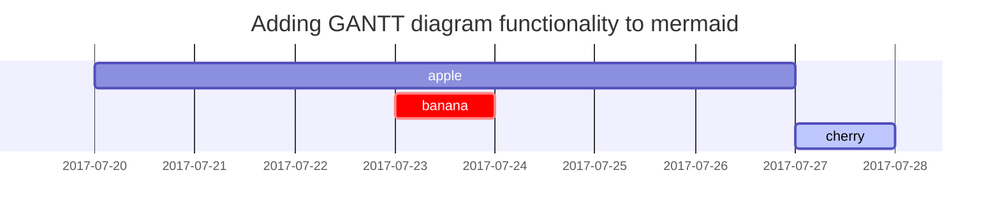
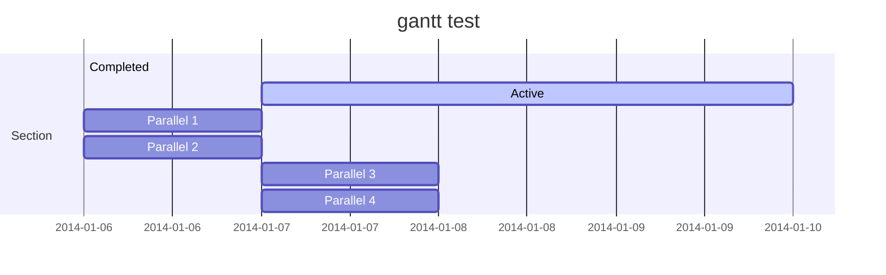
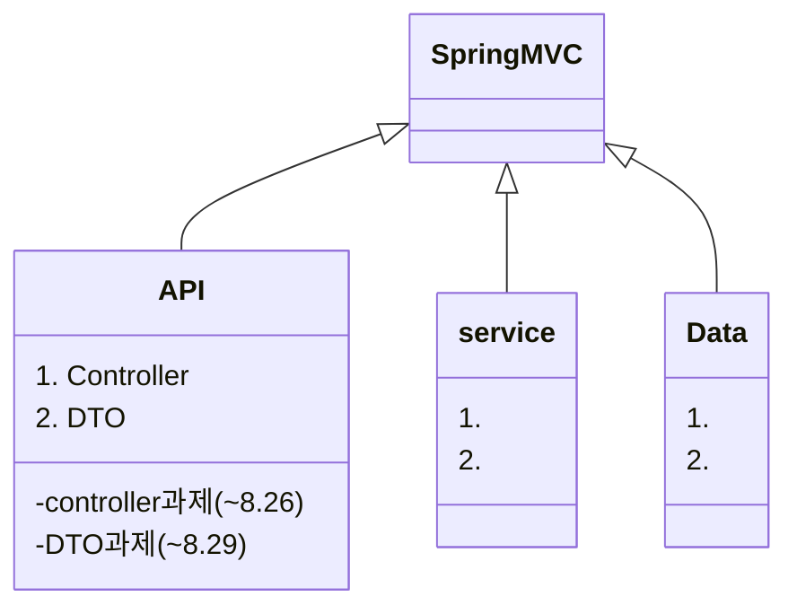

# this md file is a post template.

## Mermaid SVG



## Prompts

> An example showing the `tip` type prompt.
{: .prompt-tip }

> An example showing the `info` type prompt.
{: .prompt-info }

> An example showing the `warning` type prompt.
{: .prompt-warning }

> An example showing the `danger` type prompt.
{: .prompt-danger }


## gantt 1


## gantt 2



## title [Spring MVC] API 계층



### 시작하면서

1. 개요

- 웹 앱 제작 본격적. 백문 불여일타. 
    Spring MVC
        Spring MVC란 무엇인지 이해할 수 있다.
        Spring MVC의 동작방식과 구성요소를 이해할 수 있다.
    Controller
        API 엔드 포인트인 Controller의 구성 요소를 이해할 수 있다.
        실제 동작하는 Controller의 기본 기능을 구현할 수 있다.
    DTO(Data Transfer Object)
        DTO가 무엇인지 이해할 수 있다
        DTO Validation이 무엇인지 이해할 수 있다.
        Controller에 DTO 클래스를 적용할 수 있다.

2. 샘플 프로젝트 환경 구성

- 이런 앱을 만들 것입니다.


```
샘플 프로젝트 환경 구성

커피 주문 애플리케이션 제작을 위한 프로젝트 환경은 ‘실습 환경 구성(필수)’ 챕터의 가이드 대로 새로운 프로젝트 하나를 생성하면 됩니다.

단, 변경되는 부분은 아래를 참고해서 변경하길 바랍니다.

    [그림 2-0-1]의 Spring Initializr 항목 입력 부분에서 [Project Metadata] 부분의 [Artifact], [Name], [Description] 항목에서 ‘section2-week3’를 ‘section3-week1’으로 변경하면 됩니다.
```


### Spring MVC 아키텍처

- Spring MVC : 스프링 모듈 중 서블릿 API 를 기반으로 클라이언트 요청을 처리하는 모듈. spring.webmvc.
  - 줄여서 Spring MVC.
  - Spring MVC 프레임워크

- Spring MVC
  - Model
  - View
  - Controller

- Spring MVC 동작 방식


### Coltroller

1. Controller 클래스 설계 및 구조 생성

2. 핸들러 메서드

3. 응답 데이터에 ResponseEntity 적용

4. 심화 HTTP 헤더

5. 심화 Rest Client

6. [실습] Controller 구현 실습

- [실습 과제 제출 안내](https://urclass.codestates.com/0b67fbff-abed-4fb3-860a-80f73b47cc47?playlist=1978)

- 제출 기한
  - 2022.08.26 24:00 까지

- 실습 요구 사항

  - MemberController

  - CoffeController

==========

```
Gson 라이브러리 추가
- Gradle 경우
- build.gradle에서
dependencies {
  implementation 'com.google.code.gson:gson:2.9.0'
}

- Maven 경우
- pom.xml에
<dependency>
  <groupId>com.google.code.gson</groupId>
  <artifactId>gson</artifactId>
  <version>2.9.0</version>
</dependency>

넣고 리빌드


Deprecated Gradle features were used in this build, making it incompatible with Gradle 8.0.


- 인텔리j 에서 다른 건 그냥 리팩토링으로 바꾸거나 프로젝트 이름은 폴더 이름을 변경하면 되는데, gradle module rename 시도시 cant rename root module name 이라고 뜸. 
- 해결 방법: 상위 폴더에 shift 두번으로 찾기 누르고 settings.gradle 에서 이름 바꾸고 리빌드
```

```
//  MemeberController.class 에서

(1) @SpringBootApplication

@SpringBootApplication 은 코드 상에서는 보이지 않지만 내부적으로 세가지 일을 해줍니다.

    자동 구성을 활성화합니다.
    애플리케이션 패키지 내에서 @Component가 붙은 클래스를 검색한 후(scan), Spring Bean으로 등록하는 기능을 활성화합니다.
    @Configuration 이 붙은 클래스를 자동으로 찾아주고, 추가적으로 Spring Bean을 등록하는 기능을 활성화합니다.


(2) SpringApplication.run(Section3Week1Application.class, args);

Spring 애플리케이션을 부트스트랩하고, 실행하는 역할을 합니다. 

    부트스트랩(Bootstrap)이란?

    애플리케이션이 실행되기 전에 여러가지 설정 작업을 수행하여 실행 가능한 애플리케이션으로 만드는 단계를 의미합니다.

(1) @RestController

    Spring MVC에서는 특정 클래스에 @RestController 를 추가하면 해당 클래스가 REST API의 리소스(자원, Resource)를 처리하기 위한 API 엔드포인트로 동작함을 정의합니다.
    또한 @RestController 가 추가된 클래스는 애플리케이션 로딩 시, Spring Bean으로 등록해줍니다.


(2) @RequestMapping

    @RequestMapping 은 클라이언트의 요청과 클라이언트 요청을 처리하는 핸들러 메서드(Handler Method)를 매핑해주는 역할을 합니다.


    @RequestMapping 은 코드 3-5와 같이 Controller 클래스 레벨에 추가하여 클래스 전체에 사용되는 공통 URL(Base URL) 설정을 합니다. 

    핸들러 메서드 레벨에 추가하는 @RequestMapping 애너테이션은 [핸들러 메서드(Handler Method)] 챕터에서 설명할 예정입니다.

```

```
//핵심
    Spring Boot 애플리케이션으로서 동작하기 위한 엔트리포인트에는 @SpringBootApplication을 추가한다.
    main() 메서드 내에서 SpringApplication.run()을 호출하면 Spring Boot 기반의 애플리케이션으로 동작한다.
    @RestController를 클래스에 추가함으로써 해당 클래스를 REST API의 리소스(자원, Resource)를 처리하기 위한 API 엔드포인트로 동작하게 해준다.
    @RequestMapping을 Controller 클래스 레벨에 추가하여 클래스 전체에 사용되는 공통 URL(Base URL)을 설정할 수 있다.
```

#### 리눅스 실행중인 로컬 포트 확인 및 중지 방법

```
인텔리제이에서 서버를 닫지 않고 종료 후 재시작 했을 때 서버가 닫히지 않아서 다시 서버 실행을 할 경우 이미 사용중인 포트번호라고 뜨는 문제가 있었다.
// 리눅스 특정 포트에서 실행 중인 프로세스 제거하기

[dami@fedora ~]$ netstat -ano | grep "8080"
tcp        0      0 127.0.0.1:50700         127.0.0.1:8080          ESTABLISHED keepalive (0.78/0/0)
tcp6       0      0 :::8080                 :::*                    LISTEN      off (0.00/0/0)
tcp6       0      0 127.0.0.1:8080          127.0.0.1:50700         ESTABLISHED off (0.00/0/0)
[dami@fedora ~]$ fuser 8080/tcp
8080/tcp:             5539
[dami@fedora ~]$ lsof -i:8080
COMMAND  PID USER   FD   TYPE DEVICE SIZE/OFF NODE NAME
java    5539 dami   47u  IPv6  68025      0t0  TCP *:webcache (LISTEN)
[dami@fedora ~]$ kill $(lsof -t -i:8080)
[dami@fedora ~]$ lsof -i:8080
[dami@fedora ~]$ 

```

#### 리눅스 서드파티 tar.gz 앱 설치 및 심링크 생성

```
// 220821 16:55.
// 페도라 postman 설치하기.
// dnf 나 rpm 등으로 관리되지 않는 tar.gz 형태의 애플리케이션을 설치해야 하는 경우가 많은 것 같다.
// 할 때마다 설치 위치를 고민하기는 싫어서 조금 알아보고 그냥 /opt 안에 설치하기로 했다. zoom 은 dnf 로 설치했지만 opt 안에 설치되어 있었다.

이번엔 postman. 

어쨋든

1. /opt 에 옮기고 압축해제
history 1000 > ~/Downloads/1000.txt
ls ~/Downloads/
sudo mv -f ~/Downloads/postman-linux-x64.tar.gz /opt/postman.tar.gz
ls /opt
cd /opt
sudo tar -xvf postman.tar.gz

2. (선택)앱 빌드 및 심볼릭 링크 생성
[dami@fedora opt]$ ls
Postman  postman.tag.gz  zoom
[dami@fedora opt]$ cd Postman
[dami@fedora Postman]$ which intellij
/usr/bin/intellij
[dami@fedora Postman]$ ls
app  Postman
[dami@fedora Postman]$ cd Postman
bash: cd: Postman: Not a directory
[dami@fedora Postman]$ cd app
[dami@fedora app]$ sudo ln -s ./Postman /usr/bin/postman
[sudo] password for dami: 
[dami@fedora app]$ cd ~
[dami@fedora ~]$ postman
bash: postman: command not found...
[dami@fedora ~]$ sudo ln -s /opt/Postman/app/Postman /usr/bin/postman
ln: failed to create symbolic link '/usr/bin/postman': File exists
[dami@fedora ~]$ sudo rm /usr/bin/postman
[dami@fedora ~]$ sudo ln -s /opt/Postman/app/Postman /usr/bin/postman
[dami@fedora ~]$ which postman
/usr/bin/postman
[dami@fedora ~]$ postman

3.
```

```
//postman
//send post

{
    "timestamp": "2022-08-21T08:25:58.702+00:00",
    "status": 404,
    "error": "Not Found",
    "path": "/v1/members"
}

이처럼 에러 응답을 받는 이유는 MemberController에 클라이언트의 요청을 처리할 핸들러 메서드(Handler Method)가 아직 없기 때문입니다.
```

- MemberController.class 에 핸들러 메서드를 다음과 같이 작성하고,

```java

@RestController
@RequestMapping("/v1/members")
public class MemberController {

    @PostMapping
    public String postMember(@RequestParam("email") String email,
                             @RequestParam("name") String name,
                             @RequestParam("phone") String phone) {
        System.out.println("# email: " + email);
        System.out.println("# name: " + name);
        System.out.println("# phone: " + phone);

        String response =
                "{\"" +
                        "email\":\"" + email + "\"," +
                        "\"name\":\"" + name + "\",\"" +
                        "phone\":\"" + phone +
                        "\"}";
        return response;
    }

    @GetMapping("/{member-id}")
    public String getMember(@PathVariable("member-id") long memberId) {
        System.out.println("# memberId: " + memberId);

        // not implementation
        return null;
    }

    @GetMapping
    public String getMembers() {
        System.out.println("# get Members");

        // not implementation
        return null;
    }
}

```

- postman 에 다음과 같이 요청.


==============

- 20220821 일요일 21:51. 겨우 따라잡았다..
  - be-homework-controller 요구 사항 4개 중 일단 1개는 성공
  - section3-week1 필수 전체 및 핵심 일부 구현


