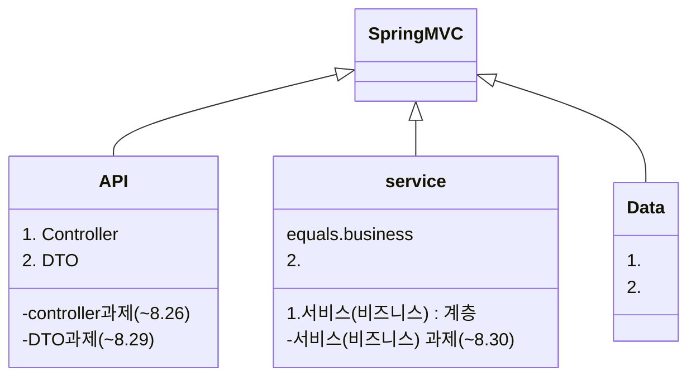

## Prompts

> An example showing the `tip` type prompt.
{: .prompt-tip }

> An example showing the `info` type prompt.
{: .prompt-info }

> An example showing the `warning` type prompt.
{: .prompt-warning }

> An example showing the `danger` type prompt.
{: .prompt-danger }

## title [Spring MVC] API 계층

## 개요 및 학습 사전 준비

## 서비스 계층에서의 DI

### 개요

### 기본. DI 를 통한 서비스 계층 <-> API 계층 연동

### 기본. 매퍼(Mapper) 를 이용한 DTO 클래스 <-> 엔터티(Entity) 클래스 매핑

### 실습. 서비스 계층과 API 계층의 연동 실습

