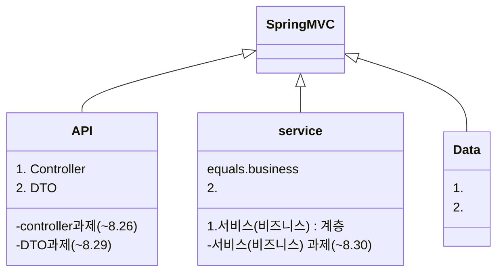

## Prompts

> An example showing the `tip` type prompt.
{: .prompt-tip }

> An example showing the `info` type prompt.
{: .prompt-info }

> An example showing the `warning` type prompt.
{: .prompt-warning }

> An example showing the `danger` type prompt.
{: .prompt-danger }


## title [Spring MVC] API 계층



### 아침 줌 세션

- 정규표현식 중,
  - 

- MapStruct 라이브러리 이용(예전엔 ModelMapper)

- @RequestBody 
  - @ResponseBody 는 ResponseEntity 를 쓰면 생략할 수 있다.

## 개요 및 학습 사전 준비


## 서비스 계층에서의 DI

### 개요

### 기본. DI 를 통한 서비스 계층 <-> API 계층 연동

- section3/be-template-service-layer 에서 MemberController v2까지 실습 후

```
- @Getter, @Setter , @NoArgsConstructor , @AllArgsConstructor
  - lombok 라이브러리 에서 제공하는 애너테이션들

그런데 코드 3-45는 Spring에서 지원하는 DI 기능을 사용하지 않았기때문에 MemberController와 MemberService가 강하게 결합(Tight Coupling)되어 있는 상태입니다.

Spring의 DI를 사용하면 클래스 간의 결합을 느슨한 결합(Loose Coupling)으로 손쉽게 만들 수 있습니다.

그럼 Spring의 DI를 사용하도록 MemberController를 바꿔볼까요?

클래스 간에 DI가 필요한 이유는 [Spring Framework 기본] 유닛의 [IoC(Inversioin of Control)/DI(Dependency Injection)](https://urclass.codestates.com/15d05644-7d74-4209-a04a-3f514db49649?playlist=2029) 챕터를 참고하세요
```

- v3. DI를 통한 느슨한 결합
  - public MemberController(MemberService memberService) 로 바꿔준 후, MemberService.class 위에 @Service 추가
  - MemberController 위에 @RestController 이 있으므로 Spring Bean.
  - 생성자가 하나이므로 @Autowired 붙이지 않아도 되지만 두개 이상일 경우 @Autowired 붙여야 한다.


### 기본. 매퍼(Mapper) 를 이용한 DTO 클래스 <-> 엔터티(Entity) 클래스 매핑

- MemberController v3 의 문제점
    - MemberController의 핸들러 메서드가 DTO 클래스를 엔티티(Entity) 클래스로 변환하는 작업까지 도맡아서 하고 있다.
    엔티티(Entity) 클래스의 객체를 클라이언트의 응답으로 전송함으로써 계층 간의 역할 분리가 이루어지지 않았다.
    - 결국 DTO 클래스와 엔티티(Entity) 클래스를 서로 변환해주는 누군가 즉, 매퍼(Mapper)가 필요한 상황입니다.

  

### 실습. 서비스 계층과 API 계층의 연동 실습

