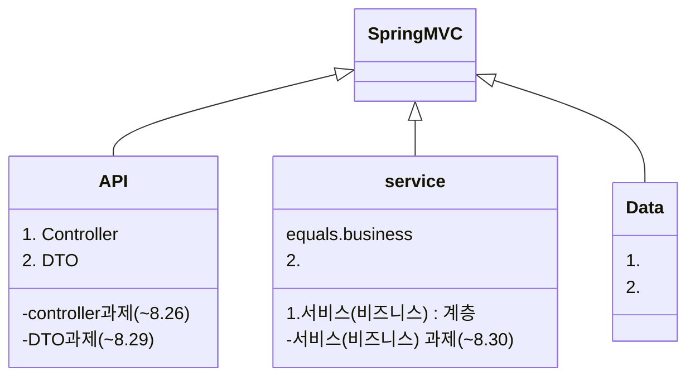
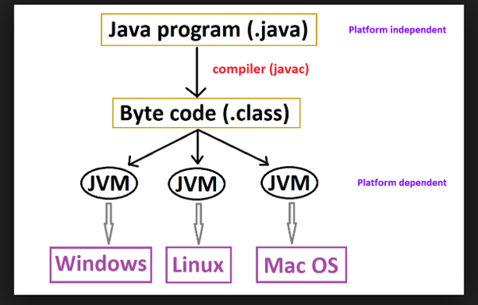

- section3/be-template-service-layer 에서 MemberController 

## Prompts

> An example showing the `tip` type prompt.
{: .prompt-tip }

> An example showing the `info` type prompt.
{: .prompt-info }

> An example showing the `warning` type prompt.
{: .prompt-warning }

> An example showing the `danger` type prompt.
{: .prompt-danger }


## title [Spring MVC] API 계층



### 아침 줌 세션

- 정규표현식 중,
  - 

- MapStruct 라이브러리 이용(예전엔 ModelMapper)

- @RequestBody 
  - @ResponseBody 는 ResponseEntity 를 쓰면 생략할 수 있다.

## 개요 및 학습 사전 준비


## 서비스 계층에서의 DI

### 개요

### 기본. DI 를 통한 서비스 계층 <-> API 계층 연동

- section3/be-template-service-layer 에서 MemberController v2까지 실습 후

```
- @Getter, @Setter , @NoArgsConstructor , @AllArgsConstructor
  - lombok 라이브러리 에서 제공하는 애너테이션들

그런데 코드 3-45는 Spring에서 지원하는 DI 기능을 사용하지 않았기때문에 MemberController와 MemberService가 강하게 결합(Tight Coupling)되어 있는 상태입니다.

Spring의 DI를 사용하면 클래스 간의 결합을 느슨한 결합(Loose Coupling)으로 손쉽게 만들 수 있습니다.

그럼 Spring의 DI를 사용하도록 MemberController를 바꿔볼까요?

클래스 간에 DI가 필요한 이유는 [Spring Framework 기본] 유닛의 [IoC(Inversioin of Control)/DI(Dependency Injection)](https://urclass.codestates.com/15d05644-7d74-4209-a04a-3f514db49649?playlist=2029) 챕터를 참고하세요
```

- v3. DI를 통한 느슨한 결합
  - public MemberController(MemberService memberService) 로 바꿔준 후, MemberService.class 위에 @Service 추가
  - MemberController 위에 @RestController 이 있으므로 Spring Bean.
  - 생성자가 하나이므로 @Autowired 붙이지 않아도 되지만 두개 이상일 경우 @Autowired 붙여야 한다.


### 기본. 매퍼(Mapper) 를 이용한 DTO 클래스 <-> 엔터티(Entity) 클래스 매핑

- MemberController v3 의 문제점
    - MemberController의 핸들러 메서드가 DTO 클래스를 엔티티(Entity) 클래스로 변환하는 작업까지 도맡아서 하고 있다.
    엔티티(Entity) 클래스의 객체를 클라이언트의 응답으로 전송함으로써 계층 간의 역할 분리가 이루어지지 않았다.
    - 결국 DTO 클래스와 엔티티(Entity) 클래스를 서로 변환해주는 누군가 즉, 매퍼(Mapper)가 필요한 상황입니다.

  
-  MemberController v4
   - MemberMapper, MemberResponseDto 클래스를 만들고, MemberController 에 수정사항을 반영하였다. 수정된 코드 설명은 클래스 안에 첨부함.

- MemberMapper 인터페이스 생성후
- MapStruct 의존 라이브러리 설정
```java
dependencies {
	...
	...
	implementation 'org.mapstruct:mapstruct:1.4.2.Final'
	annotationProcessor 'org.mapstruct:mapstruct-processor:1.4.2.Final'
}
```

- 이후 gradle build 하면 build/generated/sources 안에 MemberMapper 인터페이스를 구현하는 MemberMapperImpl 클래스가 자동 생성된다.
  - 이후 MemberController 안에 import com.codestates.member.mapstruct.mapper.MemberMapper; 만 추가하고 주소만 v5로 변경하면 수동으로 만든 MemberMapper 대신 MemberMapper 인터페이스를 자동으로 사용한다.


### 실습. 서비스 계층과 API 계층의 연동 실습

과제 be-homework-mapper
  - 2022.08.30 24:00까지
  - 220830 제출완료

## 오후 줌 세션

- DispatcherServlet.class, FrameworkServlet.class, HttpServlet.class

- HttpMessageConverter
  - Request Body 를 java 객체로 변환해준다.
  - Java 객체를 Response Body 로 변환해준다.
  - DTO 에 setter 메서드가 필요없음

- Java Bean Spec, RMI(Remote Method In), objectMapper, CRUD,

- 서비스 클래스를 Spring Bean 에 등록하는 방법
  - @Service
  - @Component

- 생성자 기반 DI
```java
    private final MemberService memberService;
    private final MemberMapper mapper;
    //

    public MemberController(MemberService memberService, MemberMapper mapper) {
        this.memberService = memberService;
        this.mapper = mapper;
    }
// 만약 MemberController() 괄호 안에 파라미터를 여러개 쓰는 경우도 있고, 아닐 경우 밑에 public 으로 또 만들 수 있다. 이때는 아마 @Autowired 붙여야?

```
- setter 기반 DI
  - setter 를 통해 DI 되는 객체를 바꿔야 될 경우
    - 흔하지 않음

- DTO 클래스와 Entity 클래스 분리 이유
  - REST API 스펙의 독립성 확보 
    - a
    - 패스워드 같은 민감한 데이터 분리
  - 계층별 관심사 분리
  - 코드 구성의 단순화

- Mapper 종류
  - MapStruct, JMapper, ModelMapper
  - www.baeldung.com
- MapStruct vs ModelMapper
  - ModelMapper: 런타임에 실행
  - MapStruct: 컴파일 타임에 매핑 구현체 모두 생성

- MemberResponseDto 안에 @NoArgs @AllArgs rombok 
  - @NoArgs : 파라밑터 없는거 알아서 만들어줌
  - @AllArgs 아래거 생략가능
    ```java
    public MemberResponseDto(long parameter, ...) {
      this.efef = efef;
      this.efef = ef;
    
    }
    ```
- MapStruct 가 매핑을  
  -     

- 아기소리

### 수업 종료 후 추가공부

- .java .class 차이점
  - .java 는 프로그램 작성시, .class 는 빌드된 파일로서, JVM 에서 프로그램 구동 시 사용된다.
  - .class 파일은 .java 코드를 보안 이유로 바이트 코드 바꾼 것이고 또한 이걸 실행하는 것이 속도가 더 빠르다.



```
//질문: 궁금한 게 있습니다. Mapper 라이브러리가 설명만 봤을 때는 엄청나게 편해보였는데, 막상 사용해보니 Entity와 DTO의 멤버가 다른 경우(예를 들어 유저에게 아이디 패스워드 네임 이메일이 있는데 UserDto에서는 네임과 이메일만 가져올 경우) 일일히 옵션으로 매핑 처리를 해줘야하고 그에 맞는 DTO도 별도로 만들어줘야해서 수작업으로 Entity To Dto 클래스를 만들어서 매핑해주는 것에 비해 큰 이점이 있는지 잘 모르겠다는 생각이 들었는데, 실무에서는 거의 매퍼를 사용하나요? 
//답변: 야옹
```

- CofferService.java 안에 있는 데이터. stub, 또는 목업데이터

- Stream API 리뷰

```
//질문: @Email 유효성 검증에서 ‘@‘는 빠지면 안 되는데 ‘.’는 빠져도 되더라구요. 어디를 뜯어보면 확인할 수 있나요? 
//답변: 
```

```mermaid
flowchart LR
CNPJValidator(CNPJValidator)
CPFValidator(CPFValidator)
EANValidator(EANValidator)
INNValidator(INNValidator)
ISBNValidator(ISBNValidator)
NIPValidator(NIPValidator)
PESELValidator(PESELValidator)
REGONValidator(REGONValidator)
URLValidator(URLValidator)
abstractEmailValidator(abstractEmailValidator)
aopAutoConfiguration(aopAutoConfiguration)
node217(aopAutoConfiguration.ClassProxyingConfiguration)
applicationAvailability(applicationAvailability)
applicationAvailability(applicationAvailability)
applicationAvailabilityAutoConfiguration(applicationAvailabilityAutoConfiguration)
applicationTaskExecutor(applicationTaskExecutor)
assertFalseValidator(assertFalseValidator)
assertTrueValidator(assertTrueValidator)
basicErrorController(basicErrorController)
basicErrorController(basicErrorController)
be39Section3Week1HomeworkMapperApplication(be39Section3Week1HomeworkMapperApplication)
beanNameHandlerMapping(beanNameHandlerMapping)
beanNameHandlerMapping(beanNameHandlerMapping)
beanNameViewResolver(beanNameViewResolver)
beanNameViewResolver(beanNameViewResolver)
beanNameViewResolver(beanNameViewResolver)
beanNameViewResolver(beanNameViewResolver)
beanPostProcessorsRegistrar(beanPostProcessorsRegistrar)
buildProperties(buildProperties)
buildProperties(buildProperties)
cacheAutoConfiguration(cacheAutoConfiguration)
cacheAutoConfigurationValidator(cacheAutoConfigurationValidator)
cacheAutoConfigurationValidator(cacheAutoConfigurationValidator)
cacheConfigurationImportSelector(cacheConfigurationImportSelector)
cacheManager(cacheManager)
cacheManagerCustomizers(cacheManagerCustomizers)
cacheManagerCustomizers(cacheManagerCustomizers)
characterEncodingFilter(characterEncodingFilter)
characterEncodingFilter(characterEncodingFilter)
codePointLengthValidator(codePointLengthValidator)
coffeeController(coffeeController)
coffeeMapperImpl(coffeeMapperImpl)
coffeeService(coffeeService)
configurationPropertiesAutoConfiguration(configurationPropertiesAutoConfiguration)
conventionErrorViewResolver(conventionErrorViewResolver)
conventionErrorViewResolver(conventionErrorViewResolver)
conversionService(conversionService)
currencyValidatorForMonetaryAmount(currencyValidatorForMonetaryAmount)
databaseInitializationDependencyConfigurer(databaseInitializationDependencyConfigurer)
decimalMaxValidatorForBigDecimal(decimalMaxValidatorForBigDecimal)
decimalMaxValidatorForBigInteger(decimalMaxValidatorForBigInteger)
decimalMaxValidatorForByte(decimalMaxValidatorForByte)
decimalMaxValidatorForCharSequence(decimalMaxValidatorForCharSequence)
decimalMaxValidatorForDouble(decimalMaxValidatorForDouble)
decimalMaxValidatorForFloat(decimalMaxValidatorForFloat)
decimalMaxValidatorForInteger(decimalMaxValidatorForInteger)
decimalMaxValidatorForLong(decimalMaxValidatorForLong)
decimalMaxValidatorForMonetaryAmount(decimalMaxValidatorForMonetaryAmount)
decimalMaxValidatorForNumber(decimalMaxValidatorForNumber)
decimalMaxValidatorForShort(decimalMaxValidatorForShort)
decimalMinValidatorForBigDecimal(decimalMinValidatorForBigDecimal)
decimalMinValidatorForBigInteger(decimalMinValidatorForBigInteger)
decimalMinValidatorForByte(decimalMinValidatorForByte)
decimalMinValidatorForCharSequence(decimalMinValidatorForCharSequence)
decimalMinValidatorForDouble(decimalMinValidatorForDouble)
decimalMinValidatorForFloat(decimalMinValidatorForFloat)
decimalMinValidatorForInteger(decimalMinValidatorForInteger)
decimalMinValidatorForLong(decimalMinValidatorForLong)
decimalMinValidatorForMonetaryAmount(decimalMinValidatorForMonetaryAmount)
decimalMinValidatorForNumber(decimalMinValidatorForNumber)
decimalMinValidatorForShort(decimalMinValidatorForShort)
defaultServletHandlerMapping(defaultServletHandlerMapping)
defaultServletHandlerMapping(defaultServletHandlerMapping)
defaultValidator(defaultValidator)
defaultValidator(defaultValidator)
defaultViewResolver(defaultViewResolver)
defaultViewResolver(defaultViewResolver)
digitsValidatorForCharSequence(digitsValidatorForCharSequence)
digitsValidatorForMonetaryAmount(digitsValidatorForMonetaryAmount)
digitsValidatorForNumber(digitsValidatorForNumber)
dispatcherServlet(dispatcherServlet)
dispatcherServletAutoConfiguration(dispatcherServletAutoConfiguration)
node255(dispatcherServletAutoConfiguration.DispatcherServletConfiguration)
node38(dispatcherServletAutoConfiguration.DispatcherServletRegistrationConfiguration)
dispatcherServletRegistration(dispatcherServletRegistration)
durationMaxValidator(durationMaxValidator)
durationMinValidator(durationMinValidator)
emailValidator(emailValidator)
emailValidator(emailValidator)
embeddedWebServerFactoryCustomizerAutoConfiguration(embeddedWebServerFactoryCustomizerAutoConfiguration)
node66(embeddedWebServerFactoryCustomizerAutoConfiguration.TomcatWebServerFactoryCustomizerConfiguration)
enableConfigurationPropertiesRegistrar(enableConfigurationPropertiesRegistrar)
environment(environment)
error(error)
errorAttributes(errorAttributes)
errorAttributes(errorAttributes)
errorMvcAutoConfiguration(errorMvcAutoConfiguration)
node364(errorMvcAutoConfiguration.DefaultErrorViewResolverConfiguration)
node1(errorMvcAutoConfiguration.WhitelabelErrorViewConfiguration)
errorPageCustomizer(errorPageCustomizer)
errorPageCustomizer(errorPageCustomizer)
flashMapManager(flashMapManager)
flashMapManager(flashMapManager)
flashMapManager(flashMapManager)
flashMapManager(flashMapManager)
forceAutoProxyCreatorToUseClassProxying(forceAutoProxyCreatorToUseClassProxying)
forceAutoProxyCreatorToUseClassProxying(forceAutoProxyCreatorToUseClassProxying)
formContentFilter(formContentFilter)
formContentFilter(formContentFilter)
futureOrPresentValidatorForCalendar(futureOrPresentValidatorForCalendar)
futureOrPresentValidatorForDate(futureOrPresentValidatorForDate)
futureOrPresentValidatorForHijrahDate(futureOrPresentValidatorForHijrahDate)
futureOrPresentValidatorForInstant(futureOrPresentValidatorForInstant)
futureOrPresentValidatorForJapaneseDate(futureOrPresentValidatorForJapaneseDate)
futureOrPresentValidatorForLocalDate(futureOrPresentValidatorForLocalDate)
futureOrPresentValidatorForLocalDateTime(futureOrPresentValidatorForLocalDateTime)
futureOrPresentValidatorForLocalTime(futureOrPresentValidatorForLocalTime)
futureOrPresentValidatorForMinguoDate(futureOrPresentValidatorForMinguoDate)
futureOrPresentValidatorForMonthDay(futureOrPresentValidatorForMonthDay)
futureOrPresentValidatorForOffsetDateTime(futureOrPresentValidatorForOffsetDateTime)
futureOrPresentValidatorForOffsetTime(futureOrPresentValidatorForOffsetTime)
futureOrPresentValidatorForReadableInstant(futureOrPresentValidatorForReadableInstant)
futureOrPresentValidatorForReadablePartial(futureOrPresentValidatorForReadablePartial)
futureOrPresentValidatorForThaiBuddhistDate(futureOrPresentValidatorForThaiBuddhistDate)
futureOrPresentValidatorForYear(futureOrPresentValidatorForYear)
futureOrPresentValidatorForYearMonth(futureOrPresentValidatorForYearMonth)
futureOrPresentValidatorForZonedDateTime(futureOrPresentValidatorForZonedDateTime)
futureValidatorForCalendar(futureValidatorForCalendar)
futureValidatorForDate(futureValidatorForDate)
futureValidatorForHijrahDate(futureValidatorForHijrahDate)
futureValidatorForInstant(futureValidatorForInstant)
futureValidatorForJapaneseDate(futureValidatorForJapaneseDate)
futureValidatorForLocalDate(futureValidatorForLocalDate)
futureValidatorForLocalDateTime(futureValidatorForLocalDateTime)
futureValidatorForLocalTime(futureValidatorForLocalTime)
futureValidatorForMinguoDate(futureValidatorForMinguoDate)
futureValidatorForMonthDay(futureValidatorForMonthDay)
futureValidatorForOffsetDateTime(futureValidatorForOffsetDateTime)
futureValidatorForOffsetTime(futureValidatorForOffsetTime)
futureValidatorForReadableInstant(futureValidatorForReadableInstant)
futureValidatorForReadablePartial(futureValidatorForReadablePartial)
futureValidatorForThaiBuddhistDate(futureValidatorForThaiBuddhistDate)
futureValidatorForYear(futureValidatorForYear)
futureValidatorForYearMonth(futureValidatorForYearMonth)
futureValidatorForZonedDateTime(futureValidatorForZonedDateTime)
gitProperties(gitProperties)
gitProperties(gitProperties)
handlerExceptionResolver(handlerExceptionResolver)
handlerExceptionResolver(handlerExceptionResolver)
handlerFunctionAdapter(handlerFunctionAdapter)
handlerFunctionAdapter(handlerFunctionAdapter)
hiddenHttpMethodFilter(hiddenHttpMethodFilter)
hiddenHttpMethodFilter(hiddenHttpMethodFilter)
httpEncodingAutoConfiguration(httpEncodingAutoConfiguration)
httpMessageConvertersAutoConfiguration(httpMessageConvertersAutoConfiguration)
node182(httpMessageConvertersAutoConfiguration.StringHttpMessageConverterConfiguration)
httpRequestHandlerAdapter(httpRequestHandlerAdapter)
httpRequestHandlerAdapter(httpRequestHandlerAdapter)
httpServletRequest(httpServletRequest)
httpServletRequest(httpServletRequest)
httpServletResponse(httpServletResponse)
httpSession(httpSession)
jacksonAutoConfiguration(jacksonAutoConfiguration)
node104(jacksonAutoConfiguration.Jackson2ObjectMapperBuilderCustomizerConfiguration)
node361(jacksonAutoConfiguration.JacksonObjectMapperBuilderConfiguration)
node65(jacksonAutoConfiguration.JacksonObjectMapperConfiguration)
node195(jacksonAutoConfiguration.ParameterNamesModuleConfiguration)
jacksonHttpMessageConvertersConfiguration(jacksonHttpMessageConvertersConfiguration)
node212(jacksonHttpMessageConvertersConfiguration.MappingJackson2HttpMessageConverterConfiguration)
jacksonObjectMapper(jacksonObjectMapper)
jacksonObjectMapper(jacksonObjectMapper)
jacksonObjectMapperBuilder(jacksonObjectMapperBuilder)
jacksonObjectMapperBuilder(jacksonObjectMapperBuilder)
jsonComponentModule(jsonComponentModule)
jsonComponentModule(jsonComponentModule)
lambdaExecutor(lambdaExecutor)
lengthValidator(lengthValidator)
lifecycleAutoConfiguration(lifecycleAutoConfiguration)
lifecycleProcessor(lifecycleProcessor)
localeCharsetMappingsCustomizer(localeCharsetMappingsCustomizer)
localeCharsetMappingsCustomizer(localeCharsetMappingsCustomizer)
localeResolver(localeResolver)
localeResolver(localeResolver)
localeResolver(localeResolver)
localeResolver(localeResolver)
luhnCheckValidator(luhnCheckValidator)
mappingJackson2HttpMessageConverter(mappingJackson2HttpMessageConverter)
mappingJackson2HttpMessageConverter(mappingJackson2HttpMessageConverter)
maxValidatorForBigDecimal(maxValidatorForBigDecimal)
maxValidatorForBigInteger(maxValidatorForBigInteger)
maxValidatorForByte(maxValidatorForByte)
maxValidatorForCharSequence(maxValidatorForCharSequence)
maxValidatorForDouble(maxValidatorForDouble)
maxValidatorForFloat(maxValidatorForFloat)
maxValidatorForInteger(maxValidatorForInteger)
maxValidatorForLong(maxValidatorForLong)
maxValidatorForMonetaryAmount(maxValidatorForMonetaryAmount)
maxValidatorForNumber(maxValidatorForNumber)
maxValidatorForShort(maxValidatorForShort)
memberController(memberController)
memberMapperImpl(memberMapperImpl)
memberService(memberService)
messageConverters(messageConverters)
messageConverters(messageConverters)
messageSource(messageSource)
messageSource(messageSource)
messageSourceAutoConfiguration(messageSourceAutoConfiguration)
messageSourceProperties(messageSourceProperties)
messageSourceProperties(messageSourceProperties)
methodValidationPostProcessor(methodValidationPostProcessor)
methodValidationPostProcessor(methodValidationPostProcessor)
minValidatorForBigDecimal(minValidatorForBigDecimal)
minValidatorForBigInteger(minValidatorForBigInteger)
minValidatorForByte(minValidatorForByte)
minValidatorForCharSequence(minValidatorForCharSequence)
minValidatorForDouble(minValidatorForDouble)
minValidatorForFloat(minValidatorForFloat)
minValidatorForInteger(minValidatorForInteger)
minValidatorForLong(minValidatorForLong)
minValidatorForMonetaryAmount(minValidatorForMonetaryAmount)
minValidatorForNumber(minValidatorForNumber)
minValidatorForShort(minValidatorForShort)
mod10CheckValidator(mod10CheckValidator)
mod11CheckValidator(mod11CheckValidator)
modCheckValidator(modCheckValidator)
multipartAutoConfiguration(multipartAutoConfiguration)
multipartConfigElement(multipartConfigElement)
multipartConfigElement(multipartConfigElement)
multipartResolver(multipartResolver)
multipartResolver(multipartResolver)
multipartResolver(multipartResolver)
mvcContentNegotiationManager(mvcContentNegotiationManager)
mvcContentNegotiationManager(mvcContentNegotiationManager)
mvcContentNegotiationManager(mvcContentNegotiationManager)
mvcContentNegotiationManager(mvcContentNegotiationManager)
mvcConversionService(mvcConversionService)
mvcConversionService(mvcConversionService)
mvcConversionService(mvcConversionService)
mvcConversionService(mvcConversionService)
mvcHandlerMappingIntrospector(mvcHandlerMappingIntrospector)
mvcHandlerMappingIntrospector(mvcHandlerMappingIntrospector)
mvcPathMatcher(mvcPathMatcher)
mvcPathMatcher(mvcPathMatcher)
mvcPatternParser(mvcPatternParser)
mvcPatternParser(mvcPatternParser)
mvcResourceUrlProvider(mvcResourceUrlProvider)
mvcResourceUrlProvider(mvcResourceUrlProvider)
mvcUriComponentsContributor(mvcUriComponentsContributor)
mvcUriComponentsContributor(mvcUriComponentsContributor)
mvcUrlPathHelper(mvcUrlPathHelper)
mvcUrlPathHelper(mvcUrlPathHelper)
mvcValidator(mvcValidator)
mvcValidator(mvcValidator)
mvcValidator(mvcValidator)
mvcValidator(mvcValidator)
mvcViewResolver(mvcViewResolver)
mvcViewResolver(mvcViewResolver)
negativeOrZeroValidatorForBigDecimal(negativeOrZeroValidatorForBigDecimal)
negativeOrZeroValidatorForBigInteger(negativeOrZeroValidatorForBigInteger)
negativeOrZeroValidatorForByte(negativeOrZeroValidatorForByte)
negativeOrZeroValidatorForCharSequence(negativeOrZeroValidatorForCharSequence)
negativeOrZeroValidatorForDouble(negativeOrZeroValidatorForDouble)
negativeOrZeroValidatorForFloat(negativeOrZeroValidatorForFloat)
negativeOrZeroValidatorForInteger(negativeOrZeroValidatorForInteger)
negativeOrZeroValidatorForLong(negativeOrZeroValidatorForLong)
negativeOrZeroValidatorForMonetaryAmount(negativeOrZeroValidatorForMonetaryAmount)
negativeOrZeroValidatorForNumber(negativeOrZeroValidatorForNumber)
negativeOrZeroValidatorForShort(negativeOrZeroValidatorForShort)
negativeValidatorForBigDecimal(negativeValidatorForBigDecimal)
negativeValidatorForBigInteger(negativeValidatorForBigInteger)
negativeValidatorForByte(negativeValidatorForByte)
negativeValidatorForCharSequence(negativeValidatorForCharSequence)
negativeValidatorForDouble(negativeValidatorForDouble)
negativeValidatorForFloat(negativeValidatorForFloat)
negativeValidatorForInteger(negativeValidatorForInteger)
negativeValidatorForLong(negativeValidatorForLong)
negativeValidatorForMonetaryAmount(negativeValidatorForMonetaryAmount)
negativeValidatorForNumber(negativeValidatorForNumber)
negativeValidatorForShort(negativeValidatorForShort)
normalizedValidator(normalizedValidator)
notBlankValidator(notBlankValidator)
notBlankValidator(notBlankValidator)
notEmptyValidatorForArray(notEmptyValidatorForArray)
notEmptyValidatorForArraysOfBoolean(notEmptyValidatorForArraysOfBoolean)
notEmptyValidatorForArraysOfByte(notEmptyValidatorForArraysOfByte)
notEmptyValidatorForArraysOfChar(notEmptyValidatorForArraysOfChar)
notEmptyValidatorForArraysOfDouble(notEmptyValidatorForArraysOfDouble)
notEmptyValidatorForArraysOfFloat(notEmptyValidatorForArraysOfFloat)
notEmptyValidatorForArraysOfInt(notEmptyValidatorForArraysOfInt)
notEmptyValidatorForArraysOfLong(notEmptyValidatorForArraysOfLong)
notEmptyValidatorForArraysOfShort(notEmptyValidatorForArraysOfShort)
notEmptyValidatorForCharSequence(notEmptyValidatorForCharSequence)
notEmptyValidatorForCollection(notEmptyValidatorForCollection)
notEmptyValidatorForMap(notEmptyValidatorForMap)
notNullValidator(notNullValidator)
notSpaceValidator(notSpaceValidator)
nullValidator(nullValidator)
orderController(orderController)
orderMapperImpl(orderMapperImpl)
orderService(orderService)
parameterNamesModule(parameterNamesModule)
parameterNamesModule(parameterNamesModule)
parameterScriptAssertValidator(parameterScriptAssertValidator)
pastOrPresentValidatorForCalendar(pastOrPresentValidatorForCalendar)
pastOrPresentValidatorForDate(pastOrPresentValidatorForDate)
pastOrPresentValidatorForHijrahDate(pastOrPresentValidatorForHijrahDate)
pastOrPresentValidatorForInstant(pastOrPresentValidatorForInstant)
pastOrPresentValidatorForJapaneseDate(pastOrPresentValidatorForJapaneseDate)
pastOrPresentValidatorForLocalDate(pastOrPresentValidatorForLocalDate)
pastOrPresentValidatorForLocalDateTime(pastOrPresentValidatorForLocalDateTime)
pastOrPresentValidatorForLocalTime(pastOrPresentValidatorForLocalTime)
pastOrPresentValidatorForMinguoDate(pastOrPresentValidatorForMinguoDate)
pastOrPresentValidatorForMonthDay(pastOrPresentValidatorForMonthDay)
pastOrPresentValidatorForOffsetDateTime(pastOrPresentValidatorForOffsetDateTime)
pastOrPresentValidatorForOffsetTime(pastOrPresentValidatorForOffsetTime)
pastOrPresentValidatorForReadableInstant(pastOrPresentValidatorForReadableInstant)
pastOrPresentValidatorForReadablePartial(pastOrPresentValidatorForReadablePartial)
pastOrPresentValidatorForThaiBuddhistDate(pastOrPresentValidatorForThaiBuddhistDate)
pastOrPresentValidatorForYear(pastOrPresentValidatorForYear)
pastOrPresentValidatorForYearMonth(pastOrPresentValidatorForYearMonth)
pastOrPresentValidatorForZonedDateTime(pastOrPresentValidatorForZonedDateTime)
pastValidatorForCalendar(pastValidatorForCalendar)
pastValidatorForDate(pastValidatorForDate)
pastValidatorForHijrahDate(pastValidatorForHijrahDate)
pastValidatorForInstant(pastValidatorForInstant)
pastValidatorForJapaneseDate(pastValidatorForJapaneseDate)
pastValidatorForLocalDate(pastValidatorForLocalDate)
pastValidatorForLocalDateTime(pastValidatorForLocalDateTime)
pastValidatorForLocalTime(pastValidatorForLocalTime)
pastValidatorForMinguoDate(pastValidatorForMinguoDate)
pastValidatorForMonthDay(pastValidatorForMonthDay)
pastValidatorForOffsetDateTime(pastValidatorForOffsetDateTime)
pastValidatorForOffsetTime(pastValidatorForOffsetTime)
pastValidatorForReadableInstant(pastValidatorForReadableInstant)
pastValidatorForReadablePartial(pastValidatorForReadablePartial)
pastValidatorForThaiBuddhistDate(pastValidatorForThaiBuddhistDate)
pastValidatorForYear(pastValidatorForYear)
pastValidatorForYearMonth(pastValidatorForYearMonth)
pastValidatorForZonedDateTime(pastValidatorForZonedDateTime)
patternValidator(patternValidator)
positiveOrZeroValidatorForBigDecimal(positiveOrZeroValidatorForBigDecimal)
positiveOrZeroValidatorForBigInteger(positiveOrZeroValidatorForBigInteger)
positiveOrZeroValidatorForByte(positiveOrZeroValidatorForByte)
positiveOrZeroValidatorForCharSequence(positiveOrZeroValidatorForCharSequence)
positiveOrZeroValidatorForDouble(positiveOrZeroValidatorForDouble)
positiveOrZeroValidatorForFloat(positiveOrZeroValidatorForFloat)
positiveOrZeroValidatorForInteger(positiveOrZeroValidatorForInteger)
positiveOrZeroValidatorForLong(positiveOrZeroValidatorForLong)
positiveOrZeroValidatorForMonetaryAmount(positiveOrZeroValidatorForMonetaryAmount)
positiveOrZeroValidatorForNumber(positiveOrZeroValidatorForNumber)
positiveOrZeroValidatorForShort(positiveOrZeroValidatorForShort)
positiveValidatorForBigDecimal(positiveValidatorForBigDecimal)
positiveValidatorForBigInteger(positiveValidatorForBigInteger)
positiveValidatorForByte(positiveValidatorForByte)
positiveValidatorForCharSequence(positiveValidatorForCharSequence)
positiveValidatorForDouble(positiveValidatorForDouble)
positiveValidatorForFloat(positiveValidatorForFloat)
positiveValidatorForInteger(positiveValidatorForInteger)
positiveValidatorForLong(positiveValidatorForLong)
positiveValidatorForMonetaryAmount(positiveValidatorForMonetaryAmount)
positiveValidatorForNumber(positiveValidatorForNumber)
positiveValidatorForShort(positiveValidatorForShort)
preserveErrorControllerTargetClassPostProcessor(preserveErrorControllerTargetClassPostProcessor)
preserveErrorControllerTargetClassPostProcessor(preserveErrorControllerTargetClassPostProcessor)
primaryDefaultValidatorPostProcessor(primaryDefaultValidatorPostProcessor)
projectInfoAutoConfiguration(projectInfoAutoConfiguration)
propertyPlaceholderAutoConfiguration(propertyPlaceholderAutoConfiguration)
propertyResolver(propertyResolver)
propertySourcesPlaceholderConfigurer(propertySourcesPlaceholderConfigurer)
propertySourcesPlaceholderConfigurer(propertySourcesPlaceholderConfigurer)
regexpURLValidator(regexpURLValidator)
requestContextFilter(requestContextFilter)
requestContextFilter(requestContextFilter)
requestMappingHandlerAdapter(requestMappingHandlerAdapter)
requestMappingHandlerAdapter(requestMappingHandlerAdapter)
requestMappingHandlerAdapter(requestMappingHandlerAdapter)
requestMappingHandlerAdapter(requestMappingHandlerAdapter)
requestMappingHandlerMapping(requestMappingHandlerMapping)
requestMappingHandlerMapping(requestMappingHandlerMapping)
requestMappingHandlerMapping(requestMappingHandlerMapping)
requestMappingHandlerMapping(requestMappingHandlerMapping)
resourceHandlerMapping(resourceHandlerMapping)
resourceHandlerMapping(resourceHandlerMapping)
restTemplateAutoConfiguration(restTemplateAutoConfiguration)
restTemplateBuilder(restTemplateBuilder)
restTemplateBuilder(restTemplateBuilder)
restTemplateBuilderConfigurer(restTemplateBuilderConfigurer)
restTemplateBuilderConfigurer(restTemplateBuilderConfigurer)
routerFunctionMapping(routerFunctionMapping)
routerFunctionMapping(routerFunctionMapping)
scheduledBeanLazyInitializationExcludeFilter(scheduledBeanLazyInitializationExcludeFilter)
scheduledBeanLazyInitializationExcludeFilter(scheduledBeanLazyInitializationExcludeFilter)
scriptAssertValidator(scriptAssertValidator)
node295(server-org.springframework.boot.autoconfigure.web.ServerProperties)
servletConfig(servletConfig)
servletContext(servletContext)
servletWebServerFactoryAutoConfiguration(servletWebServerFactoryAutoConfiguration)
node336(servletWebServerFactoryConfiguration.EmbeddedTomcat)
servletWebServerFactoryCustomizer(servletWebServerFactoryCustomizer)
servletWebServerFactoryCustomizer(servletWebServerFactoryCustomizer)
simpleCacheConfiguration(simpleCacheConfiguration)
simpleControllerHandlerAdapter(simpleControllerHandlerAdapter)
simpleControllerHandlerAdapter(simpleControllerHandlerAdapter)
sizeValidatorForArray(sizeValidatorForArray)
sizeValidatorForArraysOfBoolean(sizeValidatorForArraysOfBoolean)
sizeValidatorForArraysOfByte(sizeValidatorForArraysOfByte)
sizeValidatorForArraysOfChar(sizeValidatorForArraysOfChar)
sizeValidatorForArraysOfDouble(sizeValidatorForArraysOfDouble)
sizeValidatorForArraysOfFloat(sizeValidatorForArraysOfFloat)
sizeValidatorForArraysOfInt(sizeValidatorForArraysOfInt)
sizeValidatorForArraysOfLong(sizeValidatorForArraysOfLong)
sizeValidatorForArraysOfShort(sizeValidatorForArraysOfShort)
sizeValidatorForCharSequence(sizeValidatorForCharSequence)
sizeValidatorForCollection(sizeValidatorForCollection)
sizeValidatorForMap(sizeValidatorForMap)
node431(spring.cache-org.springframework.boot.autoconfigure.cache.CacheProperties)
node174(spring.info-org.springframework.boot.autoconfigure.info.ProjectInfoProperties)
node397(spring.jackson-org.springframework.boot.autoconfigure.jackson.JacksonProperties)
node52(spring.lifecycle-org.springframework.boot.autoconfigure.context.LifecycleProperties)
node75(spring.mvc-org.springframework.boot.autoconfigure.web.servlet.WebMvcProperties)
node87(spring.servlet.multipart-org.springframework.boot.autoconfigure.web.servlet.MultipartProperties)
node256(spring.sql.init-org.springframework.boot.autoconfigure.sql.init.SqlInitializationProperties)
node275(spring.task.execution-org.springframework.boot.autoconfigure.task.TaskExecutionProperties)
node302(spring.task.scheduling-org.springframework.boot.autoconfigure.task.TaskSchedulingProperties)
node145(spring.web-org.springframework.boot.autoconfigure.web.WebProperties)
springApplicationArguments(springApplicationArguments)
sqlInitializationAutoConfiguration(sqlInitializationAutoConfiguration)
standardJacksonObjectMapperBuilderCustomizer(standardJacksonObjectMapperBuilderCustomizer)
standardJacksonObjectMapperBuilderCustomizer(standardJacksonObjectMapperBuilderCustomizer)
stringHttpMessageConverter(stringHttpMessageConverter)
stringHttpMessageConverter(stringHttpMessageConverter)
taskExecutionAutoConfiguration(taskExecutionAutoConfiguration)
taskExecutorBuilder(taskExecutorBuilder)
taskExecutorBuilder(taskExecutorBuilder)
taskScheduler(taskScheduler)
taskScheduler(taskScheduler)
taskSchedulerBuilder(taskSchedulerBuilder)
taskSchedulerBuilder(taskSchedulerBuilder)
taskSchedulingAutoConfiguration(taskSchedulingAutoConfiguration)
themeResolver(themeResolver)
themeResolver(themeResolver)
themeResolver(themeResolver)
themeResolver(themeResolver)
tomcatServletWebServerFactory(tomcatServletWebServerFactory)
tomcatServletWebServerFactory(tomcatServletWebServerFactory)
tomcatServletWebServerFactoryCustomizer(tomcatServletWebServerFactoryCustomizer)
tomcatServletWebServerFactoryCustomizer(tomcatServletWebServerFactoryCustomizer)
tomcatWebServerFactoryCustomizer(tomcatWebServerFactoryCustomizer)
tomcatWebServerFactoryCustomizer(tomcatWebServerFactoryCustomizer)
uniqueElementsValidator(uniqueElementsValidator)
validationAutoConfiguration(validationAutoConfiguration)
viewControllerHandlerMapping(viewControllerHandlerMapping)
viewControllerHandlerMapping(viewControllerHandlerMapping)
viewNameTranslator(viewNameTranslator)
viewNameTranslator(viewNameTranslator)
viewResolver(viewResolver)
viewResolver(viewResolver)
webApplicationContext(webApplicationContext)
webMvcAutoConfiguration(webMvcAutoConfiguration)
node376(webMvcAutoConfiguration.EnableWebMvcConfiguration)
node334(webMvcAutoConfiguration.WebMvcAutoConfigurationAdapter)
webSocketServletAutoConfiguration(webSocketServletAutoConfiguration)
node329(webSocketServletAutoConfiguration.TomcatWebSocketConfiguration)
websocketServletWebServerCustomizer(websocketServletWebServerCustomizer)
websocketServletWebServerCustomizer(websocketServletWebServerCustomizer)
welcomePageHandlerMapping(welcomePageHandlerMapping)
welcomePageHandlerMapping(welcomePageHandlerMapping)

node217  -. @Bean .->  forceAutoProxyCreatorToUseClassProxying 
applicationAvailabilityAutoConfiguration  -. @Bean .->  applicationAvailability 
be39Section3Week1HomeworkMapperApplication  -..->  be39Section3Week1HomeworkMapperApplication 
be39Section3Week1HomeworkMapperApplication  -..->  coffeeController 
be39Section3Week1HomeworkMapperApplication  -..->  coffeeMapperImpl 
be39Section3Week1HomeworkMapperApplication  -..->  coffeeService 
be39Section3Week1HomeworkMapperApplication  -..->  memberController 
be39Section3Week1HomeworkMapperApplication  -..->  memberMapperImpl 
be39Section3Week1HomeworkMapperApplication  -..->  memberService 
be39Section3Week1HomeworkMapperApplication  -..->  orderController 
be39Section3Week1HomeworkMapperApplication  -..->  orderMapperImpl 
be39Section3Week1HomeworkMapperApplication  -..->  orderService 
cacheAutoConfiguration  -. @Bean .->  cacheAutoConfigurationValidator 
cacheAutoConfiguration  -- @Import -->  cacheConfigurationImportSelector 
cacheAutoConfiguration  -. @Bean .->  cacheManagerCustomizers 
node255  -. @Bean .->  dispatcherServlet 
node255  -. @Bean .->  multipartResolver 
node38  -- @Import -->  node255 
node38  -. @Bean .->  dispatcherServletRegistration 
node66  -. @Bean .->  tomcatWebServerFactoryCustomizer 
errorMvcAutoConfiguration  -. @Bean .->  basicErrorController 
errorMvcAutoConfiguration  -. @Bean .->  errorAttributes 
errorMvcAutoConfiguration  -. @Bean .->  errorPageCustomizer 
errorMvcAutoConfiguration  -. @Bean .->  preserveErrorControllerTargetClassPostProcessor 
node364  -. @Bean .->  conventionErrorViewResolver 
node1  -. @Bean .->  beanNameViewResolver 
node1  -. @Bean .->  error 
httpEncodingAutoConfiguration  -. @Bean .->  characterEncodingFilter 
httpEncodingAutoConfiguration  -. @Bean .->  localeCharsetMappingsCustomizer 
httpMessageConvertersAutoConfiguration  -- @Import -->  jacksonHttpMessageConvertersConfiguration 
httpMessageConvertersAutoConfiguration  -. @Bean .->  messageConverters 
node182  -. @Bean .->  stringHttpMessageConverter 
jacksonAutoConfiguration  -. @Bean .->  jsonComponentModule 
node104  -. @Bean .->  standardJacksonObjectMapperBuilderCustomizer 
node361  -. @Bean .->  jacksonObjectMapperBuilder 
node65  -. @Bean .->  jacksonObjectMapper 
node195  -. @Bean .->  parameterNamesModule 
node212  -. @Bean .->  mappingJackson2HttpMessageConverter 
lifecycleAutoConfiguration  -. @Bean .->  lifecycleProcessor 
messageSourceAutoConfiguration  -. @Bean .->  messageSource 
messageSourceAutoConfiguration  -. @Bean .->  messageSourceProperties 
multipartAutoConfiguration  -. @Bean .->  multipartConfigElement 
multipartAutoConfiguration  -. @Bean .->  multipartResolver 
projectInfoAutoConfiguration  -. @Bean .->  buildProperties 
projectInfoAutoConfiguration  -. @Bean .->  gitProperties 
propertyPlaceholderAutoConfiguration  -. @Bean .->  propertySourcesPlaceholderConfigurer 
restTemplateAutoConfiguration  -. @Bean .->  restTemplateBuilder 
restTemplateAutoConfiguration  -. @Bean .->  restTemplateBuilderConfigurer 
servletWebServerFactoryAutoConfiguration  -- @Import -->  beanPostProcessorsRegistrar 
servletWebServerFactoryAutoConfiguration  -- @Import -->  node336 
servletWebServerFactoryAutoConfiguration  -. @Bean .->  servletWebServerFactoryCustomizer 
servletWebServerFactoryAutoConfiguration  -. @Bean .->  tomcatServletWebServerFactoryCustomizer 
node336  -. @Bean .->  tomcatServletWebServerFactory 
simpleCacheConfiguration  -. @Bean .->  cacheManager 
sqlInitializationAutoConfiguration  -- @Import -->  databaseInitializationDependencyConfigurer 
taskExecutionAutoConfiguration  -. @Bean .->  applicationTaskExecutor 
taskExecutionAutoConfiguration  -. @Bean .->  taskExecutorBuilder 
taskSchedulingAutoConfiguration  -. @Bean .->  scheduledBeanLazyInitializationExcludeFilter 
taskSchedulingAutoConfiguration  -. @Bean .->  taskScheduler 
taskSchedulingAutoConfiguration  -. @Bean .->  taskSchedulerBuilder 
validationAutoConfiguration  -. @Bean .->  defaultValidator 
validationAutoConfiguration  -. @Bean .->  methodValidationPostProcessor 
validationAutoConfiguration  -- @Import -->  primaryDefaultValidatorPostProcessor 
webMvcAutoConfiguration  -. @Bean .->  formContentFilter 
webMvcAutoConfiguration  -. @Bean .->  hiddenHttpMethodFilter 
node376  -. @Bean .->  beanNameHandlerMapping 
node376  -. @Bean .->  defaultServletHandlerMapping 
node376  -. @Bean .->  flashMapManager 
node376  -. @Bean .->  flashMapManager 
node376  -. @Bean .->  handlerExceptionResolver 
node376  -. @Bean .->  handlerFunctionAdapter 
node376  -. @Bean .->  httpRequestHandlerAdapter 
node376  -. @Bean .->  localeResolver 
node376  -. @Bean .->  localeResolver 
node376  -. @Bean .->  mvcContentNegotiationManager 
node376  -. @Bean .->  mvcContentNegotiationManager 
node376  -. @Bean .->  mvcConversionService 
node376  -. @Bean .->  mvcConversionService 
node376  -. @Bean .->  mvcHandlerMappingIntrospector 
node376  -. @Bean .->  mvcPathMatcher 
node376  -. @Bean .->  mvcPatternParser 
node376  -. @Bean .->  mvcResourceUrlProvider 
node376  -. @Bean .->  mvcUriComponentsContributor 
node376  -. @Bean .->  mvcUrlPathHelper 
node376  -. @Bean .->  mvcValidator 
node376  -. @Bean .->  mvcValidator 
node376  -. @Bean .->  mvcViewResolver 
node376  -. @Bean .->  requestMappingHandlerAdapter 
node376  -. @Bean .->  requestMappingHandlerAdapter 
node376  -. @Bean .->  requestMappingHandlerMapping 
node376  -. @Bean .->  requestMappingHandlerMapping 
node376  -. @Bean .->  resourceHandlerMapping 
node376  -. @Bean .->  routerFunctionMapping 
node376  -. @Bean .->  simpleControllerHandlerAdapter 
node376  -. @Bean .->  themeResolver 
node376  -. @Bean .->  themeResolver 
node376  -. @Bean .->  viewControllerHandlerMapping 
node376  -. @Bean .->  viewNameTranslator 
node376  -. @Bean .->  welcomePageHandlerMapping 
node334  -. @Bean .->  beanNameViewResolver 
node334  -. @Bean .->  defaultViewResolver 
node334  -. @Bean .->  requestContextFilter 
node334  -. @Bean .->  viewResolver 
node334  -- @Import -->  node376 
node329  -. @Bean .->  websocketServletWebServerCustomizer 
```
