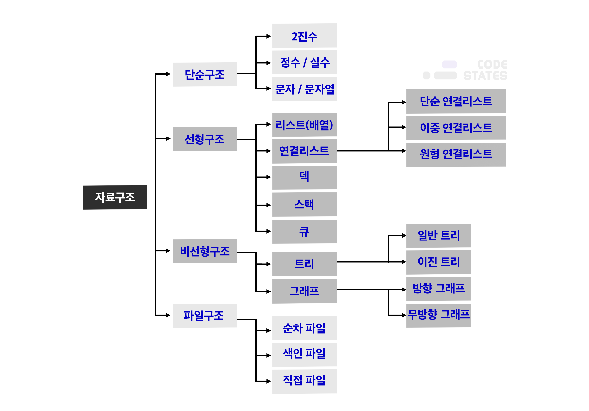

{TOC}
섹션2 자료구조 시작. 나중에 정리하겠지만 https://nelljundev.tistory.com/168?category=1012707 부트캠프 한달 두달기 읽어보자.
{:.note}

```java
// 참고로 논리곱 은 거짓이 두개여도, 한개만 있어도 거짓이라던데 아마 거짓은 0으로 처리해서 그런듯? 나중에 정확히 알아보자
```

> 학습목표
- 자료구조가 무엇인지 설명할 수 있다.
- Stack, Queue, Tree, Graph 자료구조에 대해 이해할 수 있다.
- 알고리즘 문제에서 Stack, Queue 자료구조를 배열로 대체하여 흉내낼 수 있다.
- 트리 및 그래프의 탐색 기법에 대해 이해할 수 있다.
- Binary Search Tree, BFS, DFS 를 이해할 수 있다.
- 문제의 각 상황에 맞는 자료구조를 떠올리고 활용할 수 있다.

## 자료구조의 이해
```java
-자료 구조 이전에 데이터에 대해서..
-데이터를 체계적으로 정리하는 게 나중 활용에 효율적일 것이다
-선배 개발자들은 데이터를 효율적으로 다룰 수 있는 여러 방법을 무수히 연구해 왔다.
-예를 들어
1.번호를 다 알지 않아도, 이름을 아는 것만으로 전화를 할 수 있는 방법은 무엇이 있을까
2.웹 브라우저에서 뒤로 / 앞으로 가는 방법은 무엇이 있을까?
3.게임 매칭을 잡을 때, 수많은 사람을 통제하는 방법엔 무엇이 있을까? ...등등
```


- 자주 쓰이는 네 가지의 자료구조: Stack, Queue, Tree, Graph


## Stack


- Stack 의 특징!!

```java
입력과 출력의 한 방향으로만 이루어지는 제한적 접근
-LIFO(Last In First Out)
-FILO(First In Last Out)
-Stack 에 데이터를 넣는 것을 push, 꺼내는 것을 pop 이라고 한다.
-한 번에 하나씩만, 그리고 한 방향으로만 데이터를 넣고 뺄 수 있다.
```

- LIFO (Last In First Out)
```java
Stack<Integer> stack = new Stack<>(); //Integer형 스택 선언

stack.push(1);
stack.push(2);
stack.push(3);
stack.push(4);

stack.pop(); 마지막 값부터 반환 및 제거
stack.pop();
stack.pop();
stack.pop();
---------------------------

---------------------------
//결과 4, 3, 2, 1
```
- Stack 의 실사용 예제


- 이제 코플릿을 푸는데..1번 문제에서 배열과 리스트 등장..그때 일이 생겨서.. 지금 이걸 모른 다는 건 말도 안되지만 아무튼 급하게 학습
- 그리고 그때 공부 못하고 못만든 TIL 문서를 만들면서 여기 내용과 통합하자.

```java
// array 정의
int[] numbers1 = new int[4];
// array에 값 저장
numbers1[2] = 20;
//
//자바에 리스트는 두가지가 있다. 
//LinkedList 와 ArrayList
//
1.Array - 추가, 삭제가 어렵고, 직접 구현해야함
int[] numbers = {10, 20, 30, 40, 50};
//
2.ArrayList
ArrayList numbers = new ArrayList();
//
numbers.add(10);
numbers.remove(0);
//
3.LinkedList
LinkedList numbers = new LinkedList();
//
numbers.add(10);
numbers.remove(0);
```
- ArrayList 예제
```java
List<String> list = new ArrayList<>();
list.add("hello");
list.add("cat");
list.add("hi");
list.add("dog");
list.add("good");
list.add("friends");

System.out.println(list.size());   //  6
System.out.println(list.get(3));   //  dog
list.remove(3);
list.remove("cat");
System.out.println(list);   //  [hello, hi, good, friends]
```
```java
List<String> companies = Arrays.asList("google", "apple", "samsung");
System.out.println(companies);  //  [google, apple, samsung]

List<Integer> numbers = Arrays.asList(1, 10, 100);
System.out.println(numbers);  //  [1, 10, 100]
```
- ArrayList vs LinkedList
- 출처: https://velog.io/@roro/Java-List-ArrayList-LinkedList

```java
public static void main(String[] args) {
    List<String> al = new ArrayList<>(2000000);
    List<String> ll = new LinkedList<>();

    System.out.println("=====순차적 추가=====");
    System.out.println("ArrayList : " + add1(al));
    System.out.println("LinkedList : " + add1(ll));
    System.out.println("=====중간 추가=====");
    System.out.println("ArrayList : " + add2(al));
    System.out.println("LinkedList : " + add2(ll));
    System.out.println("=====중간 삭제=====");
    System.out.println("ArrayList : " + remove2(al));
    System.out.println("LinkedList : " + remove2(ll));
    System.out.println("=====순차적 삭제=====");
    System.out.println("ArrayList : " + remove1(al));
    System.out.println("LinkedList : " + remove1(ll));
}

private static long add1(List<String> list) {
    long start = System.currentTimeMillis();
    for (int i = 0; i < 1000000; i++) {
        list.add(i + "");
    }
    long end = System.currentTimeMillis();
    return end - start;
}

private static long add2(List<String> list) {
    long start = System.currentTimeMillis();
    for (int i = 0; i < 10000; i++) {
        list.add(5000,i + "");
    }
    long end = System.currentTimeMillis();
    return end - start;
}

private static long remove1(List<String> list) {
    long start = System.currentTimeMillis();
    for (int i = list.size() - 1; i >= 0; i--) {
        list.remove(i);
    }
    long end = System.currentTimeMillis();
    return end - start;
}

private static long remove2(List<String> list) {
    long start = System.currentTimeMillis();
    for (int i = 0; i < 10000; i++) {
        list.remove(i);
    }
    long end = System.currentTimeMillis();
    return end - start;
}
// 결과
=====순차적 추가=====
ArrayList : 99
LinkedList : 233
=====중간 추가=====
ArrayList : 2233
LinkedList : 106
=====중간 삭제=====
ArrayList : 1403
LinkedList : 219
=====순차적 삭제=====
ArrayList : 8
LinkedList : 25
```

## Queue


- Queue 는 Stack 과 반대로, FIFO, LILO 이다. 
- Queue 에 데이터를 넣는 것을 enqueue, 꺼내는 것을 dequeue 라고 한다.

> Queue의 특징
1. FIFO (First In First Out, 선입선출)
```java
예1) 1, 2, 3, 4를 큐에 차례대로 넣습니다.

Queue<Integer> queue = new LinkedList<>(); //int형 queue 선언

queue.add(1);     // queue에 값 1 추가
queue.add(2);     // queue에 값 2 추가
queue.add(3);     // queue에 값 3 추가
queue.add(4);     // queue에 값 4 추가

						   queue.add(데이터)
출력 방향 <---------------------------< 입력 방향
				     1 <- 2 <- 3 <- 4
				<---------------------------<
들어간 순서대로, 1번이 제일 먼저 들어가고 4번이 마지막으로 들어가게 됩니다.

예2) 큐가 빌 때까지 데이터를 전부 빼냅니다.

queue.poll();       // queue에 첫번째 값을 반환하고 제거
queue.poll();
queue.poll();
queue.poll();

						   queue.poll()
출력 방향 <---------------------------< 입력 방향

				<---------------------------<
1, 2, 3, 4
제일 첫 번째 있는 데이터부터 차례대로 나오게 됩니다.
```

2. Stack 처럼 데이터를 하나씩 넣고 뺄 수 있다. 한꺼번에 여러개를 넣거나 뺄 수 없다.

3. 두 개 의 입출력 방향을 가지고 있다. 

- Queue 의 실사용 예제


- 위 예시처럼 컴퓨터 장치들 사이에서 데이터(data)를 주고받을 때, 각 장치 사이에 존재하는 속도의 차이나 시간 차이를 극복하기 위해 임시 기억 장치의 자료구조로 Queue를 사용합니다. 이것을 통틀어 버퍼(buffer)라고 합니다. 아래 이미지는 버퍼링(buffering)의 개념을 보여주고 있습니다.

- 대부분의 컴퓨터 장치에서 발생하는 이벤트는 파동 그래프와 같이 불규칙적으로 발생합니다. 이에 비해 CPU와 같이 발생한 이벤트를 처리하는 장치는 일정한 처리 속도를 갖습니다. 불규칙적으로 발생한 이벤트를 규칙적으로 처리하기 위해 버퍼(buffer)를 사용합니다.

 

> 즉, 컴퓨터와 프린터 사이의 데이터 통신은 
1. 프린터는 속도가 느림
2. cpu 는 데이터 처리 속도가 빠르다
3. 따라서, cpu 는 빠른 속도로 인쇄 데이터를 만들고, 인쇄 작업 Queue에 저장하고 다른 작업을 수행함
4. 프린터는 인쇄 작업 Queue 에서 데이터를 받아 일정한 속도로 인쇄

> 또 다른 사례:

- 유튜브와 같은 동영상 스트리밍 앱을 통해 동영상을 시청할 때, 다운로드 된 데이터(data)가 영상을 재생하기에 충분하지 않은 경우가 있습니다. 이때 동영상을 정상적으로 재생하기 위해 Queue에 모아 두었다가 동영상을 재생하기에 충분한 양의 데이터가 모였을 때 동영상을 재생합니다.