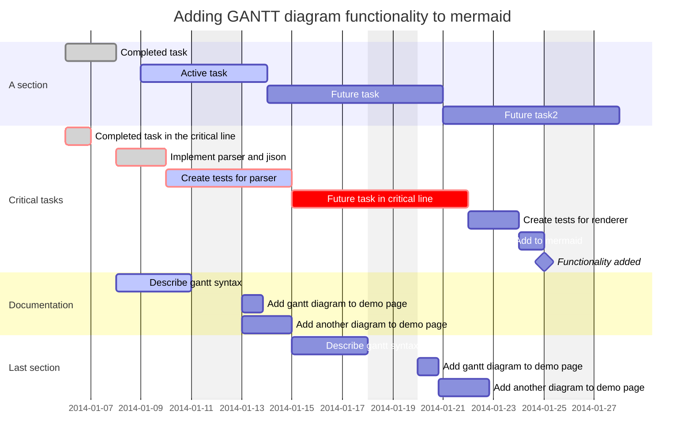

## 1

- [x] rendered on VS code preview or not
- [ ] renderd on built site or not

|--|--|--|--|--|--|--|--|
|♜| |♝|♛|♚|♝|♞|♜|
| |♟|♟|♟| |♟|♟|♟|
|♟| |♞| | | | | |
| |♗| | |♟| | | |
| | | | |♙| | | |
| | | | | |♘| | |
|♙|♙|♙|♙| |♙|♙|♙|
|♖|♘|♗|♕|♔| | |♖|

## 2

- [x] rendered on VS code preview or not
- [ ] renderd on built site or not

<div class='mermaid'>
|--|--|--|--|--|--|--|--|
|♜| |♝|♛|♚|♝|♞|♜|
| |♟|♟|♟| |♟|♟|♟|
|♟| |♞| | | | | |
| |♗| | |♟| | | |
| | | | |♙| | | |
| | | | | |♘| | |
|♙|♙|♙|♙| |♙|♙|♙|
|♖|♘|♗|♕|♔| | |♖|
</div>  


## 3

- [x] rendered on VS code preview or not
- [ ] renderd on built site or not

```mermaid
gantt
[Prototype design] lasts 15 days
[Test prototype] lasts 10 days
-- All example --
[Task 1 (1 day)] lasts 1 day
[T2 (5 days)] lasts 5 days
[T3 (1 week)] lasts 1 week
[T4 (1 week and 4 days)] lasts 1 week and 4 days
[T5 (2 weeks)] lasts 2 weeks
```

## 4

- [x] rendered on VS code preview or not
- [ ] renderd on built site or not

[Prototype design] lasts 15 days
[Test prototype] lasts 10 days
-- All example --
[Task 1 (1 day)] lasts 1 day
[T2 (5 days)] lasts 5 days
[T3 (1 week)] lasts 1 week
[T4 (1 week and 4 days)] lasts 1 week and 4 days
[T5 (2 weeks)] lasts 2 weeks

## 5

- [x] rendered on VS code preview or not
- [ ] renderd on built site or not

<div class="mermaid">
graph TD 
A[Client] --> B[Load Balancer] 
B --> C[Server01] 
B --> D[Server02]
</div>


## 6
- [x] rendered on VS code preview or not
- [ ] renderd on built site or not

    ```mermaid
    graph TD;
    A-->B;
    A-->C;
    B-->D;
    C-->D;
    ```


## 7

- [o] rendered on VS code preview or not
- [ ] renderd on built site or not

|:             Here's an Inline Attribute Lists example                :||||
| ------- | ------------------ | -------------------- | ------------------ |
|:       :|:  <div style="color: red;"> &lt; Normal HTML Block > </div> :|||
| ^^      |   Red    {: .cls style="background: orange" }                |||
| ^^ IALs |   Green  {: #id style="background: green; color: white" }    |||
| ^^      |   Blue   {: style="background: blue; color: white" }         |||
| ^^      |   Black  {: color-style text-style }                         |||


## 8

- [o] rendered on VS code preview or not
- [ ] renderd on built site or not

| :        Fruits \|\| Food       : |||
| :--------- | :-------- | :--------  |
| Apple      | : Apple : | Apple      \
| Banana     |   Banana  | Banana     \
| Orange     |   Orange  | Orange     |
| :   Rowspan is 4    : || How's it?  |
|^^    A. Peach         ||   1. Fine :|
|^^    B. Orange        ||^^ 2. Bad   |
|^^    C. Banana        ||  It's OK!  |

## 9

- [o] rendered on VS code preview or not
- [ ] renderd on built site or not

| :                    MathJax \|\| Image                 : |||
| :------------ | :-------- | :----------------------------- |
| Apple         | : Apple : | Apple                          \
| Banana        | Banana    | Banana                         \
| Orange        | Orange    | Orange                         |
| :     Rowspan is 4     : || :        How's it?           : |
| ^^     A. Peach          ||    1. ![example][cell-image]   |
| ^^     B. Orange         || ^^ 2. $I = \int \rho R^{2} dV$ |
| ^^     C. Banana         || **It's OK!**                   |

[cell-image]: https://jekyllrb.com/img/octojekyll.png "An exemplary image"

## 10

- [o] rendered on VS code preview or not
- [ ] renderd on built site or not

$I = \int \rho R^{2} dV$  
$ 3 * 3 $


## 11

- [x] rendered on VS code preview or not
- [ ] renderd on built site or not




## 12

- [x] rendered on VS code preview or not
- [ ] renderd on built site or not

<script async src="//platform.twitter.com/widgets.js" charset="utf-8"></script>
<blockquote class="twitter-tweet" data-lang="en">
  <p lang="en" dir="ltr">
    The next version of Hydejack (v6.3.0) will allow embedding 3rd party scripts,
    like the one that comes with this tweet for example.
  </p>
  &mdash; Florian Klampfer (@qwtel)
  <a href="https://twitter.com/qwtel/status/871098943505039362">June 3, 2017</a>
</blockquote>

  


## 13

- [x] rendered on VS code preview or not
- [ ] renderd on built site or not

<div class="mermaid">
graph TD;
    A-->B;
    A-->C;
    B-->D;
    C-->D;
</div>


## 14

- [o] rendered on VS code preview or not
- [ ] renderd on built site or not

$$
a * b = c ^ b   \\
2^{\frac{n-1}{3}}  \\  
\int\_a^b f(x)\,dx.  \\

$$

-------------------
$$
\begin{aligned} %!!15
  \phi(x,y) &= \phi \left(\sum_{i=1}^n x_ie_i, \sum_{j=1}^n y_je_j \right) \\[2em]
            &= \sum_{i=1}^n \sum_{j=1}^n x_i y_j \phi(e_i, e_j)            \\[2em]
            &= (x_1, \ldots, x_n)
               \left(\begin{array}{ccc}
                 \phi(e_1, e_1)  & \cdots & \phi(e_1, e_n) \\
                 \vdots          & \ddots & \vdots         \\
                 \phi(e_n, e_1)  & \cdots & \phi(e_n, e_n)
               \end{array}\right)
               \left(\begin{array}{c}
                 y_1    \\
                 \vdots \\
                 y_n
               \end{array}\right)
\end{aligned}
$$

## 15
- maermaidjs live editor.

- [o] rendered on VS code preview or not
- [ ] renderd on built site or not

[](https://mermaid-js.github.io/mermaid-live-editor/edit#pako:eNplj7EOwjAMRH_F8twFIZasFDF1Yu1iNRY10BiljqoK8e-klEoFMiXvznfOAxv1jA4BLppi4LEOkI-J3RiqEQaNVwln8PRRem5MNMBRwfQtzxygoiuDMTnYOah4wdmY7r2RxN7Bdq2U87yDzUQL2JP9dbTarZO8DmHJ-mo5ib3FnwossOPYkfj8x8dEa7SWcya6fPWU18c6PLMv3T0ZH7yYRnQWExdIyfQ0hmZ5z55S6Bypm-HzBR-_ZCw)


## 16

