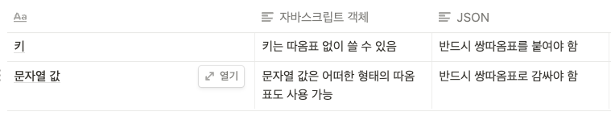

## 개요


이번 과제에서는 서로 다른 프로그램 사이에서 데이터를 주고받기 위해 사용되는 데이터 타입인 JSON에 대해 학습하고, 실습을 통해 앞서 배운 자바에서 사용하는 데이터 타입을 재귀를 사용하여 직접 JSON타입으로 변경하는 코드를 작성하게 됩니다.

    과제를 시작하기 전에 이전에 학습했던 재귀함수의 동작원리를 복습하세요.
    Java에서 사용하는 다양한 데이터 타입에 대한 이해가 필요합니다.

> 그래서 JSON 이 뭔데?

```java
    String - ""로 묶여야 함
    Number
    Object - {로 시작하고 }로 끝내어 표현함, name뒤에 :를 붙이고 ,로 구분
    Array - [로 시작하고 ]로 끝냄, ,로 값을 구분
    Boolean
    Null
```
```java
///JSON 의 구조
{
    "characters" : [
      {
        "name": "archer",
        "level": 1,xccccdfff
        "inventory": null,
        "hardcore": false
      },
      {
        "name": "knight",
        "level": 8,
        "inventory": ["sword", "shield"],
        "hardcore": true
      }
    ]
}
```


<details>
<summary>학습 목표</summary>

Java에서 제공하는 데이터 타입을 JSON으로 변경하는 기능을 구현할 수 있어야 합니다.

    null을 입력받을 경우, 알맞은 형태의 JSON으로 변환합니다
    Boolean 타입을 입력받을 경우, 알맞은 형태의 JSON으로 변환합니다
    String 타입을 입력받을 경우, 알맞은 형태의 JSON으로 변환합니다
    배열을 입력받을 경우, 알맞은 형태의 JSON으로 변환합니다
    HashMap을 입력받을 경우, 알맞은 형태의 JSON으로 변환합니다
    배열, Map 타입의 요소를 가진 배열이나 Map을 입력받을 경우, 알맞은 형태의 JSON으로 변환합니다.
</details>

## JSON


```java
- JSON 은 JavaScript Object Notation 의 줄임말
- 
```

```java
Map<String, String> message = new HashMap<>(){{
      put("sender", "김코딩");
      put("receiver", "박해커");
      put("message", "밥먹을래?");
      put("createdAt", "2021-01-12,10:10:10");
    }};
    
```    
- 만약 위 데이터에서 message.toString() 을 시도하면, {createdAt=2021-01-12,10:10:10, receiver=박해커, sender=김코딩, message=밥먹을래?} 라는 결과를 리턴할 것이고, 해당 형식은 범용적이지 않다.

- 이번 예제는 jackson 라이브러리에서 제공하는 ObjectMapper클래스를 사용하여 JSON형태로 변환해보자.

```java
ObjectMapper mapper = new ObjectMapper();
String json = mapper.writeValueAsString(message);

System.out.println(json);
/*
{"createdAt":"2021-01-12,10:10:10","receiver":"박해커","sender":"김코딩","message":"밥먹을래?"}
*/
```
- 위와 같이 writeValueAsString 하는 과정을 직렬화(serialize) 라고 한다.

- 그렇다면 이 문자열 메시지를 어떻게 다시 객체의 형태로 만들까?

```java
ObjectMapper mapper = new ObjectMapper();
String json = "{\"createdAt\":\"2021-01-12,10:10:10\",\"receiver\":\"박해커\",\"sender\":\"김코딩\",\"message\":\"밥먹을래?\"}";

Map<String, String> deserializedData = mapper.readValue(json, Map.class);
System.out.println(deserializedData);
/*
{createdAt=2021-01-12,10:10:10, receiver=박해커, sender=김코딩, message=밥먹을래?}
*/
```

- readValue 를 적용하는 이 과정을 역직렬화(deserialize) 라고 한다.

> JSON 은 얼핏 자바스크립트의 객체와 비슷해 보이지만, 다음과 같은 차이가 있다.




## 시작하기
이 프로젝트를 이해하고 구현하기 위해 공부했던 자료들을 출처와 함께 정리

| 내용 | 링크 및 출처|
| --   | -- |
|1. JUnit, AssertJ, 단위테스트 개념 및 다양한 활용법 | https://jminie.tistory.com/68 |
|2. 단위테스트 필요성 등등(1/3) | https://mangkyu.tistory.com/143|
| [Spring] JUnit과 Mockito 기반의 Spring 단위 테스트 코드 작성법 (3/3) |출처: https://mangkyu.tistory.com/145 [MangKyu's Diary:티스토리] |
|Java - JSON을 파싱하는 가장 쉬운 방법 |https://codechacha.com/ko/java-parse-json/ |
| | |
| | |
| | |
| | |
```java
그니까 테스트 하기 위해 JUnit 과 AssertJ 가 있는데,  
// AssertJ는 이렇게 임포트
import static org.assertj.core.api.Assertions.*;
import org.junit.jupiter.api.Test;
//그리고 
assertThat(테스트타겟).메소드1().메소드2().메소드3();
이런 식으로 쓰는데, 
//이 프로젝트에선 이런 식으로 사용하였고,
assertThat(test.stringify(null)).isEqualTo(ObjectMapper(null));

```
```java
Bare minimum Requirements

    src/main/java/stringifyJSON.java 에서 stringify 함수를 직접 구현해보고, src/test/java/stringifyJSON_test.java 파일을 실행하여 모든 테스트를 통과해야 합니다.
```
> 파일: section2/be-sprint-stringify-json/

> 하면서 몰랐던, 새로 알게 된 것들 정리:

```java
instanceof // if (data instanceof String) 이런 식으로 쓴다.
.isEqualTo() // 두 객체가 서로 같은 값을 가지고 있는지
.isSameAs() // 같은 메모리 주소를 참조하는지
```


```java
// assertThat 예제 .출처 https://bibi6666667.tistory.com/231
assertThat("Hello, world! Nice to meet you.") // 주어진 "Hello, world! Nice to meet you."라는 문자열은
                .isNotEmpty() // 비어있지 않고
                .contains("Nice") // "Nice"를 포함하고
                .contains("world") // "world"도 포함하고
                .doesNotContain("ZZZ") // "ZZZ"는 포함하지 않으며
                .startsWith("Hell") // "Hell"로 시작하고
                .endsWith("u.") // "u."로 끝나며
                .isEqualTo("Hello, world! Nice to meet you."); // "Hello, world! Nice to meet you."과 일치합니다.
```

```java
//assertThat 예제 2 .출처 https://bibi6666667.tistory.com/231
assertThat(3.14d) // 주어진 3.14라는 숫자는
                .isPositive() // 양수이고
                .isGreaterThan(3) // 3보다 크며
                .isLessThan(4) // 4보다 작습니다
                .isEqualTo(3, offset(1d)) // 오프셋 1 기준으로 3과 같고
                .isEqualTo(3.1, offset(0.1d)) // 오프셋 0.1 기준으로 3.1과 같으며
                .isEqualTo(3.14); // 오프셋 없이는 3.14와 같습니다
```                

```java
// 프로젝트 폴더에서, stringifyJSON 이라는 클래스 안에, 
    public String stringify(Object data) {
            public String stringify(Object data) {
    // 입력된 값이 문자열일 경우
      if(data instanceof String){
          return "\""+(String)data+"\"";
      }
      ....
      ....
// 함수(메서드인가?.. section1 돌아가서 복습하자..) 를 구현한다.
```
```java
// 그리고 stringifyJSON_test 라는 퍼블릭 클래스 를 만들고, 그 안에
public class stringifyJSON_test {

    private static stringifyJSON test = new stringifyJSON();
// 
    public String ObjectMapper(Object data) throws JsonProcessingException {
        ObjectMapper mapper = new ObjectMapper();
        return mapper.writeValueAsString(data);
    }

    @Test
    @DisplayName("null을 입력받을 경우, 알맞은 형태의 JSON으로 변환합니다")
    public void null을_JSON으로_변경합니다() throws JsonProcessingException {
        assertThat(test.stringify(null)).isEqualTo(ObjectMapper(null));
    }
    ...
    ...

```
```java
- 다 보기는 시간이 없을 것 같아 다음 일부만 살펴보자.
- 다음은 원래의 마지막 부분이다.
```java
    @Test
    @DisplayName("HashMap을 입력받을 경우, 알맞은 형태의 JSON으로 변환합니다")
    public void Map_을_입력받았을_경우_JSON으로_변경합니다_3() throws JsonProcessingException {
        HashMap<Object, Object> map = new HashMap<>(){{
            put("foo", true);
            put("bar", false);
            put("baz", null);
        }};
        assertThat(test.stringify(map)).isEqualTo(ObjectMapper(map));
```
- 그럼 이 부분에 의해 @Test
    @DisplayName("HashMap을 입력받을 경우, 알맞은 형태의 JSON으로 변환합니다")

- HashMap을 입력받을 경우, 알맞은 형태의 JSON으로 변환합니다 
- 라고 뜬다. 
- 약간 수정해서
```
   @Test
    @DisplayName("HashMap을 입력받을 경우, 알맞은 형태의 JSON으로 변환합니다")
    public void Map_을_입력받았을_경우_JSON으로_변경합니다_3() throws JsonProcessingException {
        HashMap<Object, Object> map = new HashMap<>(){{
            put("foo", true);
            put("bar", false);
            put("baz", null);
        }};
        System.out.println("테스트");
        // assertThat(test.stringify(map)).isEqualTo(ObjectMapper(map));
        System.out.println(ObjectMapper(map));
    }
```
- 라고 하면
```java
테스트
{"bar":false,"foo":true,"baz":null}
```
- 위와 같이 JSON 형태로 출력되는 것을 볼 수 있다.
- 반대로 일부러 틀린 데이터를 입력해보자.
```java
 @Test
    @DisplayName("HashMap을 입력받을 경우, 알맞은 형태의 JSON으로 변환합니다")
    public void Map_을_입력받았을_경우_JSON으로_변경합니다_3() throws JsonProcessingException {
        HashMap<Object, Object> map = new HashMap<>(){{
            put("foo", true);
            put("bar", false);
            put("baz", null);
        }};
        HashMap<Object, Object> map2 = new HashMap<>(){{
            put("foo", false);
            put("bar", false);
            put("baz", null);
        }};
        
        assertThat(test.stringify(map)).isEqualTo(ObjectMapper(map2));
        
    }
```
그러면
> 테스트 실패: 1, 통과됨:12 /13개 테스트 

와 같이 결과가 나와서 잘 실행된 것을 알 수 있다.


   