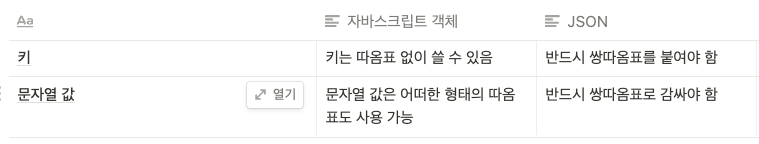

## 개요


이번 과제에서는 서로 다른 프로그램 사이에서 데이터를 주고받기 위해 사용되는 데이터 타입인 JSON에 대해 학습하고, 실습을 통해 앞서 배운 자바에서 사용하는 데이터 타입을 재귀를 사용하여 직접 JSON타입으로 변경하는 코드를 작성하게 됩니다.

    과제를 시작하기 전에 이전에 학습했던 재귀함수의 동작원리를 복습하세요.
    Java에서 사용하는 다양한 데이터 타입에 대한 이해가 필요합니다.

> 그래서 JSON 이 뭔데?

```java
    String - ""로 묶여야 함
    Number
    Object - {로 시작하고 }로 끝내어 표현함, name뒤에 :를 붙이고 ,로 구분
    Array - [로 시작하고 ]로 끝냄, ,로 값을 구분
    Boolean
    Null
```
```java
///JSON 의 구조
{
    "characters" : [
      {
        "name": "archer",
        "level": 1,xccccdfff
        "inventory": null,
        "hardcore": false
      },
      {
        "name": "knight",
        "level": 8,
        "inventory": ["sword", "shield"],
        "hardcore": true
      }
    ]
}
```


<details>
<summary>학습 목표</summary>

Java에서 제공하는 데이터 타입을 JSON으로 변경하는 기능을 구현할 수 있어야 합니다.

    null을 입력받을 경우, 알맞은 형태의 JSON으로 변환합니다
    Boolean 타입을 입력받을 경우, 알맞은 형태의 JSON으로 변환합니다
    String 타입을 입력받을 경우, 알맞은 형태의 JSON으로 변환합니다
    배열을 입력받을 경우, 알맞은 형태의 JSON으로 변환합니다
    HashMap을 입력받을 경우, 알맞은 형태의 JSON으로 변환합니다
    배열, Map 타입의 요소를 가진 배열이나 Map을 입력받을 경우, 알맞은 형태의 JSON으로 변환합니다.
</details>

## JSON


```java
- JSON 은 JavaScript Object Notation 의 줄임말
- 
```

```java
Map<String, String> message = new HashMap<>(){{
      put("sender", "김코딩");
      put("receiver", "박해커");
      put("message", "밥먹을래?");
      put("createdAt", "2021-01-12,10:10:10");
    }};
    
```    
- 만약 위 데이터에서 message.toString() 을 시도하면, {createdAt=2021-01-12,10:10:10, receiver=박해커, sender=김코딩, message=밥먹을래?} 라는 결과를 리턴할 것이고, 해당 형식은 범용적이지 않다.

- 이번 예제는 jackson 라이브러리에서 제공하는 ObjectMapper클래스를 사용하여 JSON형태로 변환해보자.

```java
ObjectMapper mapper = new ObjectMapper();
String json = mapper.writeValueAsString(message);

System.out.println(json);
/*
{"createdAt":"2021-01-12,10:10:10","receiver":"박해커","sender":"김코딩","message":"밥먹을래?"}
*/
```
- 위와 같이 writeValueAsString 하는 과정을 직렬화(serialize) 라고 한다.

- 그렇다면 이 문자열 메시지를 어떻게 다시 객체의 형태로 만들까?

```java
ObjectMapper mapper = new ObjectMapper();
String json = "{\"createdAt\":\"2021-01-12,10:10:10\",\"receiver\":\"박해커\",\"sender\":\"김코딩\",\"message\":\"밥먹을래?\"}";

Map<String, String> deserializedData = mapper.readValue(json, Map.class);
System.out.println(deserializedData);
/*
{createdAt=2021-01-12,10:10:10, receiver=박해커, sender=김코딩, message=밥먹을래?}
*/
```

- readValue 를 적용하는 이 과정을 역직렬화(deserialize) 라고 한다.

> JSON 은 얼핏 자바스크립트의 객체와 비슷해 보이지만, 다음과 같은 차이가 있다.




## 시작하기
<details>

이번 과제는 재귀를 이용해 메서드 stringify를 직접 구현합니다.

이전 콘텐츠에서 writeValue는 데이터를 JSON으로 변환하는 메서드인 것을 확인했습니다. 이 메서드를 함수의 형태로 직접 구현하기 위해서, 재귀를 사용하세요. JSON은 대표적인 트리 구조를 가지고 있으므로, 전형적인 재귀 탐색이 가능한 구조(객체의 값으로 객체를 포함하는 구조)이기 때문에 재귀 사용을 적극 권장합니다. 어떻게 풀어야 할지 방향이 잘 정해지지 않는다면, 코플릿의 재귀 문제를 풀었던 방법을 다시 상기하세요. 부모와 자식의 구조가 같은 트리 구조를 어떤 조건에서 재귀 호출하면 좋을지 고민해보세요.
Getting Started

이번 과제는 IntelliJ를 사용하여 직접 코드를 작성하고, 테스트를 통해 정확한 코드를 입력했는지 확인할 수 있습니다.
아래 순서에 맞게 진행해주세요.

    repository 주소 에서 fork 및 clone 후 메소드를 작성합니다.
    IntelliJ를 실행합니다.
    열기를 클릭한 이후, 다운받은 폴더를 클릭하고 Open버튼을 클릭합니다.
    신뢰할 수 있는 프로젝트를 클릭합니다.
    src/main/java/stringifyJSON.java 파일을 열면, stringify메서드가 작성되어 있습니다. 해당 메서드에서 // TODO:부분을 직접 채워주세요.
    모두 작성하였다면, src/test/java/stringifyJSON_test.java파일을 실행하여 작성한 코드가 정상적으로 작동하는지 테스트를 진행할 수 있습니다.
    테스트는 아래 그림을 참고하시고, 1번 또는 2번 버튼을 통해 진행할 수 있습니다.

 image
Bare minimum Requirements

    src/main/java/stringifyJSON.java 에서 stringify 함수를 직접 구현해보고, src/test/java/stringifyJSON_test.java 파일을 실행하여 모든 테스트를 통과해야 합니다.

</details>