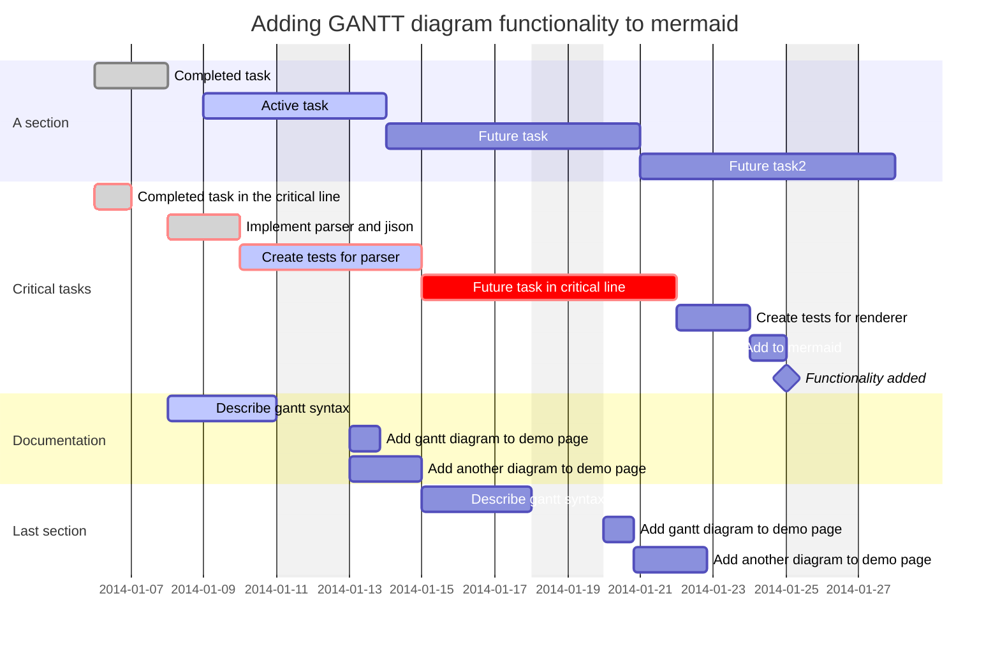

0. {:toc}
jekyll과 현재 hydejack theme 구조를 이해하고 사이트 저장소 최적화 하는중.
{:.note}

## Chapters


| TIL 링크 | 학습한 내용 | 처음 학습한 날짜 |
| --       | --         | --              |
|    [job]   | [Java]객체지향 프로그래밍 기초  |        |
|    [joa]   | [Java]객체지향 프로그래밍 심화  |        |
|    [Collection]   | [Java]컬렉션Collection) | 2022.07.14  |
|      |            |       ㅇㄹ          |
|      |            |       ㅇㄹ          |
|     |            |       ㅇㄹ          |
|  [Jekyll]     |            |       ㅇㄹ          |
|      |            |       ㅇㄹ          |


## 참고 공부 자료
|내용1 |내용2 |링크 | |
| -- | -- | -- | -- |
| | |https://www.geeksforgeeks.org/ | |
|코딩테스트 초보자 입문 | |https://plzrun.tistory.com/entry/%EC%95%8C%EA%B3%A0%EB%A6%AC%EC%A6%98-%EB%AC%B8%EC%A0%9C%ED%92%80%EC%9D%B4PS-%EC%8B%9C%EC%9E%91%ED%95%98%EA%B8%B0 | |
|GeeksforGeeks | |https://www.geeksforgeeks.org/ | |
|rails | | [rails-pacman]| |
| | | | |
| | | | |
| | | | |

================

----------
Lorem ipsum $$ f(x) = x^2 $$.

-----------------
$$
a * b = c ^ b   \\
2^{\frac{n-1}{3}}  \\  
\int\_a^b f(x)\,dx.  \\

$$

-------------------
$$
\begin{aligned} %!!15
  \phi(x,y) &= \phi \left(\sum_{i=1}^n x_ie_i, \sum_{j=1}^n y_je_j \right) \\[2em]
            &= \sum_{i=1}^n \sum_{j=1}^n x_i y_j \phi(e_i, e_j)            \\[2em]
            &= (x_1, \ldots, x_n)
               \left(\begin{array}{ccc}
                 \phi(e_1, e_1)  & \cdots & \phi(e_1, e_n) \\
                 \vdots          & \ddots & \vdots         \\
                 \phi(e_n, e_1)  & \cdots & \phi(e_n, e_n)
               \end{array}\right)
               \left(\begin{array}{c}
                 y_1    \\
                 \vdots \\
                 y_n
               \end{array}\right)
\end{aligned}
$$

-------------------------

An optional caption for a math block
{:.figcaption}

```plantuml!
Bob -> Alice : hello world
```

@startuml
Bob -> Alice : hello
@enduml

@startmermaid
pie title Pets adopted by volunteers
  "Dogs" : 386
  "Cats" : 85
  "Rats" : 35
@endmermaid




<div class="mermaid">
graph TD;
    A-->B;
    A-->C;
    B-->D;
    C-->D;
</div>

<script async src="//platform.twitter.com/widgets.js" charset="utf-8"></script>
<blockquote class="twitter-tweet" data-lang="en">
  <p lang="en" dir="ltr">
    The next version of Hydejack (v6.3.0) will allow embedding 3rd party scripts,
    like the one that comes with this tweet for example.
  </p>
  &mdash; Florian Klampfer (@qwtel)
  <a href="https://twitter.com/qwtel/status/871098943505039362">June 3, 2017</a>
</blockquote>


    gantt;
    dateFormat  YYYY-MM-DD
    title       Adding GANTT diagram functionality to mermaid
    excludes    weekends
    %% (`excludes` accepts specific dates in YYYY-MM-DD format, days of the week ("sunday") or "weekends", but not the word "weekdays".)

    section A section
    Completed task            :done,    des1, 2014-01-06,2014-01-08
    Active task               :active,  des2, 2014-01-09, 3d
    Future task               :         des3, after des2, 5d
    Future task2              :         des4, after des3, 5d

    section Critical tasks
    Completed task in the critical line :crit, done, 2014-01-06,24h
    Implement parser and jison          :crit, done, after des1, 2d
    Create tests for parser             :crit, active, 3d
    Future task in critical line        :crit, 5d
    Create tests for renderer           :2d
    Add to mermaid                      :1d
    Functionality added                 :milestone, 2014-01-25, 0d

    section Documentation
    Describe gantt syntax               :active, a1, after des1, 3d
    Add gantt diagram to demo page      :after a1  , 20h
    Add another diagram to demo page    :doc1, after a1  , 48h

    section Last section
    Describe gantt syntax               :after doc1, 3d
    Add gantt diagram to demo page      :20h
    Add another diagram to demo page    :48h



---------------------

|내용1 |내용2 |링크 | |
| -- | -- | -- | -- |
| | |https://www.geeksforgeeks.org/ | |
|코딩테스트 초보자 입문 | |https://plzrun.tistory.com/entry/%EC%95%8C%EA%B3%A0%EB%A6%AC%EC%A6%98-%EB%AC%B8%EC%A0%9C%ED%92%80%EC%9D%B4PS-%EC%8B%9C%EC%9E%91%ED%95%98%EA%B8%B0 | |
|GeeksforGeeks | |https://www.geeksforgeeks.org/ | |
| | | | |


| :                   MathJax \|\| Image                 : |||
| :------------ | :-------- | :----------------------------- |
| Apple         | : Apple : | Apple                          \
| Banana        | Banana    | Banana                         \
| Orange        | Orange    | Orange                         |
| :     Rowspan is 4     : || :        How's it?           : |
| ^^     A. Peach          ||    1. ![example][cell-image]   |
| ^^     B. Orange         || ^^ 2. $I = \int \rho R^{2} dV$ |
| ^^     C. Banana         || **It's OK!**                   |

[cell-image]: https://jekyllrb.com/img/octojekyll.png "An exemplary image"


| :        Fruits \|\| Food       : |||
| :--------- | :-------- | :--------  |
| Apple      | : Apple : | Apple      \
| Banana     |   Banana  | Banana     \
| Orange     |   Orange  | Orange     |
| :   Rowspan is 4    : || How's it?  |
|^^    A. Peach         ||   1. Fine :|
|^^    B. Orange        ||^^ 2. Bad   |
|^^    C. Banana        ||  It's OK!  |
===============
```
| | | | |
| -- | -- | -- | -- |
| | | | |
| | | | |
```
{:color-style: style="background: black;"}
{:color-style: style="color: white;"}
{:text-style: style="font-weight: 800; text-decoration: underline;"}

<div class="mermaid">
|:             Here's an Inline Attribute Lists example                :||||
| ------- | ------------------ | -------------------- | ------------------ |
|:       :|:  <div style="color: red;"> &lt; Normal HTML Block > </div> :|||
| ^^      |   Red    {: .cls style="background: orange" }                |||
| ^^ IALs |   Green  {: #id style="background: green; color: white" }    |||
| ^^      |   Blue   {: style="background: blue; color: white" }         |||
| ^^      |   Black  {: color-style text-style }                         |||
</div>


graph TD;
    A-->B;
    A-->C;
    B-->D;
    C-->D;


@startmermaid
pie title Pets adopted by volunteers
  "Dogs" : 386
  "Cats" : 85
  "Rats" : 35
@endmermaid


|--|--|--|--|--|--|--|--|
|♜| |♝|♛|♚|♝|♞|♜|
| |♟|♟|♟| |♟|♟|♟|
|♟| |♞| | | | | |
| |♗| | |♟| | | |
| | | | |♙| | | |
| | | | | |♘| | |
|♙|♙|♙|♙| |♙|♙|♙|
|♖|♘|♗|♕|♔| | |♖|


### 링크 구성

[job]: java.oop.basic.md
[joa]: java.oop.advanced.md
[Collection]: collection.md
[11]: 11.md
[rails-pacman]:rails-pacman.md
[Jekyll]:aboutJekyll.md

<div class="mermaid">
graph TD 
A[Client] --> B[Load Balancer] 
B --> C[Server01] 
B --> D[Server02]
</div>

==================
<div class="mermaid">
graph TD;
    A-->B;
    A-->C;
    B-->D;
    C-->D;
</div>

