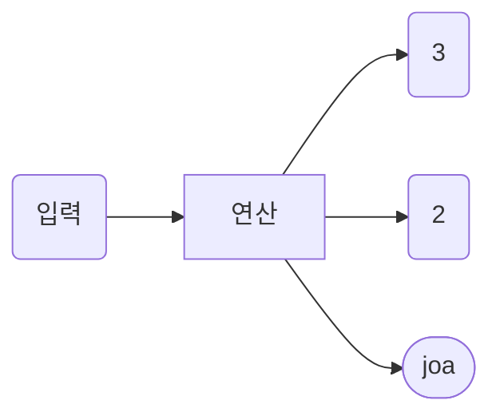

0. {:toc}
jekyll과 현재 hydejack theme 구조를 이해하고 사이트 저장소 최적화 하는중.
{:.note}

## Chapters


| TIL 링크 | 학습한 내용 | 처음 학습한 날짜 |
| --       | --         | --              |
|    [job]   | [Java]객체지향 프로그래밍 기초  |        |
|    [joa]   | [Java]객체지향 프로그래밍 심화  |        |
|    [Collection]   | [Java]컬렉션Collection) | 2022.07.14  |
|      |            |       ㅇㄹ          |
|      |            |       ㅇㄹ          |
|     |            |       ㅇㄹ          |
|  [Jekyll]     |            |       ㅇㄹ          |
|      |            |       ㅇㄹ          |


## 참고 공부 자료
|내용1 |내용2 |링크 | |
| -- | -- | -- | -- |
| | |https://www.geeksforgeeks.org/ | |
|코딩테스트 초보자 입문 | |https://plzrun.tistory.com/entry/%EC%95%8C%EA%B3%A0%EB%A6%AC%EC%A6%98-%EB%AC%B8%EC%A0%9C%ED%92%80%EC%9D%B4PS-%EC%8B%9C%EC%9E%91%ED%95%98%EA%B8%B0 | |
|GeeksforGeeks | |https://www.geeksforgeeks.org/ | |
|rails | | [rails-pacman]| |
| | | | |
| | | | |
| | | | |

================



<div class="mermaid">
gantt
        dateFormat  YYYY-MM-DD
        title Adding GANTT diagram functionality to mermaid

        section A section
        Completed task            :done,    des1, 2014-01-06,2014-01-08
        Active task               :active,  des2, 2014-01-09, 3d
        Future task               :         des3, 2014-01-10, 1d
        Future task2               :         des4, after des3, 5d

        section Critical tasks
        Completed task in the critical line :crit, done, 2014-01-06,24h
        Implement parser and jison          :crit, done, after des1, 2d
        Create tests for parser             :crit, active, 3d
        Future task in critical line        :crit, 5d
        Create tests for renderer           :2d
        Add to mermaid                      :1d

        section Documentation
        Describe gantt syntax               :active, a1, after des1, 3d
        Add gantt diagram to demo page      :after a1  , 20h
        Add another diagram to demo page    :doc1, after a1  , 48h

        section Last section
        Describe gantt syntax               :after doc1, 3d
        Add gantt diagram to demo page      : 20h
        Add another diagram to demo page    : 48h
</div>

|내용1 |내용2 |링크 | |
| -- | -- | -- | -- |
| | |https://www.geeksforgeeks.org/ | |
|코딩테스트 초보자 입문 | |https://plzrun.tistory.com/entry/%EC%95%8C%EA%B3%A0%EB%A6%AC%EC%A6%98-%EB%AC%B8%EC%A0%9C%ED%92%80%EC%9D%B4PS-%EC%8B%9C%EC%9E%91%ED%95%98%EA%B8%B0 | |
|GeeksforGeeks | |https://www.geeksforgeeks.org/ | |
| | | | |


===============
```
| | | | |
| -- | -- | -- | -- |
| | | | |
| | | | |
```


### 링크 구성

[job]: java.oop.basic.md
[joa]: java.oop.advanced.md
[Collection]: collection.md
[11]: 11.md
[rails-pacman]:rails-pacman.md
[Jekyll]:aboutJekyll.md